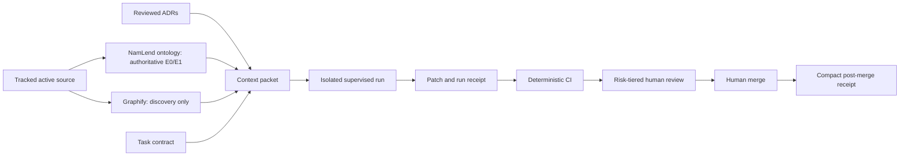

# NamLend AI Engineering Harness

## Purpose

The harness makes agent-assisted work reproducible, evidence-backed and subject
to the same regulatory, security and human-review controls as human work. It is
not a source of lending authority and has no production credentials.

The original `eb45703` inventory contained 91 effective tables and 194 indexes.
The security upgrade to `@convex-dev/auth` 0.0.95 adds one Auth-owned index, so
the current deterministic extraction contains 91 tables and 195 indexes. The
ontology reports dependency-derived current truth; historical counts remain
revision-bound evidence rather than being treated as current facts.

## Architecture

The NamLend ontology answers exact inventory, proof and change-impact questions.
Graphify may find exploratory symbols or relationships, but its `EXTRACTED`,
`INFERRED` and `AMBIGUOUS` labels describe discovery confidence—not NamLend
evidence tiers.

## Three memory clocks

| Memory               | Contents                                                 | Retention and authority                           |
| -------------------- | -------------------------------------------------------- | ------------------------------------------------- |
| Task state           | Workspace, status, redacted trace, patch and run receipt | Ephemeral; 30 days                                |
| Repository structure | Ontology and optional Graphify cache for a source SHA    | Regenerated and stale after affected paths change |
| Engineering history  | Reviewed ADRs, conflicts and compact merge receipts      | Append-only; use `SUPERSEDES` or `INVALIDATES`    |

Never retain secret values, production/customer data, raw prompts, hidden model
reasoning, raw provider payloads or unredacted logs in any memory layer.

## Risk and authority

- `R0 ReadOnly`: research, diagnosis, impact and review; no repository writes.
- `R1 Eligible`: allowlisted documentation, tests and generated ontology output.
- `R2 HumanLed`: application behavior, integrations and dependency migrations.
- `R3 Protected`: lending rules, APR, KYC, identity, roles, tenancy, schema, data,
  money movement, audit, flags, deployments, secrets, workflows and agent policy.

Only R0/R1 tasks may enter an unattended runner. Agents cannot push, merge,
deploy, seed, migrate, backfill, rewrite history, read secrets, mutate production,
or write to external systems. One human approval is required generally; protected
changes require two distinct humans.

## Operating loop

1. Validate a task contract with `npm run agent:preflight -- <file>`.
2. Build a cited context packet with `npm run agent:context -- <file>`.
3. Work in an isolated workspace with deny-by-default network and no production identity.
4. Record only redacted command digests, test identities and changed paths.
5. Validate the run with `npm run agent:verify -- <receipt>`.
6. Run CI and independent human review.
7. Publish durable evidence only from a successful reviewed merge.

The machine schemas in `agent-harness/schemas/` are the wire contract. Policy in
`agent-harness/policy.json` is authoritative over this explanatory document.

## Debt ratchet

Existing registered non-safety ontology gaps may remain until their review date,
but additions, worsening counts and expired exceptions fail CI. APR, KYC,
authorization, tenant isolation, audit, financial deletion, secrets, unsupported
settlement claims and missing money-movement proof cannot be grandfathered.

Dependency exceptions apply only to demonstrably tool-only packages and require a
linked gap. Critical exceptions last at most 14 days, high exceptions 30 days and
other non-safety debt 90 days.

## Evaluation and promotion

The repository dataset contains exact-impact, evidence, exploratory and adversarial
cases plus 24 coding-task blueprints. Graphify remains useful only if it reaches
90% expected-node recall in the top ten, 100% decision-citation correctness, zero
stale/excluded leakage, and either a ten-point recall improvement or 20% median
investigation-time reduction over the ontology alone.

Autonomous PR proposal remains disabled until the system has 100% hard-invariant
success, zero severe violations, at least 90% exact task success, 95% scope
containment, 80% first-review acceptance and twenty consecutive safe shadow tasks.
Any severe incident returns dispatch to read-only shadow mode.

## Resolved security finding

GitHub secret-scanning alert 1 identified a legacy Supabase service-role credential in tracked debug scripts. The current tree was redacted, the project's legacy JWT-based `anon` and `service_role` API keys were disabled, and GitHub records the alert as revoked. Secret scanning and push protection remain enabled. `agent-harness/security-findings.json` records the redacted resolution metadata; historical rewriting remains excluded pending separate authorization.

## External proof boundaries

Convex transaction success, outbox enqueue, TigerBeetle acceptance, IPS callback
processing and final funds settlement are distinct claims. Each requires its own
named evidence. The harness must never collapse these into a generic “payment
worked” assertion.
