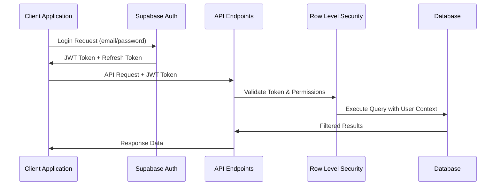

# NamLend Trust - API Documentation

## 🔗 Base Configuration

**Supabase Project URL**: `https://puahejtaskncpazjyxqp.supabase.co`  
**API Base**: `https://puahejtaskncpazjyxqp.supabase.co/rest/v1`

## Authentication & Security

### Authentication Flow



All API requests require authentication using Supabase Auth with JWT tokens for secure access control and Row-Level Security (RLS) for data isolation.

### Client Authentication (Public Operations)

```typescript
// Using anon key for public operations
const supabase = createClient(supabaseUrl, anonKey);
```

### Admin Authentication (Privileged Operations)

```typescript
// Using service role key for admin operations
const supabaseAdmin = createClient(supabaseUrl, serviceRoleKey, {
  auth: { autoRefreshToken: false, persistSession: false }
});
```

## 👤 User Management

### Sign Up

```typescript
const { data, error } = await supabase.auth.signUp({
  email: 'user@example.com',
  password: 'password123'
});
```

### Sign In

```typescript
const { data, error } = await supabase.auth.signInWithPassword({
  email: 'user@example.com',
  password: 'password123'
});
```

### Password Reset (Admin Only)

```typescript
const { data, error } = await supabaseAdmin.auth.admin.updateUserById(
  userId,
  { password: 'newPassword123' }
);
```

## 🏦 Loan Operations

### Create Loan Application

```typescript
const { data, error } = await supabase
  .from('loans')
  .insert({
    user_id: userId,
    amount: 50000,
    purpose: 'Business expansion',
    term_months: 24,
    status: 'submitted'
  });
```

### Get User Loans

```typescript
const { data, error } = await supabase
  .from('loans')
  .select('*')
  .eq('user_id', userId)
  .order('created_at', { ascending: false });
```

### Update Loan Status (Admin Only)

```typescript
const { data, error } = await supabase
  .from('loans')
  .update({
    status: 'approved',
    approved_at: new Date().toISOString(),
    approved_by: adminUserId
  })
  .eq('id', loanId);
```

### Process Approved Loan Application (Atomic Transaction)

```typescript
// New atomic transaction function for loan approval processing
const { data, error } = await supabase
  .rpc('process_approval_transaction', {
    request_id: approvalRequestId
  });

// Response format:
// Success: { success: true, loan_id: "uuid", message: "Loan created successfully" }
// Error: { success: false, error: "Error message" }
```

**Features:**

- Atomic transaction processing prevents partial updates
- Role-based permission checking (admin only)
- Automatic notification generation
- Complete audit trail creation
- Pessimistic locking with FOR UPDATE
- Comprehensive error handling with rollback

## 👥 Role Management

### Get User Role

```typescript
const { data, error } = await supabase
  .from('user_roles')
  .select('role')
  .eq('user_id', userId)
  .maybeSingle();
```

### Assign Role (Admin Only)

```typescript
// Legacy direct table write (kept for reference). Prefer Edge Function + RPC fallback below.
const { data, error } = await supabase
  .from('user_roles')
  .upsert({
    user_id: userId,
    role: 'admin',
    assigned_by: adminUserId,
    assigned_at: new Date().toISOString()
  });
```

### Assign Role (Preferred: Edge Function + RPC fallback)

```typescript
// Preferred path: Edge Function (service role) with RPC fallback (SECURITY DEFINER)
// 1) Try Edge Function
const fn = await supabase.functions.invoke('admin-assign-role', {
  body: { target_user_id: userId, target_role: 'loan_officer' }
});

// 2) Fallback to SECURITY DEFINER RPC if Edge Function is unreachable
if (fn.error) {
  const rpc = await supabase.rpc('assign_user_role', {
    target_user_id: userId,
    target_role: 'loan_officer'
  });
  if (rpc.error) throw rpc.error;
}
```

### Admin Search RPC: get_profiles_with_roles_admin

```typescript
// Search enriched profiles with role aggregation (SECURITY DEFINER, staff-guarded)
const { data, error } = await supabase.rpc('get_profiles_with_roles_admin', {
  p_search_term: 'client@namlend.com',
  p_role_filter: null,   // 'admin' | 'loan_officer' | 'client' | null
  p_limit: 20,
  p_offset: 0
});

// Returns fields: user_id, first_name, last_name, email, phone_number,
// roles (app_role[]), primary_role (app_role), is_admin, is_loan_officer, is_client,
// account_status, created_at, updated_at, monthly_income, employment_status
```

## 📄 Document Management

### Upload Document

```typescript
const { data, error } = await supabase.storage
  .from('loan-documents')
  .upload(`${loanId}/${fileName}`, file);
```

### Get Document URL

```typescript
const { data } = supabase.storage
  .from('loan-documents')
  .getPublicUrl(`${loanId}/${fileName}`);
```

## 🔐 KYC Verification & Eligibility

### Document Verification Requirements

```typescript
// Fetch current user's document verification requirements
const { data, error } = await supabase
  .from('document_verification_requirements')
  .select('*')
  .eq('user_id', userId)
  .order('document_type', { ascending: true });
```

### Upload KYC Document (Private Bucket)

```typescript
// Upload to private KYC bucket; prefer signed URLs for access
const { error: uploadError } = await supabase.storage
  .from('kyc-documents')
  .upload(`${userId}/${docType}-${Date.now()}.${fileExt}`, file);

// Optionally create a short-lived signed URL for review purposes (admin)
const { data: signed } = await supabase.storage
  .from('kyc-documents')
  .createSignedUrl(`${userId}/${fileName}`, 60 * 10); // 10 minutes
```

### RPC: calculate_profile_completion

```typescript
const { data, error } = await supabase
  .rpc('calculate_profile_completion', { user_uuid: userId });
// data: number (0-100)
```

### RPC: check_loan_eligibility

```typescript
const { data, error } = await supabase
  .rpc('check_loan_eligibility', { user_uuid: userId });
// data: boolean
```

### Update Document Verification Status (Admin Only)

```typescript
// Update document verification status
const { data, error } = await supabase
  .from('document_verification_requirements')
  .update({
    is_verified: true,
    verification_date: new Date().toISOString(),
    rejection_reason: null // or provide reason if rejected
  })
  .eq('user_id', userId)
  .eq('document_type', 'id_document');
```

## 🔔 Notification System

### Get Approval Notifications (Admin Only)

```typescript
// Fetch approval notifications with optional unread filter
const { data, error } = await supabase
  .from('approval_notifications')
  .select(`
    *,
    approval_request:approval_request_id(
      user_id,
      request_type,
      metadata
    )
  `)
  .eq('is_read', false) // Optional: only unread
  .order('sent_at', { ascending: false })
  .limit(50);
```

### Mark Notification as Read

```typescript
const { data, error } = await supabase
  .from('approval_notifications')
  .update({
    is_read: true,
    read_at: new Date().toISOString()
  })
  .eq('id', notificationId);
```

### Notification Bell Component Usage

The notification system includes a compact bell icon component that:

- Displays unread notification count as a badge
- Shows dropdown with recent notifications on click
- Supports click-outside and Escape-to-close behavior
- Updates badge count immediately when notifications are marked as read
- Only visible to admin users

## 📊 Database Schema

### Core Tables

#### users (Supabase Auth)

- `id` - UUID (Primary Key)
- `email` - String (Unique)
- `created_at` - Timestamp
- `updated_at` - Timestamp

#### user_roles

- `id` - UUID (Primary Key)
- `user_id` - UUID (Foreign Key → users.id)
- `role` - Enum ('admin', 'client')
- `assigned_by` - UUID (Foreign Key → users.id)
- `assigned_at` - Timestamp
- `created_at` - Timestamp

#### loans

- `id` - UUID (Primary Key)
- `user_id` - UUID (Foreign Key → users.id)
- `amount` - Decimal(12,2)
- `purpose` - String
- `term_months` - Integer
- `status` - Enum ('submitted', 'under_review', 'approved', 'funded', 'rejected')
- `interest_rate` - Decimal(5,2)
- `approved_by` - UUID (Foreign Key → users.id)
- `approved_at` - Timestamp
- `created_at` - Timestamp
- `updated_at` - Timestamp

#### loan_documents

- `id` - UUID (Primary Key)
- `loan_id` - UUID (Foreign Key → loans.id)
- `document_type` - String
- `file_name` - String
- `file_path` - String
- `file_size` - Integer
- `uploaded_by` - UUID (Foreign Key → users.id)
- `created_at` - Timestamp

#### document_verification_requirements

- `id` - UUID (Primary Key)
- `user_id` - UUID (Foreign Key → users.id)
- `document_type` - Enum (`id_document`, `bank_statement_1`, `bank_statement_2`, `bank_statement_3`, `payslip`, `proof_of_residence`, `employment_letter`)
- `is_required` - Boolean
- `is_submitted` - Boolean
- `is_verified` - Boolean
- `submission_date` - Timestamp
- `verification_date` - Timestamp
- `rejection_reason` - Text (nullable)
- `file_path` - Text (path in `kyc-documents` bucket)
- Unique constraint: (`user_id`, `document_type`)

## 🔒 Row-Level Security (RLS)

All tables have RLS enabled with the following policies:

### user_roles

- Users can read their own role
- Only admins can insert/update roles

### loans

- Users can read/write their own loans
- Admins can read/write all loans

### loan_documents

- Users can read/write documents for their own loans
- Admins can read/write all documents

## 🚨 Error Handling

### Common Error Responses

```typescript
// Authentication Error
{
  "error": {
    "message": "Invalid API key",
    "status": 401
  }
}

// Permission Error
{
  "error": {
    "message": "Permission denied",
    "status": 403
  }
}

// Validation Error
{
  "error": {
    "message": "Invalid input",
    "details": "Amount must be greater than 0",
    "status": 400
  }
}
```

## 🛠️ Development Utilities

### Test Functions (Development Only)

Available in browser console when `VITE_RUN_DEV_SCRIPTS=true`:

```javascript
// Test password reset
window.directPasswordReset();

// Debug service key
window.debugServiceKey();

// Test database access
window.testSupabaseAccess();

// Create sample data
window.createSampleLoans();
```

## 📈 Rate Limits

- **Authentication**: 60 requests/minute per IP
- **Database Operations**: 100 requests/minute per user
- **File Uploads**: 20 uploads/minute per user

## 🌍 Environment Configuration

### Development

```env
VITE_SUPABASE_URL=https://puahejtaskncpazjyxqp.supabase.co
VITE_SUPABASE_ANON_KEY=your_dev_anon_key
VITE_SUPABASE_SERVICE_ROLE_KEY=your_dev_service_role_key
```

### Production

```env
VITE_SUPABASE_URL=https://puahejtaskncpazjyxqp.supabase.co
VITE_SUPABASE_ANON_KEY=your_prod_anon_key
VITE_SUPABASE_SERVICE_ROLE_KEY=your_prod_service_role_key
VITE_RUN_DEV_SCRIPTS=false
```
