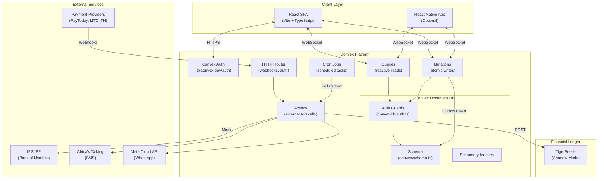
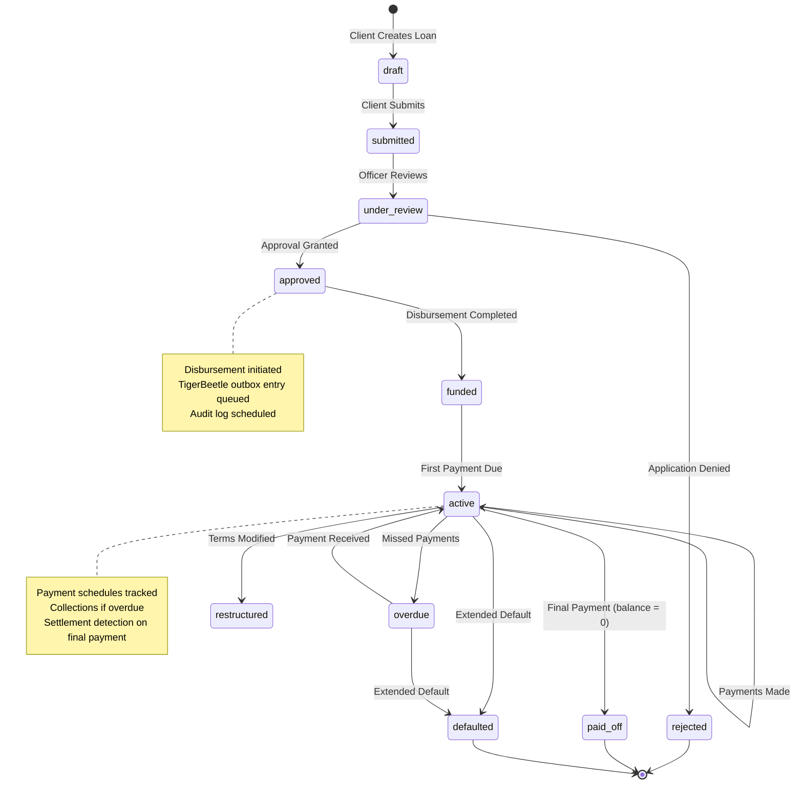
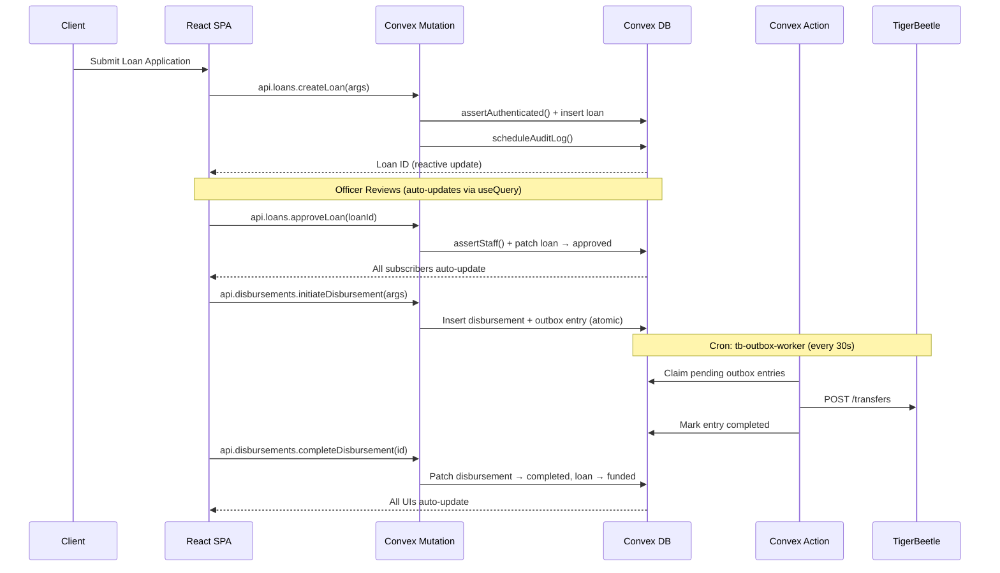
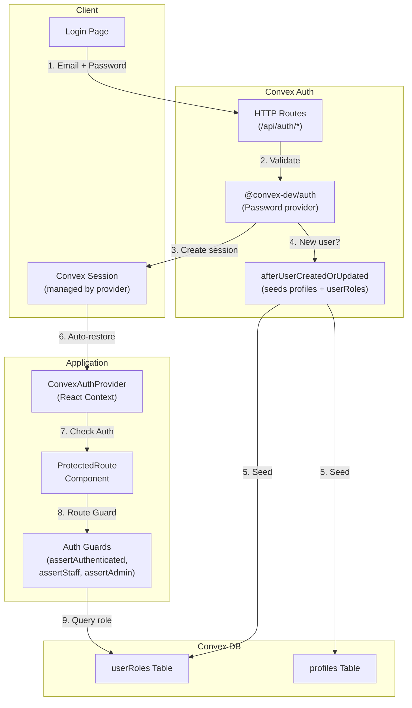

# NamLend Trust - System Architecture

**Last Updated**: 2026-03-22
**Aligned With**: Financial Ontology Engine (v5.1.0)
**Status**: Current ✅
**Previous Backend**: Supabase (PostgreSQL + RLS + Edge Functions) — retained for reference in `supabase/` (INACTIVE).

> Backend fully migrated to Convex (Feb 2026). Financial Ontology Engine implemented (Mar 2026). Frontend service migration complete. IPS adapter and TigerBeetle posting are mock/simulated.

---

## Table of Contents

- [System Overview](#system-overview)
- [Migration Summary](#migration-summary-supabase--convex)
- [Architecture Diagrams](#architecture-diagrams)
- [Client Layer](#client-layer)
- [Backend Layer (Convex)](#backend-layer-convex)
- [Convex Function Types](#convex-function-types)
- [Authorization Model](#authorization-model)
- [TigerBeetle Integration](#tigerbeetle-integration)
- [External Integrations](#external-integrations)
- [Scheduled Jobs](#scheduled-jobs)
- [Admin Architecture](#admin-architecture)
- [Observability and Safety](#observability-and-safety)
- [Known Architectural Gaps](#known-architectural-gaps)

---

## System Overview

NamLend Trust is a React SPA backed by **Convex** (reactive document-relational database with built-in server functions). The system integrates with multiple payment channels and exposes admin workflows for approvals, disbursements, collections, reconciliation, IPS, and settlement.

The backend was migrated from Supabase to Convex in February 2026. The frontend React SPA remains the same; only the data layer and server logic changed.

---

## Migration Summary: Supabase → Convex

| Aspect                | Before (Supabase)                          | After (Convex)                                           |
| --------------------- | ------------------------------------------ | -------------------------------------------------------- |
| **Database**          | PostgreSQL 15+ (relational, SQL)           | Document-relational (TypeScript, no SQL)                 |
| **Schema**            | 33 SQL migrations                          | `convex/schema.ts` (67+ tables incl. 12 ontology tables) |
| **Access control**    | 40+ RLS policies (SQL)                     | 5 guard functions in `convex/lib/auth.ts`                |
| **Server logic**      | 35+ RPCs + 18 Edge Functions (Deno)        | Queries, Mutations, Actions (TypeScript)                 |
| **Auth**              | GoTrue (JWT-based)                         | `@convex-dev/auth` (Password provider, session-based)    |
| **Transactions**      | Explicit `BEGIN/COMMIT`                    | Every mutation is automatically atomic (serializable)    |
| **Reactivity**        | Postgres LISTEN/NOTIFY + Realtime (opt-in) | Native — every `useQuery()` auto-subscribes              |
| **Scheduling**        | pg_cron + Edge Function timers             | Built-in `cronJobs()` + `ctx.scheduler`                  |
| **Type safety**       | Generated from SQL                         | End-to-end — schema → functions → client                 |
| **Client connection** | `supabase.from()` / `supabase.rpc()`       | `useQuery(api.module.fn)` / `useMutation(api.module.fn)` |

### Key Architectural Wins

1. **Automatic Reactivity** — Every `useQuery()` auto-updates when data changes. No manual subscriptions.
2. **ACID Transactions** — Every mutation is automatically serializable. No partial state possible.
3. **End-to-End Types** — Schema generates TypeScript types consumed directly by the frontend.
4. **Simplified Security** — 40+ RLS policies compressed into 5 auditable guard functions.
5. **No Connection Management** — No JWT refresh, no session listeners, no client configuration.

---

## Architecture Diagrams

### High-Level System Architecture (Convex)



### Loan Lifecycle Flow



### Data Flow: Loan Application to Disbursement (Convex)



### IPS/IPP Integration Flow

```mermaid
flowchart LR
    subgraph NamLend["NamLend Trust"]
        SPA["React SPA"]
        Adapter["ipsAdapter.ts<br/>(Convex Action)"]
        DB["ipsTransactions<br/>ipsApiLogs"]
    end

    subgraph IPS["IPS Switch (Bank of Namibia)"]
        Switch["IPS Central<br/>Switch"]
        Mapper["Central<br/>Mapper"]
    end

    subgraph Banks["Participating Banks"]
        FNB["FNB"]
        BWH["Bank Windhoek"]
        Other["Other Banks"]
    end

    SPA -->|1. Initiate| Adapter
    Adapter -->|2. Validate VPA| Mapper
    Mapper -->|3. Resolve Account| Switch
    Adapter -->|4. Submit pacs.008| Switch
    Switch -->|5. Route| Banks
    Banks -->|6. Confirm| Switch
    Switch -->|7. pacs.002 Status| Adapter
    Adapter -->|8. ctx.runMutation()| DB
    DB -->|9. Reactive update| SPA

    style Adapter fill:#f9f,stroke:#333
    style Switch fill:#bbf,stroke:#333
```

### Authentication & Authorization Flow (Convex)



### TigerBeetle Shadow Ledger Pattern (Convex)

```mermaid
flowchart LR
    subgraph Application["Convex Mutation"]
        Mutation["recordPayment /<br/>initiateDisbursement"]
    end

    subgraph Primary["Convex DB (Source of Truth)"]
        Tables["paymentTransactions /<br/>disbursements"]
        Outbox["tigerBeetleOutbox"]
    end

    subgraph Worker["Cron: tb-outbox-worker (30s)"]
        Action["processOutbox<br/>(Convex Action)"]
    end

    subgraph Shadow["Shadow Ledger"]
        TB["TigerBeetle<br/>localhost:3001"]
        Transfers["tigerBeetleTransfers"]
    end

    Mutation -->|1. Insert record| Tables
    Mutation -->|2. Insert outbox entry<br/>(SAME atomic tx)| Outbox
    Action -->|3. Claim pending| Outbox
    Action -->|4. POST /transfers| TB
    Action -->|5. Mark completed| Outbox
    Action -->|6. Record shadow| Transfers

    style Tables fill:#90EE90
    style TB fill:#FFB6C1
```

**Key guarantee**: The outbox entry is inserted in the **same atomic mutation** as the business record. If the mutation fails, neither the payment/disbursement nor the outbox entry is written.

### External Integrations (Current Wiring)

```
PayToday / MTC MoMo / TN Mobile
          | (webhooks)
          v
    convex/http.ts (HTTP Router)
          |
          v
    actions/ipsAdapter.handlePaymentWebhook()
          |
          v
      paymentTransactions (via ctx.runMutation)

IPS/IPP (mock adapter)
          |
          v
    actions/ipsAdapter.ts (Convex Action)
          |
          v
    ipsTransactions + ipsApiLogs

SMS / WhatsApp
          |
          v
    actions/sendSms.ts / actions/sendWhatsapp.ts
          |
          v
    communicationLogs + notificationQueue
```

---

## Client Layer

- React 18 SPA using `ConvexReactClient` for reactive server state.
- Connection: `VITE_CONVEX_URL` env var → `ConvexProvider` wrapping the app.
- `useQuery()` auto-subscribes to data changes (no manual polling or subscriptions).
- `useMutation()` for atomic writes with end-to-end type safety.
- Debug utilities gated by `VITE_DEBUG_TOOLS` and `VITE_RUN_DEV_SCRIPTS`.

### Frontend Data Access Pattern

```typescript
// Read — reactive, auto-updates on data change
import { useQuery } from 'convex/react';
import { api } from '@/integrations/convex/api';
const loans = useQuery(api.loans.getMyLoans);

// Write — type-safe, atomic
import { useMutation } from 'convex/react';
const createLoan = useMutation(api.loans.createLoan);
await createLoan({ principal: 50000, interestRate: 18, termMonths: 24 });
```

### Routes (Actual)

```
/                  Landing (Index)
/auth              Authentication (Convex Auth)
/dashboard         Client dashboard
/admin/*           Admin dashboard (requireLoanOfficer guard — loan_officer AND admin can access)
/loan-application  Loan application
/payment           Client payment
/loans/:id         Loan details
/kyc               KYC / Document verification
/budget            Budget tracker & finance management
*                  NotFound
```

### Layouts

- Client and admin dashboards share a sidebar-driven layout.
- Mobile uses collapsible sidebar and stacked cards.

---

## Backend Layer (Convex)

```
React SPA
  |
  | WebSocket (reactive queries + mutations)
  | HTTPS (auth, HTTP endpoints)
  v
Convex Platform
  - Auth (@convex-dev/auth, Password provider)
  - Queries (reactive reads with auth guards)
  - Mutations (atomic writes with auth guards)
  - Actions (external API calls — IPS, SMS, WhatsApp, TigerBeetle)
  - HTTP Router (webhooks, auth callbacks)
  - Cron Jobs (outbox worker, daily maintenance)
  - Document DB with secondary indexes
```

### Data Model Highlights

- `approvalRequests` drives loan application workflow.
- `loans`, `disbursements`, `paymentTransactions`, `paymentSchedules` are core lending records.
- `collectionsInteractions`, `promiseToPay`, `overdueReminders` track delinquency workflow.
- `notifications`, `notificationQueue`, `communicationLogs` power in-app/SMS/WhatsApp.
- `ipsTransactions`, `vpaRegistry`, `ipsApiLogs` track IPS/IPP activity (mock adapter).
- `settlement*` tables (13) support DNS settlement and reconciliation.
- `reconciliationRuns` and `bankTransactions` track bank reconciliation batches.
- `tigerBeetle*` tables (4) implement outbox + shadow ledger.
- `auditLogs`, `stateTransitions`, `viewLogs`, `complianceReports` for full audit trail.

---

## Convex Function Types

All server logic lives in the `convex/` directory as TypeScript functions:

| Type                  | Purpose               | DB Access                   | External IO | Called From               |
| --------------------- | --------------------- | --------------------------- | ----------- | ------------------------- |
| **Query**             | Read-only, reactive   | Yes (read)                  | No          | `useQuery()`              |
| **Mutation**          | Atomic writes         | Yes (read/write)            | No          | `useMutation()`           |
| **Action**            | External API calls    | Via `ctx.runMutation/Query` | Yes         | `useAction()`, schedulers |
| **Internal Query**    | Server-only reads     | Yes (read)                  | No          | Other server functions    |
| **Internal Mutation** | Server-only writes    | Yes (read/write)            | No          | Actions, schedulers       |
| **HTTP Action**       | HTTP endpoint handler | Via `ctx.runMutation/Query` | Yes         | External webhooks         |

### Convex Backend File Map

```
convex/
├── schema.ts                 # 55+ table definitions (SOURCE OF TRUTH)
├── auth.ts                   # Auth config + afterUserCreatedOrUpdated callback
├── auth.config.ts            # Convex Auth provider configuration
├── http.ts                   # HTTP router (webhooks, auth routes)
├── crons.ts                  # Cron job definitions (outbox + daily tasks)
├── lib/
│   ├── auth.ts               # Guard functions (assertAuthenticated, assertStaff, etc.)
│   ├── audit.ts              # Audit log helper (schedules internal mutations)
│   ├── pagination.ts         # Pagination utilities
│   ├── regulatory.ts         # APR_LIMIT, isValidAPR, formatNAD
│   └── xmlEscape.ts          # XML escaping for pacs messages
├── loans.ts                  # Loan CRUD + state transitions
├── payments.ts               # Payment recording + schedules
├── disbursements.ts          # Disbursement state machine
├── approvalWorkflow.ts       # Approval queue + workflow
├── loanApprovals.ts          # Loan approval helpers
├── loanDocuments.ts          # Document management
├── users.ts                  # User/profile management
├── notifications.ts          # In-app + queued notifications
├── collections.ts            # Collections queue + interactions
├── analytics.ts              # Portfolio/revenue/risk analytics
├── audit.ts                  # Audit log queries + compliance reports
├── reconciliation.ts         # Bank reconciliation
├── systemConfig.ts           # System configuration CRUD
├── actions/
│   ├── ipsAdapter.ts         # IPS outbound transfers + webhooks
│   ├── processLoanApplication.ts  # Server-side loan processing
│   ├── sendNotification.ts   # Multi-channel notification dispatch
│   ├── sendSms.ts            # Africa's Talking SMS
│   └── sendWhatsapp.ts       # Meta WhatsApp Business API
├── scheduled/
│   ├── tigerBeetleOutboxWorker.ts  # TB outbox polling + posting
│   └── dailyTasks.ts         # Overdue marking, PTP checks, notification queue
├── ips/                      # IPS domain (5 files)
├── settlement/               # Settlement domain (10 files)
└── tigerbeetle/              # TigerBeetle domain (4 files)
```

---

## Authorization Model

See [DATABASE_SCHEMA.md](./DATABASE_SCHEMA.md#authorization-model-replaces-rls) for full details.

Convex replaces RLS with explicit guard functions in `convex/lib/auth.ts`:

```typescript
// Every query/mutation starts with a guard call
export const getMyLoans = query({
  handler: async (ctx) => {
    const userId = await assertAuthenticated(ctx); // throws if not logged in
    return ctx.db
      .query('loans')
      .withIndex('by_userId', (q) => q.eq('userId', userId))
      .collect();
  },
});
```

| Guard                 | Access Level                |
| --------------------- | --------------------------- |
| `assertAuthenticated` | Any logged-in user          |
| `assertOwner`         | Resource owner only         |
| `assertOwnerOrStaff`  | Owner or loan_officer/admin |
| `assertStaff`         | loan_officer or admin       |
| `assertAdmin`         | admin only                  |

---

## Admin Architecture

Admin dashboard modules are organized by domain:

- **Loans**: approval queue, loan review, bulk actions
- **Payments**: disbursement manager, payment schedule viewer, reconciliation
- **Collections**: queue, interactions, promises
- **IPS/IPP**: onboarding dashboard, IPS health widget
- **Settlement**: runs, pacs.009 viewer, reports, adjustments
- **User Management**: roles, profiles, audits
- **Settings**: credit policy, TigerBeetle config, settlement config

All admin queries use `assertStaff(ctx)` or `assertAdmin(ctx)` guards in the Convex backend.

---

## Observability and Safety

- Error monitoring is client-side via `errorMonitoring.ts` and `SystemHealthDashboard`.
- Debug tooling is gated to prevent PII exposure in production.
- Every Convex query/mutation validates auth via guard functions before any DB access.
- Audit logs are written via `ctx.scheduler.runAfter()` to avoid blocking mutations.
- TigerBeetle outbox worker includes exponential backoff on failures (max 10 retries).

---

## Known Architectural Gaps

### Critical (Pre-Production Blockers) — ALL RESOLVED

1. ~~**Auth callback ↔ schema mismatch**~~ — **RESOLVED** (Feb 2026): Auth callback now inserts only schema-valid fields. See [DATABASE_SCHEMA.md](./DATABASE_SCHEMA.md#resolved-schema-issues-feb-2026-remediation).
2. ~~**`promiseToPay.status` mismatch**~~ — **RESOLVED** (Feb 2026): Code changed from `"fulfilled"` to `"kept"`.
3. ~~**Missing `paymentSchedules.by_status` index**~~ — **RESOLVED** (Feb 2026): Index added to `schema.ts`.

### Medium Risk

4. ~~**Internal mutations exposed publicly**~~ — **RESOLVED** (Feb 2026): `markFunded` and `updateLoanBalance` in `loans.ts` converted from `mutation` to `internalMutation`. Analytics queries capped with `.take(10000)` safety limits.
5. **IPS adapter is mock** — Production IPS API + mTLS not wired.
6. **TigerBeetle outbox worker simulates posting** — No live TB cluster integration.
7. **`/admin/*` route guard** — loan_officer AND admin access allowed via `requireLoanOfficer` guard.

### Low Risk

8. ~~**Legacy Supabase services**~~ — **RESOLVED (2026-03-04)**: `src/services/` migration complete. 4 files remain with active consumers: `api-client.ts` (Convex-compatible http client), `brandingService.ts`, `creditScoring.ts` (client-side scoring), `scoringRules.ts`. These are not Supabase services — they are active utilities. See [SERVICES.md](./SERVICES.md) for details.
9. **Convex has no built-in file storage** — KYC document uploads need a storage solution (Convex file storage or external).
10. **No CI/CD pipeline** — GitHub Actions not configured for Convex deploy.

---

## Financial Ontology Engine (Mar 2026)

The system was extended with a **Financial Ontology Engine** — 6 architectural layers that transform the database from a flat lending app into a knowledge graph of financial reality. See [ONTOLOGY_ENGINE.md](./ONTOLOGY_ENGINE.md) for the full implementation report.

### Ontology Architecture

```
Layer 6: Product Engine          — configurable financial products + eligibility
Layer 5: Payment Rails           — intelligent routing with cost/speed scoring
Layer 4: Multi-Institution       — tenant isolation + temporal config
Layer 3: Knowledge Graph         — typed entity relationships with BFS traversal
Layer 2: Mandates & Consent      — debit authorization + POPIA compliance
Layer 1: Event Journal & Temporal — unified event stream + point-in-time snapshots
```

### Key Patterns

- **Audit bridge**: `scheduleAuditLog()` in `convex/lib/audit.ts` auto-emits event journal entries — every existing audit call populates the unified event stream without separate `emitEvent()` calls. Accepts optional `correlationId`/`causationId` for chain threading.
- **Fire-and-forget emission**: `emitEvent()` and `emitRelationship()` use `ctx.scheduler.runAfter(0, ...)` to decouple side-effects from the main mutation path
- **Close-and-insert temporal versioning**: Config and product versions are never updated — old records get `effectiveTo` set, new records are inserted with `effectiveFrom`
- **Pure scoring functions**: `selectOptimalRail()` is a pure function called inside mutations — rails are queried first, then passed into the scorer
- **Graceful degradation**: All ontology features are additive — rail selection skips if no rails seeded, product validation skips if no `productVersionId`, institution scoping passes through unscoped records

### Adoption Metrics (v5.1.0)

- **Event journal coverage**: ~95% of financial mutations emit events (via audit bridge)
- **Relationship graph**: 25 emissions across core + ontology modules
- **Correlation infrastructure**: `loans.correlationId` + `eventJournal.by_causationId` index + `getEventsByCausation` query (threading not yet active in lifecycle flows)

### New Directories

```
convex/ontology/     # 10 domain modules (eventJournal, relationships, mandates, etc.)
convex/lib/          # 6 new helpers (eventEmitter, temporal, relationshipEmitter, railSelector, mandateStateMachine, institutionScope)
convex/scheduled/    # 3 new cron workers (mandateExecutor, snapshotGenerator, railHealthMonitor)
```

### Cron Jobs (updated)

| Job                   | Interval        | Handler                                                |
| --------------------- | --------------- | ------------------------------------------------------ |
| `tb-outbox-worker`    | Every 30s       | `scheduled/tigerBeetleOutboxWorker.processOutbox`      |
| `daily-tasks`         | Daily 06:00 UTC | `scheduled/dailyTasks.runDailyTasks`                   |
| `eod-snapshot`        | Daily 23:30 UTC | `scheduled/snapshotGenerator.generateEndOfDaySnapshot` |
| `mandate-executor`    | Daily 06:00 UTC | `scheduled/mandateExecutor.executeDueMandates`         |
| `rail-health-monitor` | Every 5 min     | `scheduled/railHealthMonitor.checkRailHealth`          |

---

## Legacy Supabase Reference

The previous Supabase backend is retained in the repository for reference:

```
supabase/
├── migrations/        # 33 PostgreSQL migrations (INACTIVE)
├── functions/         # 18 Deno Edge Functions (INACTIVE)
└── config.toml        # Local Supabase config (INACTIVE)

src/services/          # 4 active utility files (api-client, brandingService, creditScoring, scoringRules)
src/integrations/supabase/  # Supabase client + types (LEGACY — retained for reference)
```

These files document the previous architecture and can be used as reference during frontend service migration. They should NOT be used for new development.

---

## See Also

- [INDEX.md](./INDEX.md) - Documentation index
- [ONTOLOGY_ENGINE.md](./ONTOLOGY_ENGINE.md) - Financial Ontology Engine implementation report
- [ARCHITECTURAL_REVIEW.md](./ARCHITECTURAL_REVIEW.md) - Modularization plan & domain event bus roadmap
- [DATABASE_SCHEMA.md](./DATABASE_SCHEMA.md) - Database tables and relationships (Convex)
- [SERVICES.md](./SERVICES.md) - Service layer implementation details (legacy Supabase)
- [FLOWS.md](./FLOWS.md) - User flow documentation
- [IPP_INTEGRATION.md](./IPP_INTEGRATION.md) - IPS/IPP integration details
- [TIGERBEETLE_IMPLEMENTATION.md](./TIGERBEETLE_IMPLEMENTATION.md) - Financial ledger setup
- [SECURITY.md](./SECURITY.md) - Security implementation (now auth guards)
- [context.md](./context.md) - Complete technical handover
