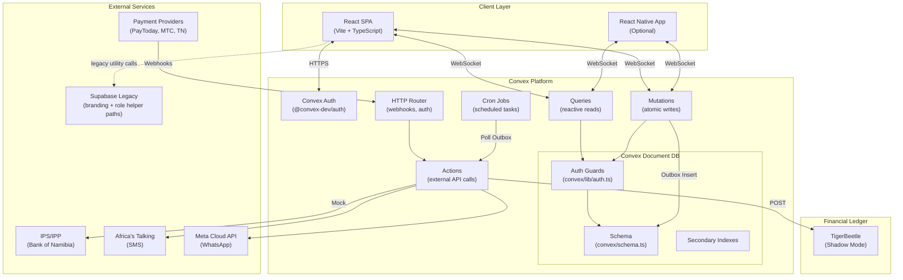
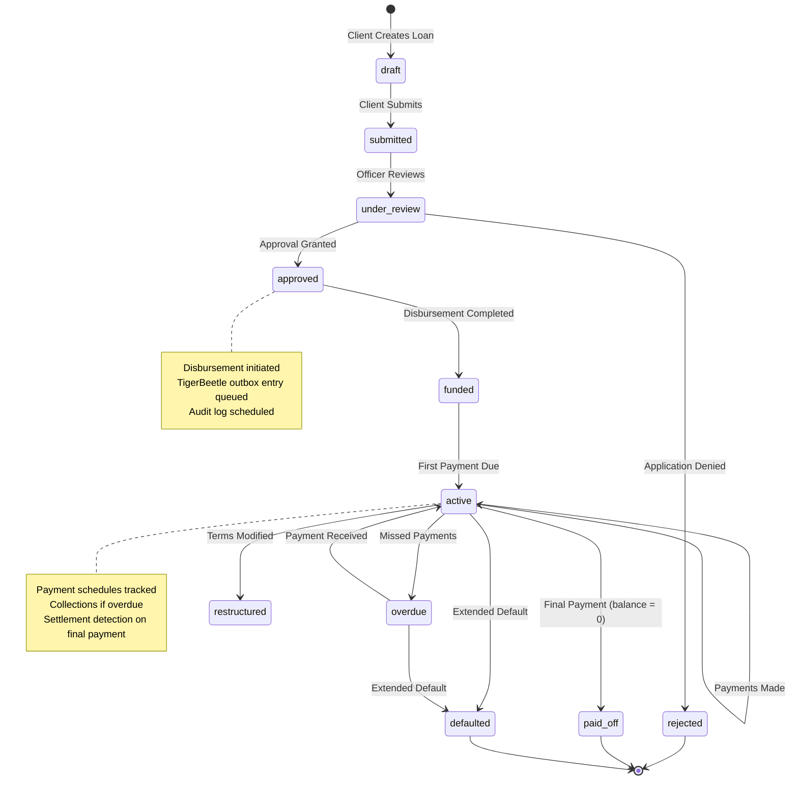
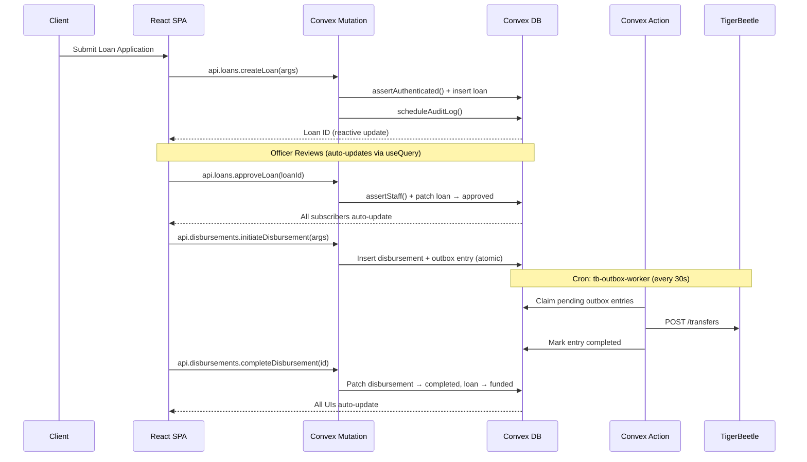
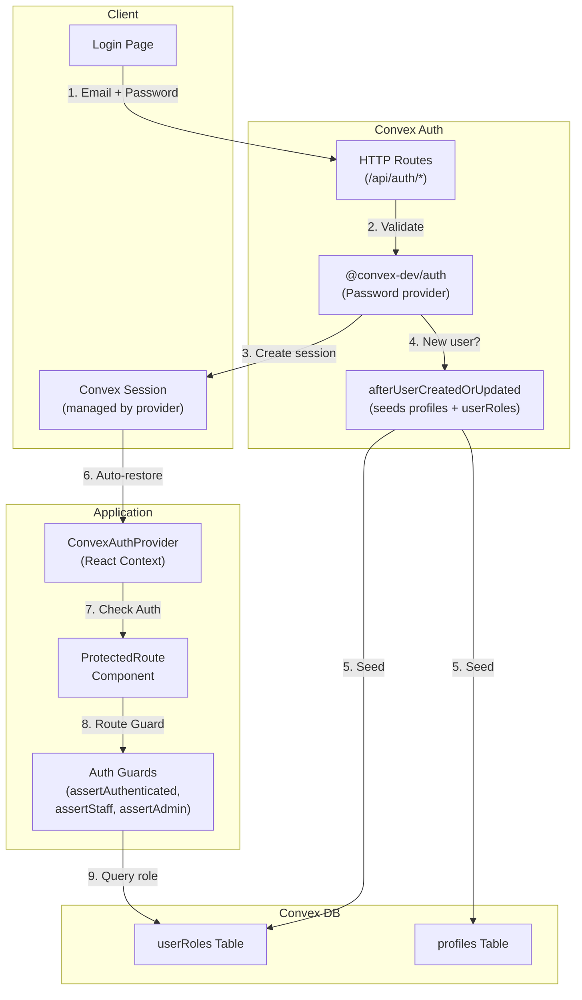

# NamLend Trust - System Architecture

**Last Updated**: 2026-04-28
**Aligned With**: Financial Ontology Engine (v5.2.1)
**Status**: Current with documented legacy islands
**Primary Backend**: Convex (database, auth, server functions, HTTP router, scheduled jobs)
**Legacy Boundary**: Supabase is retained for reference and still used by selected frontend utility paths.

> Backend financial workflows are Convex-first. Supabase is not the active lending/payment backend, but it is not fully inactive: branding configuration/assets and role-assignment helper paths still call Supabase RPC, Storage, or Edge Function APIs. IPS transport and TigerBeetle posting remain production-hardening items.

---

## Table of Contents

- [System Overview](#system-overview)
- [Migration Summary](#migration-summary-supabase--convex)
- [Architecture Diagrams](#architecture-diagrams)
- [Client Layer](#client-layer)
- [Backend Layer (Convex)](#backend-layer-convex)
- [Convex Function Types](#convex-function-types)
- [Authorization Model](#authorization-model)
- [TigerBeetle Integration](#tigerbeetle-integration)
- [External Integrations](#external-integrations)
- [Scheduled Jobs](#scheduled-jobs)
- [Admin Architecture](#admin-architecture)
- [Observability and Safety](#observability-and-safety)
- [Known Architectural Gaps](#known-architectural-gaps)

---

## System Overview

NamLend Trust is a React SPA backed primarily by **Convex** (reactive document-relational database with built-in server functions). The system integrates with multiple payment channels and exposes admin workflows for approvals, disbursements, collections, reconciliation, IPS, settlement, ontology administration, and operational reporting.

The backend migrated from Supabase to Convex in February 2026. The current implementation is Convex-first, but a small set of legacy Supabase utilities remains in the web layer and must be treated as active migration debt, not historical-only code.

---

## Migration Summary: Supabase → Convex

| Aspect                | Before (Supabase)                          | After (Convex)                                                                             |
| --------------------- | ------------------------------------------ | ------------------------------------------------------------------------------------------ |
| **Database**          | PostgreSQL 15+ (relational, SQL)           | Document-relational (TypeScript, no SQL)                                                   |
| **Schema**            | 33 SQL migrations                          | `convex/schema.ts` (66 app tables + Convex Auth tables)                                    |
| **Access control**    | 40+ RLS policies (SQL)                     | 5 guard functions in `convex/lib/auth.ts`                                                  |
| **Server logic**      | 35+ RPCs + 18 Edge Functions (Deno)        | Queries, Mutations, Actions (TypeScript)                                                   |
| **Auth**              | GoTrue (JWT-based)                         | `@convex-dev/auth` (Password provider, session-based)                                      |
| **Transactions**      | Explicit `BEGIN/COMMIT`                    | Every mutation is automatically atomic (serializable)                                      |
| **Reactivity**        | Postgres LISTEN/NOTIFY + Realtime (opt-in) | Native — every `useQuery()` auto-subscribes                                                |
| **Scheduling**        | pg_cron + Edge Function timers             | Built-in `cronJobs()` + `ctx.scheduler`                                                    |
| **Type safety**       | Generated from SQL                         | End-to-end — schema → functions → client                                                   |
| **Client connection** | `supabase.from()` / `supabase.rpc()`       | `useQuery(api.module.fn)` / `useMutation(api.module.fn)` with documented legacy exceptions |

### Key Architectural Wins

1. **Automatic Reactivity** — Every `useQuery()` auto-updates when data changes. No manual subscriptions.
2. **ACID Transactions** — Every mutation is automatically serializable. No partial state possible.
3. **End-to-End Types** — Schema generates TypeScript types consumed directly by the frontend.
4. **Simplified Security Model** — RLS was replaced by explicit guard functions in `convex/lib/auth.ts`; every public Convex query/mutation must enforce the correct guard.
5. **No Connection Management** — No JWT refresh, no session listeners, no client configuration.

---

## Architecture Diagrams

### High-Level System Architecture (Convex)



### Loan Lifecycle Flow



### Data Flow: Loan Application to Disbursement (Convex)



### IPS/IPP Integration Flow

```mermaid
flowchart LR
    subgraph NamLend["NamLend Trust"]
        SPA["React SPA"]
        Adapter["ipsAdapter.ts<br/>(Convex Action)"]
        DB["ipsTransactions<br/>ipsApiLogs"]
    end

    subgraph IPS["IPS Switch (Bank of Namibia)"]
        Switch["IPS Central<br/>Switch"]
        Mapper["Central<br/>Mapper"]
    end

    subgraph Banks["Participating Banks"]
        FNB["FNB"]
        BWH["Bank Windhoek"]
        Other["Other Banks"]
    end

    SPA -->|1. Initiate| Adapter
    Adapter -->|2. Validate VPA| Mapper
    Mapper -->|3. Resolve Account| Switch
    Adapter -->|4. Submit pacs.008| Switch
    Switch -->|5. Route| Banks
    Banks -->|6. Confirm| Switch
    Switch -->|7. pacs.002 Status| Adapter
    Adapter -->|8. ctx.runMutation()| DB
    DB -->|9. Reactive update| SPA

    style Adapter fill:#f9f,stroke:#333
    style Switch fill:#bbf,stroke:#333
```

### Authentication & Authorization Flow (Convex)



### TigerBeetle Shadow Ledger Pattern (Convex)

```mermaid
flowchart LR
    subgraph Application["Convex Mutation"]
        Mutation["recordPayment /<br/>initiateDisbursement"]
    end

    subgraph Primary["Convex DB (Source of Truth)"]
        Tables["paymentTransactions /<br/>disbursements"]
        Outbox["tigerBeetleOutbox"]
    end

    subgraph Worker["Cron: tb-outbox-worker (30s)"]
        Action["processOutbox<br/>(Convex Action)"]
    end

    subgraph Shadow["Shadow Ledger"]
        TB["TigerBeetle<br/>localhost:3001"]
        Transfers["tigerBeetleTransfers"]
    end

    Mutation -->|1. Insert record| Tables
    Mutation -->|2. Insert outbox entry<br/>(SAME atomic tx)| Outbox
    Action -->|3. Claim pending| Outbox
    Action -->|4. POST /transfers| TB
    Action -->|5. Mark completed| Outbox
    Action -->|6. Record shadow| Transfers

    style Tables fill:#90EE90
    style TB fill:#FFB6C1
```

**Key guarantee**: The outbox entry is inserted in the **same atomic mutation** as the business record. If the mutation fails, neither the payment/disbursement nor the outbox entry is written.

### External Integrations (Current Wiring)

```
PayToday / MTC MoMo / TN Mobile
          | (webhooks)
          v
    convex/http.ts (HTTP Router)
          |
          v
    actions/ipsAdapter.handlePaymentWebhook()
          |
          v
      paymentTransactions (via ctx.runMutation)

IPS/IPP (async XML over HTTPS — mock or live per IPS_PROTOCOL_MODE)
          |
          v
    actions/ipsAdapter.ts           (payments: ReqPay, ReqChkTxn, ReqHbt, ReqBalEnq)
    actions/ipsAliasAdapter.ts      (aliases: ReqRegMapper, ReqGetAdd)
    actions/ipsOnboardingAdapter.ts (onboarding: ReqRegMob, ReqListAccPvd, ReqOtp, ReqSetCre)
          |
          v
    ipsTransactions + ipsAliasDirectory + ipsApiLogs

SMS / WhatsApp
          |
          v
    actions/sendSms.ts / actions/sendWhatsapp.ts
          |
          v
    communicationLogs + notificationQueue

Supabase legacy islands
          |
          v
    src/services/creditScoring.ts deprecated adapter paths
    src/utils/rpc.ts and src/utils/testUtils.ts
          |
          v
    Supabase RPC / legacy test APIs
```

The Supabase paths above are active technical debt. They should not be used as patterns for new work, and they should be migrated or removed before Supabase credentials are retired.

---

## Client Layer

- React 18 SPA using `ConvexReactClient` for reactive server state.
- Connection: `VITE_CONVEX_URL` env var → `ConvexProvider` wrapping the app.
- `useQuery()` auto-subscribes to data changes (no manual polling or subscriptions).
- `useMutation()` for atomic writes with end-to-end type safety.
- Debug utilities gated by `VITE_DEBUG_TOOLS` and `VITE_RUN_DEV_SCRIPTS`.

### Frontend Data Access Pattern

```typescript
// Read — reactive, auto-updates on data change
import { useQuery } from 'convex/react';
import { api } from '@/integrations/convex/api';
const loans = useQuery(api.loans.getMyLoans);

// Write — type-safe, atomic
import { useMutation } from 'convex/react';
const createLoan = useMutation(api.loans.createLoan);
await createLoan({ principal: 50000, interestRate: 18, termMonths: 24 });
```

### Routes (Actual)

```
/                  Landing (Index)
/auth              Authentication (Convex Auth)
/dashboard         Client dashboard
/admin/*           Admin dashboard (requireLoanOfficer guard — loan_officer AND admin can access)
/loan-application  Loan application
/payment           Client payment
/loans/:id         Loan details
/kyc               KYC / Document verification
/budget            Budget tracker & finance management
*                  NotFound
```

### Layouts

All authenticated client pages use `DashboardLayout` (`src/components/Layout/DashboardLayout.tsx`) which provides:

- `AdaptiveShell` — viewport-aware shell that switches compact drawer, medium rail, and desktop sidebar modes
- `ThemedSidebar` — client navigation with drawer/rail/sidebar display modes and role-based menu items
- Sticky header with page title and notification center
- Scrollable main content area (`max-w-7xl`)
- Compact client bottom navigation for the core flows: overview, loans, applications, payments, and profile where available

Pages on their own routes (`/budget`, `/kyc`, `/payment`, `/loan-application`, `/loans/:id`) each implement a `handleTabChange` function that routes sidebar tab clicks: internal tabs stay local, everything else navigates to `/dashboard` with `location.state.tab` for cross-page tab switching.

The public `Header` component (`src/components/Header.tsx`) is used ONLY on unauthenticated pages (landing page `Index.tsx`). **Do not use `Header` on any authenticated page.**

Admin uses a routed layout at `/admin/*` with grouped sidebar navigation (direct links, not tab state). `AdminLayout` also uses `AdaptiveShell`: compact screens get a grouped drawer, medium screens get a rail, and desktop/wide screens get a permanent grouped sidebar.

See [ADAPTIVE_UI.md](./ADAPTIVE_UI.md) for the adaptive shell contract and viewport matrix. See [DESIGN_SYSTEM.md](./DESIGN_SYSTEM.md) for component styling. See [UI_DESIGN.md](./UI_DESIGN.md) for theme-specific sidebar styling.

---

## Backend Layer (Convex)

```
React SPA
  |
  | WebSocket (reactive queries + mutations)
  | HTTPS (auth, HTTP endpoints)
  v
Convex Platform
  - Auth (@convex-dev/auth, Password provider)
  - Queries (reactive reads with auth guards)
  - Mutations (atomic writes with auth guards)
  - Actions (external API calls — IPS, SMS, WhatsApp, TigerBeetle)
  - HTTP Router (webhooks, auth callbacks)
  - Cron Jobs (outbox worker, daily maintenance)
  - Document DB with secondary indexes
```

### Data Model Highlights

- `approvalRequests` drives loan application workflow.
- `loans`, `disbursements`, `paymentTransactions`, `paymentSchedules` are core lending records.
- `collectionsInteractions`, `promiseToPay`, `overdueReminders` track delinquency workflow.
- `notifications`, `notificationQueue`, `communicationLogs` power in-app/SMS/WhatsApp.
- `ipsTransactions`, `ipsAliasDirectory`, `ipsApiLogs`, `ipsOnboardingApplications`, `ipsDeviceBindings` track IPS/IPP activity. `vpaRegistry` is legacy (being replaced by `ipsAliasDirectory`).
- `settlement*` tables (13) support DNS settlement and reconciliation.
- `reconciliationRuns` and `bankTransactions` track bank reconciliation batches.
- `tigerBeetle*` tables (4) implement outbox + shadow ledger.
- `auditLogs`, `stateTransitions`, `viewLogs`, `complianceReports` for full audit trail.

---

## Convex Function Types

All server logic lives in the `convex/` directory as TypeScript functions:

| Type                  | Purpose               | DB Access                   | External IO | Called From               |
| --------------------- | --------------------- | --------------------------- | ----------- | ------------------------- |
| **Query**             | Read-only, reactive   | Yes (read)                  | No          | `useQuery()`              |
| **Mutation**          | Atomic writes         | Yes (read/write)            | No          | `useMutation()`           |
| **Action**            | External API calls    | Via `ctx.runMutation/Query` | Yes         | `useAction()`, schedulers |
| **Internal Query**    | Server-only reads     | Yes (read)                  | No          | Other server functions    |
| **Internal Mutation** | Server-only writes    | Yes (read/write)            | No          | Actions, schedulers       |
| **HTTP Action**       | HTTP endpoint handler | Via `ctx.runMutation/Query` | Yes         | External webhooks         |

### Convex Backend File Map

```
convex/
├── schema.ts                 # 66 application tables + Convex Auth tables (SOURCE OF TRUTH)
├── auth.ts                   # Auth config + afterUserCreatedOrUpdated callback
├── auth.config.ts            # Convex Auth provider configuration
├── http.ts                   # HTTP router (webhooks, auth routes)
├── crons.ts                  # Cron job definitions (outbox + daily tasks)
├── lib/
│   ├── auth.ts               # Guard functions (assertAuthenticated, assertStaff, etc.)
│   ├── audit.ts              # Audit log helper (schedules internal mutations)
│   ├── pagination.ts         # Pagination utilities
│   ├── regulatory.ts         # APR_LIMIT, isValidAPR, formatNAD
│   └── xmlEscape.ts          # XML escaping for pacs messages
├── loans.ts                  # Loan CRUD + state transitions
├── payments.ts               # Payment recording + schedules
├── disbursements.ts          # Disbursement state machine
├── approvalWorkflow.ts       # Approval queue + workflow
├── loanApprovals.ts          # Loan approval helpers
├── loanDocuments.ts          # Document management
├── users.ts                  # User/profile management
├── notifications.ts          # In-app + queued notifications
├── collections.ts            # Collections queue + interactions
├── analytics.ts              # Portfolio/revenue/risk analytics
├── audit.ts                  # Audit log queries + compliance reports
├── reconciliation.ts         # Bank reconciliation
├── systemConfig.ts           # System configuration CRUD
├── actions/
│   ├── ipsAdapter.ts         # IPS payment + utility APIs (ReqPay, ReqChkTxn, ReqHbt, ReqBalEnq)
│   ├── ipsAliasAdapter.ts    # IPN Alias Directory (ReqRegMapper, ReqGetAdd)
│   ├── ipsOnboardingAdapter.ts # IPS onboarding APIs (ReqRegMob, ReqListAccPvd, ReqOtp, ReqSetCre)
│   ├── processLoanApplication.ts  # Server-side loan processing
│   ├── sendNotification.ts   # Multi-channel notification dispatch
│   ├── sendSms.ts            # Africa's Talking SMS
│   └── sendWhatsapp.ts       # Meta WhatsApp Business API
├── scheduled/
│   ├── tigerBeetleOutboxWorker.ts  # TB outbox polling + posting
│   └── dailyTasks.ts         # Overdue marking, PTP checks, notification queue
├── ips/                      # IPS domain (7 files: transactions, VPA, onboarding, alias directory, API logs, alerts)
├── settlement/               # Settlement domain (10 files)
└── tigerbeetle/              # TigerBeetle domain (4 files)
```

---

## Authorization Model

See [DATABASE_SCHEMA.md](./DATABASE_SCHEMA.md#authorization-model-replaces-rls) for full details.

Convex replaces RLS with explicit guard functions in `convex/lib/auth.ts`:

```typescript
// Every query/mutation starts with a guard call
export const getMyLoans = query({
  handler: async (ctx) => {
    const userId = await assertAuthenticated(ctx); // throws if not logged in
    return ctx.db
      .query('loans')
      .withIndex('by_userId', (q) => q.eq('userId', userId))
      .collect();
  },
});
```

| Guard                 | Access Level                |
| --------------------- | --------------------------- |
| `assertAuthenticated` | Any logged-in user          |
| `assertOwner`         | Resource owner only         |
| `assertOwnerOrStaff`  | Owner or loan_officer/admin |
| `assertStaff`         | loan_officer or admin       |
| `assertAdmin`         | admin only                  |

---

## Admin Architecture

Admin dashboard modules are organized by domain:

- **Loans**: approval queue, loan review, bulk actions
- **Payments**: disbursement manager, payment schedule viewer, reconciliation
- **Collections**: queue, interactions, promises
- **IPS/IPP**: onboarding dashboard, IPS health widget
- **Settlement**: runs, pacs.009 viewer, reports, adjustments
- **User Management**: roles, profiles, audits
- **Settings**: credit policy, TigerBeetle config, settlement config

All admin queries use `assertStaff(ctx)` or `assertAdmin(ctx)` guards in the Convex backend.

---

## Observability and Safety

- Error monitoring is client-side via `errorMonitoring.ts` and `SystemHealthDashboard`.
- Debug tooling is gated to prevent PII exposure in production.
- Every Convex query/mutation validates auth via guard functions before any DB access.
- Audit logs are written via `ctx.scheduler.runAfter()` to avoid blocking mutations. This improves availability, but audit persistence is asynchronous and must be monitored as a separate reliability surface.
- TigerBeetle outbox worker includes exponential backoff on failures, but the current worker posts to a hardcoded local shadow endpoint rather than a production TigerBeetle cluster.

---

## Known Architectural Gaps

### High Risk

1. **Authorization guard coverage requires audit** — most Convex APIs call guards, but several read/write functions authenticate without clearly enforcing owner-or-staff authorization on returned or linked records. Current examples to review: `approvalWorkflow.getApprovalRequest`, `ipsTransactions.getTransaction`, `ipsTransactions.getTransactionByMsgId`, `ipsAliasDirectory.getAliasByAddr`, `ipsAlerts.createAlert`, and `mandates.createMandate`.
2. **Supabase legacy paths remain in utilities/tests** — runtime branding and role assignment are Convex-backed, but `creditScoring.ts`, `rpc.ts`, and legacy test utilities still retain Supabase adapters.
3. **TigerBeetle is shadow/simulated** — financial mutations enqueue outbox records, but posting is not a production ledger authority.
4. **IPS production readiness is incomplete** — XML protocol support exists, but production use depends on `IPS_PROTOCOL_MODE`, mTLS/certificate configuration, BoN connectivity, and operational runbooks.

### Medium Risk

5. **Audit logging is asynchronous** — financial mutations can commit before audit writes complete. This is intentional for availability, but it requires monitoring of scheduled audit failures and event-journal coverage.
6. **Data retention is not consistently reflected in tests** — several E2E/API utilities still hard-delete financial records for cleanup, conflicting with the 7-year retention rule.
7. **Documentation and agent instructions drift can recur** — root and scoped `AGENTS.md` files previously described Supabase/RLS/RPC as primary architecture. This documentation pass realigns them, but they must be kept aligned with this document.
8. **Quality gate gaps** — `npm run typecheck` is documented but missing from `package.json`; lint passes with warnings; docs lint fails broadly in imported IPP/reference documents.

### Low Risk

9. **Bundle and styling warnings** — production build passes, but Tailwind reports ambiguous arbitrary easing utilities and the generated bundle has large shared UI/chart chunks.
10. **Historical docs remain mixed with active docs** — `docs_old/` and some root docs are useful references, but active docs must clearly label legacy Supabase content.

---

## Financial Ontology Engine (Mar 2026)

The system was extended with a **Financial Ontology Engine** — 6 architectural layers that transform the database from a flat lending app into a knowledge graph of financial reality. See [ONTOLOGY_ENGINE.md](./ONTOLOGY_ENGINE.md) for the full implementation report.

### Ontology Architecture

```
Layer 6: Product Engine          — configurable financial products + eligibility
Layer 5: Payment Rails           — intelligent routing with cost/speed scoring
Layer 4: Multi-Institution       — tenant isolation + temporal config
Layer 3: Knowledge Graph         — typed entity relationships with BFS traversal
Layer 2: Mandates & Consent      — debit authorization + POPIA compliance
Layer 1: Event Journal & Temporal — unified event stream + point-in-time snapshots
```

### Key Patterns

- **Audit bridge**: `scheduleAuditLog()` in `convex/lib/audit.ts` auto-emits event journal entries — every existing audit call populates the unified event stream without separate `emitEvent()` calls. Accepts optional `correlationId`/`causationId` for chain threading.
- **Fire-and-forget emission**: `emitEvent()` and `emitRelationship()` use `ctx.scheduler.runAfter(0, ...)` to decouple side-effects from the main mutation path
- **Close-and-insert temporal versioning**: Config and product versions are never updated — old records get `effectiveTo` set, new records are inserted with `effectiveFrom`
- **Pure scoring functions**: `selectOptimalRail()` is a pure function called inside mutations — rails are queried first, then passed into the scorer
- **Graceful degradation**: All ontology features are additive — rail selection skips if no rails seeded, product validation skips if no `productVersionId`, institution scoping passes through unscoped records

### Adoption Metrics (v5.2.1)

- **Domain event coverage**: ~95% of financial mutations emit semantic domain events (23 event types in `domainEvents.ts`) + audit bridge events
- **Relationship graph**: 25+ emissions across core + ontology modules
- **Event-driven projections**: 10 projection handlers in `portfolioProjection.ts` (loan created/submitted/rejected/approved/funded/paid_off, payment completed/failed, disbursement completed/failed)
- **Business rules consumed**: 5 data-driven rules (APR_LIMIT, MIN_CREDIT_SCORE, MAX_DTI_RATIO, RAIL_WEIGHTS, DATA_RETENTION_YEARS) — changeable via admin UI, no deploy needed
- **Correlation infrastructure**: `loans.correlationId` + `eventJournal.by_causationId` index + `getEventsByCausation` query (threading not yet active in lifecycle flows)

See [ONTOLOGY_ENGINE.md](./ONTOLOGY_ENGINE.md) for the full implementation report including phase-by-phase details.

### New Directories

```
convex/ontology/     # 10 domain modules (eventJournal, relationships, mandates, etc.)
convex/lib/          # 6 new helpers (eventEmitter, temporal, relationshipEmitter, railSelector, mandateStateMachine, institutionScope)
convex/scheduled/    # 3 new cron workers (mandateExecutor, snapshotGenerator, railHealthMonitor)
```

### Cron Jobs (updated)

| Job                   | Interval        | Handler                                                |
| --------------------- | --------------- | ------------------------------------------------------ |
| `tb-outbox-worker`    | Every 30s       | `scheduled/tigerBeetleOutboxWorker.processOutbox`      |
| `daily-tasks`         | Daily 06:00 UTC | `scheduled/dailyTasks.runDailyTasks`                   |
| `eod-snapshot`        | Daily 23:30 UTC | `scheduled/snapshotGenerator.generateEndOfDaySnapshot` |
| `mandate-executor`    | Daily 06:00 UTC | `scheduled/mandateExecutor.executeDueMandates`         |
| `rail-health-monitor` | Every 5 min     | `scheduled/railHealthMonitor.checkRailHealth`          |

---

## Legacy Supabase Reference

The previous Supabase backend is retained in the repository for reference, and a few web utility paths still call it:

```
supabase/
├── migrations/        # PostgreSQL migrations (legacy/reference)
├── functions/         # Deno Edge Functions (legacy/reference; some helper names still referenced)
└── config.toml        # Local Supabase config (legacy/reference)

src/services/creditScoring.ts         # mixed pure scoring + deprecated Supabase adapter paths
src/utils/rpc.ts                      # legacy Supabase RPC wrapper
src/utils/testUtils.ts                # legacy Supabase test helpers
src/integrations/supabase/            # legacy client + generated types used by those paths/tests
```

Do not use Supabase patterns for new application work. New server-side behavior belongs in `convex/`, and existing Supabase utility paths should be retired or explicitly documented until migration is complete.

---

## See Also

- [INDEX.md](./INDEX.md) - Documentation index
- [ONTOLOGY_ENGINE.md](./ONTOLOGY_ENGINE.md) - Financial Ontology Engine implementation report
- [ARCHITECTURAL_REVIEW.md](./ARCHITECTURAL_REVIEW.md) - Modularization plan & domain event bus roadmap
- [DATABASE_SCHEMA.md](./DATABASE_SCHEMA.md) - Database tables and relationships (Convex)
- [SERVICES.md](./SERVICES.md) - Service layer and legacy island inventory
- [FLOWS.md](./FLOWS.md) - User flow documentation
- [IPP_INTEGRATION.md](./IPP_INTEGRATION.md) - IPS/IPP integration details
- [TIGERBEETLE_IMPLEMENTATION.md](./TIGERBEETLE_IMPLEMENTATION.md) - Financial ledger setup
- [SECURITY.md](./SECURITY.md) - Security implementation (now auth guards)
- [context.md](./context.md) - Complete technical handover
