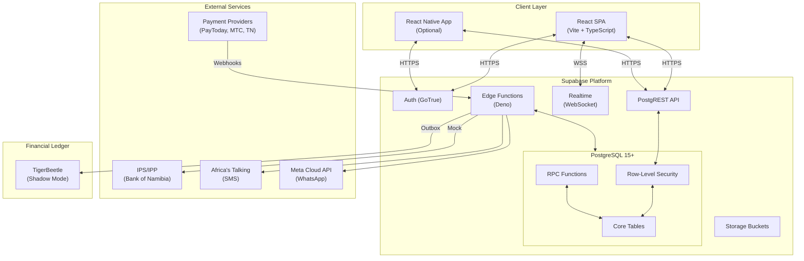
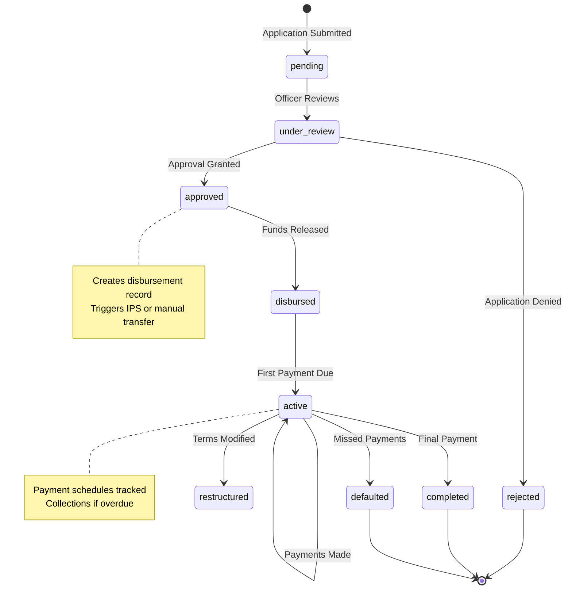
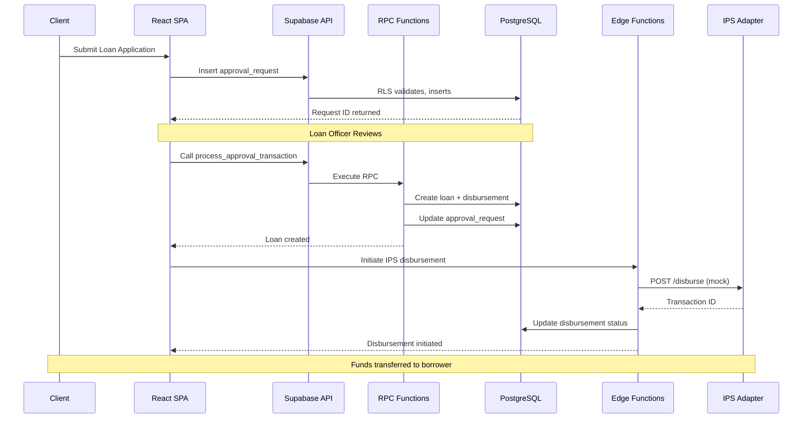
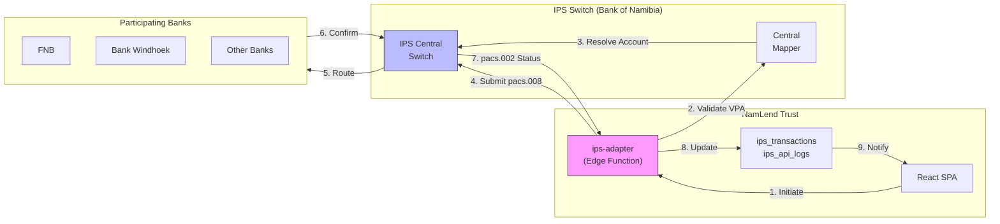
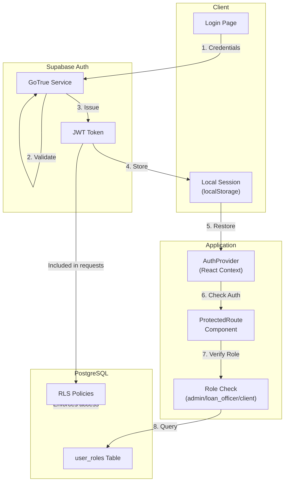
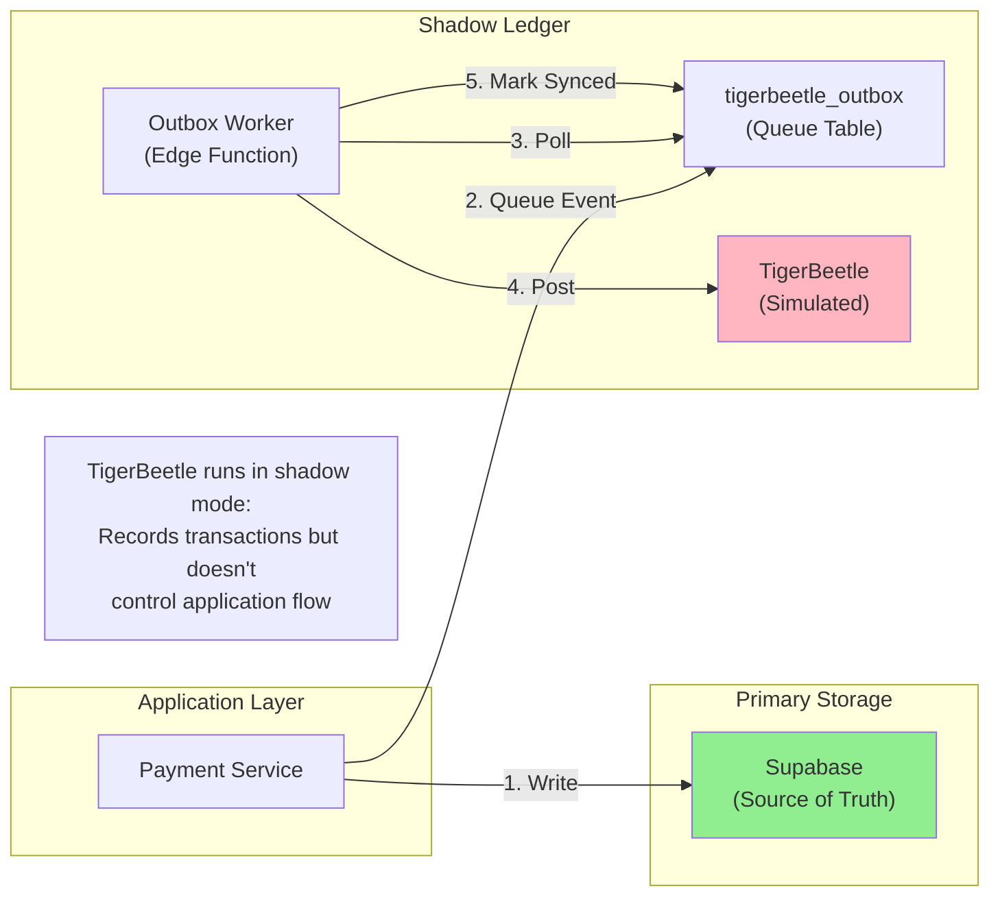

# NamLend Trust - System Architecture

**Doc Revision**: 2026-01-19  \
**Status**: Core architecture implemented; API orchestration layer live; IPS adapter and TigerBeetle posting are mock/simulated.

---

## Table of Contents

- [System Overview](#system-overview)
- [Architecture Diagrams](#architecture-diagrams)
- [Client Layer](#client-layer)
- [Backend Layer](#backend-layer)
- [Service Layer Pattern](#service-layer-pattern)
- [Edge Functions](#edge-functions)
- [Admin Architecture](#admin-architecture)
- [Observability and Safety](#observability-and-safety)
- [Known Architectural Gaps](#known-architectural-gaps)

---

## System Overview

NamLend Trust is a React SPA backed by Supabase (PostgreSQL + Auth + Edge Functions). The system integrates with multiple payment channels and exposes admin workflows for approvals, disbursements, collections, reconciliation, IPS, and settlement.

---

## Architecture Diagrams

### High-Level System Architecture



### Loan Lifecycle Flow



### Data Flow: Loan Application to Disbursement



### IPS/IPP Integration Flow



### Authentication & Authorization Flow



### TigerBeetle Shadow Ledger Pattern



### External Integrations (Current Wiring)

```
PayToday / MTC MoMo / TN Mobile
          | (webhooks)
          v
    payment-webhook (Edge Function)
          |
          v
      payment_transactions -> payments -> schedules

IPS/IPP (mock adapter)
          |
          v
       ips-adapter (Edge Function)
          |
          v
       ips_transactions + ips_api_logs

SMS / WhatsApp
          |
          v
send-sms / send-whatsapp (Edge Functions)
          |
          v
    communication_logs + notification_queue
```

---

## Client Layer

- React 18 SPA using TanStack Query for server state.
- Supabase client with local session persistence (`storageKey: namlend-auth`).
- Debug utilities gated by `VITE_DEBUG_TOOLS` and `VITE_RUN_DEV_SCRIPTS`.
- Optional mock Supabase client when missing credentials (dev only).

### Routes (Actual)

```
/                  Landing (Index)
/auth              Authentication
/dashboard         Client dashboard
/admin/*           Admin dashboard (admin-only route guard)
/loan-application  Loan application
/payment           Client payment
/loans/:id         Loan details
/kyc               KYC / Document verification
/budget            Budget tracker & finance management
*                  NotFound
```

### Layouts

- Client and admin dashboards share a sidebar-driven layout.
- Mobile uses collapsible sidebar and stacked cards.

---

## Backend Layer (Supabase)

```
React SPA
  |
  | HTTPS / WSS
  v
Supabase Platform
  - Auth (GoTrue)
  - PostgREST
  - Realtime (optional)
  - Edge Functions
  - Storage
  - PostgreSQL 15+ with RLS
```

### Data Model Highlights

- `approval_requests` drives loan application workflow.
- `loans`, `disbursements`, `payments`, `payment_schedules` are core lending records.
- `collections_*` tables track delinquency workflow.
- `notification_*` + `communication_logs` power in-app/SMS/WhatsApp.
- `ips_*` tables track IPS/IPP activity (mock adapter).
- `settlement_*` tables support DNS settlement and reconciliation.
- `reconciliation_runs` and `bank_transactions` track bank reconciliation batches and imported statement lines.
- `tigerbeetle_*` tables implement outbox + shadow ledger.

---

## Service Layer Pattern

Services are thin RPC/data wrappers; heavy logic lives in SQL functions and Edge Functions.

```ts
// Example: disbursementService.ts
export async function completeDisbursement(
  disbursementId: string,
  paymentMethod: 'bank_transfer' | 'mobile_money' | 'cash' | 'debit_order',
  paymentReference: string,
  notes?: string
) {
  const { data, error } = await supabase.rpc('complete_disbursement', {
    p_disbursement_id: disbursementId,
    p_payment_method: paymentMethod,
    p_payment_reference: paymentReference.trim(),
    p_notes: notes || null,
  });
  if (error) return { success: false, error: error.message };
  return data;
}
```

---

## Edge Functions

| Function | Purpose | Notes |
| --- | --- | --- |
| `ips-adapter` | IPS mock adapter | JWT required; mock responses |
| `payment-webhook` | Payment provider webhooks | HMAC verification; updates payments |
| `process-loan-application` | Server-side review update | Not invoked by SPA |
| `scheduled-tasks` | Overdue, reminders, queue processing | Intended for pg_cron |
| `send-notification` | Staff-triggered notifications | Staff role required |
| `send-sms` | Africa's Talking delivery | Requires secrets |
| `send-whatsapp` | WhatsApp Business API | Requires secrets |
| `tigerbeetle-outbox-worker` | Outbox processing | Simulated TB posting |
| **`api-admin`** | Admin dashboard API | ✅ Deployed - staff RBAC |
| **`api-analytics`** | Portfolio analytics API | ✅ Deployed - staff RBAC |
| **`api-audit`** | Audit log API | ✅ Deployed - admin only |
| **`api-collections`** | Collections API | ✅ Deployed - staff RBAC |
| **`api-disbursements`** | Disbursement API | ✅ Deployed - staff RBAC |
| **`api-loans`** | Loan management API | ✅ Deployed - JWT + RBAC |
| **`api-notifications`** | Notification API | ✅ Deployed - JWT + RBAC |
| **`api-payments`** | Payment operations API | ✅ Deployed - JWT + RBAC |
| **`api-reconciliation`** | Reconciliation API | ✅ Deployed - staff RBAC |
| **`api-users`** | User management API | ✅ Deployed - JWT + RBAC |

### API Orchestration Layer

The `api-*` functions form a centralized API layer providing:
- **JWT Authentication** on all endpoints
- **Role-Based Access Control** (client, loan_officer, admin)
- **Input Validation** via Zod schemas
- **Audit Logging** for all financial operations
- **Standardized Responses** with CORS headers

Frontend client: `src/services/api-client.ts` (hooks in `src/hooks/useApiQueries.ts`)

---

## Admin Architecture

Admin dashboard modules are organized by domain:

- **Loans**: approval queue, loan review, bulk actions
- **Payments**: disbursement manager, payment schedule viewer, reconciliation
- **Collections**: queue, interactions, promises
- **IPS/IPP**: onboarding dashboard, IPS health widget
- **Settlement**: runs, pacs.009 viewer, reports, adjustments
- **User Management**: roles, profiles, audits
- **Settings**: credit policy, TigerBeetle config, settlement config

---

## Observability and Safety

- Error monitoring is client-side via `errorMonitoring.ts` and `SystemHealthDashboard`.
- Debug tooling is gated to prevent PII exposure in production.
- Edge Functions validate JWT and enforce staff access for privileged operations.

---

## Known Architectural Gaps

- IPS adapter is mock; production IPS API + mTLS not wired.
- TigerBeetle outbox worker simulates posting; no live cluster integration.
- `/admin/*` route guard is admin-only; loan_officer access requires router change.
- Reconciliation schema drift exists between recent migrations and legacy client/types (needs consolidation).
- Some flows still rely on manual refresh rather than realtime subscriptions.

---

## See Also

- [INDEX.md](./INDEX.md) - Documentation index
- [DATABASE_SCHEMA.md](./DATABASE_SCHEMA.md) - Database tables and relationships
- [SERVICES.md](./SERVICES.md) - Service layer implementation details
- [FLOWS.md](./FLOWS.md) - User flow documentation
- [IPP_INTEGRATION.md](./IPP_INTEGRATION.md) - IPS/IPP integration details
- [TIGERBEETLE_IMPLEMENTATION.md](./TIGERBEETLE_IMPLEMENTATION.md) - Financial ledger setup
- [SECURITY.md](./SECURITY.md) - Security implementation (RLS, auth)
- [context.md](./context.md) - Complete technical handover
