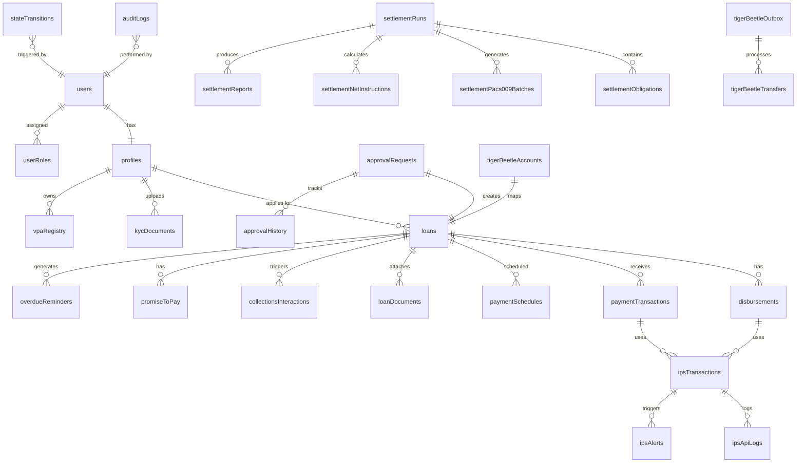

# NamLend Trust - Database Schema Summary

**Last Updated**: 2026-03-04
**Aligned With**: Post-quality-sweep codebase
**Status**: Current ✅
**Last verified against schema**: 2026-03-04 (convex/schema.ts)
**Database**: Convex (document-relational)  
**Previous Database**: PostgreSQL 15+ (Supabase) — migrated February 2026  
**Backend Version**: v4.0.0 (Convex)

---

## Source of Truth

- **Schema is defined in** `convex/schema.ts` (~1,031 lines, 55+ tables).
- Generated types live in `convex/_generated/` and are auto-generated on `npx convex dev` or deploy.
- Re-exported for frontend use via `src/integrations/convex/api.ts`.

```bash
# Types auto-generate when running Convex dev server
npx convex dev

# Or deploy to regenerate
npx convex deploy
```

### Migration Context

The backend was migrated from Supabase (PostgreSQL + RLS + Edge Functions) to Convex in February 2026. The previous PostgreSQL schema (33 migrations, `supabase/migrations/`) is retained for reference but is **no longer the active backend**. All new development targets `convex/schema.ts`.

| Aspect            | Before (Supabase)              | After (Convex)                         |
| ----------------- | ------------------------------ | -------------------------------------- |
| Schema definition | SQL migrations                 | `convex/schema.ts` (TypeScript)        |
| Type generation   | `npx supabase gen types`       | Automatic via `convex/_generated/`     |
| Access control    | RLS policies (SQL)             | Guard functions (`convex/lib/auth.ts`) |
| Server logic      | RPC functions + Edge Functions | Queries, Mutations, Actions            |
| Transactions      | Explicit `BEGIN/COMMIT`        | Every mutation is automatically atomic |

---

## Schema Overview (Convex Document Model)

All tables are defined using `defineTable()` with Convex validators (`v.string()`, `v.number()`, `v.id("tableName")`, etc.). Indexes are defined inline with `.index("name", ["field1", "field2"])`.

### Auth Tables (from `@convex-dev/auth`)

Spread via `...authTables` in the schema. These are managed by Convex Auth:

- `users` — Core user identity (managed by Convex Auth)
- `authAccounts` — Auth provider accounts
- `authSessions` — Active sessions
- `authRefreshTokens` — Token refresh tracking
- `authVerificationCodes` — Email/phone verification
- `authVerifiers` — Auth challenge verifiers
- `authRateLimits` — Rate limiting for auth attempts

### Identity and Access

| Table          | Key Fields                                                                                                                                                                | Indexes     |
| -------------- | ------------------------------------------------------------------------------------------------------------------------------------------------------------------------- | ----------- |
| `profiles`     | `userId`, `email`, `fullName`, `phone`, `idNumber`, `idType`, `kycStatus`, `monthlyIncome`                                                                                | `by_userId` |
| `userRoles`    | `userId`, `role` (client/loan_officer/admin), `assignedBy`                                                                                                                | `by_userId` |
| `kycDocuments` | `userId`, `documentType`, `status` (pending/approved/rejected), `fileStorageId?` (Convex `_storage` ID), `documentNumber?`, `reviewedBy?` (v.id("users")), `reviewNotes?` | `by_userId` |

### Lending Core

| Table                 | Key Fields                                                                                                                                                                                          | Indexes                  |
| --------------------- | --------------------------------------------------------------------------------------------------------------------------------------------------------------------------------------------------- | ------------------------ |
| `loans`               | `userId`, `principal`, `interestRate`, `termMonths`, `status`, `outstandingBalance`, `totalPaid`, `monthlyPayment`, `creditScore?`, `debtToIncomeRatio?`, `recommendation?` (approve/review/reject) | `by_userId`, `by_status` |
| `loanDocuments`       | `loanId`, `userId`, `documentType`, `fileName`, `fileStorageId` (v.id("\_storage")), `fileSize?`, `mimeType?`, `status` (pending/approved/rejected), `uploadedAt`                                   | `by_loanId`              |
| `disbursements`       | `loanId`, `userId`, `amount`, `method`, `status`, `bankName`, `accountNumber`, `initiatedBy`                                                                                                        | `by_loanId`, `by_status` |
| `paymentTransactions` | `loanId`, `userId`, `amount`, `method`, `status`, `principalPaid`, `interestPaid`, `feesPaid`                                                                                                       | `by_loanId`, `by_status` |
| `paymentSchedules`    | `loanId`, `installmentNumber`, `dueDate`, `principalDue`, `interestDue`, `totalDue`, `status`                                                                                                       | `by_loanId`, `by_status` |

**Loan Status Values** (exact schema values): `draft`, `submitted`, `under_review`, `approved`, `rejected`, `funded`, `active`, `paid_off`, `defaulted`, `written_off`

**Disbursement Method Values**: `bank_transfer`, `ips`, `mobile_money`, `cash`, `cheque`

**Disbursement Status Values** (txStatus): `pending`, `processing`, `completed`, `failed`, `reversed`, `cancelled`

**Payment Status Values** (paymentTxStatus): `pending`, `processing`, `completed`, `failed`, `reversed`, `refunded`

### Approval Workflow

| Table                 | Key Fields                                                                      | Indexes                      |
| --------------------- | ------------------------------------------------------------------------------- | ---------------------------- |
| `approvalRequests`    | `userId`, `requestType`, `entityId`, `status`, `priority`, `assignedTo`         | `by_status`, `by_assignedTo` |
| `approvalHistory`     | `approvalRequestId`, `action`, `performedBy`, `notes`, `fromStatus`, `toStatus` | `by_approvalRequestId`       |
| `workflowDefinitions` | `name`, `description`, `stages`, `isActive`                                     | `by_name`                    |
| `workflowInstances`   | `definitionId`, `entityType`, `entityId`, `currentStage`, `status`              | `by_entityId`                |

### Notifications and Comms

| Table                     | Key Fields                                                                                                                                                                                                                                                 | Indexes                         |
| ------------------------- | ---------------------------------------------------------------------------------------------------------------------------------------------------------------------------------------------------------------------------------------------------------- | ------------------------------- |
| `notifications`           | `userId`, `title`, `body?`, `message?`, `type?`, `channel?`, `category?` (loan/payment/kyc/account/general/marketing), `priority?` (low/normal/high/urgent), `isRead`, `actionUrl?`, `actionLabel?`, `expiresAt?`, `entityType?`, `entityId?`, `metadata?` | `by_userId`, `by_userId_isRead` |
| `notificationTemplates`   | `name`, `channel`, `subject`, `body`, `variables`                                                                                                                                                                                                          | `by_name`                       |
| `notificationPreferences` | `userId`, `channel`, `category`, `enabled`, `createdAt`, `updatedAt`                                                                                                                                                                                       | `by_userId`                     |
| `notificationQueue`       | `userId`, `channel`, `recipient?`, `subject?`, `body?`, `content?`, `status` (pending/processing/sending/sent/failed), `attempts?`, `retryCount?`, `scheduledAt?`, `updatedAt?`                                                                            | `by_status`                     |
| `communicationLogs`       | `userId`, `channel`, `direction` (inbound/outbound), `recipient`, `subject?`, `body`, `status`, `externalId?`, `entityType?`, `entityId?`, `metadata?`                                                                                                     | `by_userId`                     |

### IPS/IPP (Instant Payment System)

| Table                       | Key Fields                                                                                                                                                                                                                                                                                                                                                  | Indexes                                           |
| --------------------------- | ----------------------------------------------------------------------------------------------------------------------------------------------------------------------------------------------------------------------------------------------------------------------------------------------------------------------------------------------------------- | ------------------------------------------------- |
| `ipsTransactions`           | `msgId` (idempotency key), `txType` (credit_transfer/request_to_pay/reversal), `direction` (inbound/outbound), `status` (pending/processing/completed/failed/reversed/timeout), `amount`, `currency`, `debtorVpa?`, `creditorVpa?`, `debtorName?`, `creditorName?`, `debtorBic?`, `creditorBic?`, `endToEndId?`, `loanId?`, `disbursementId?`, `paymentId?` | `by_msgId`, `by_status`, `by_loanId`, `by_userId` |
| `vpaRegistry`               | `userId`, `vpa`, `status`, `bankAccountId`                                                                                                                                                                                                                                                                                                                  | `by_userId`, `by_vpa`                             |
| `ipsApiLogs`                | `transactionId`, `method`, `endpoint`, `requestBody`, `responseStatus`, `durationMs`                                                                                                                                                                                                                                                                        | `by_transactionId`                                |
| `ipsAlerts`                 | `transactionId?`, `alertType`, `severity` (info/warning/critical), `message`, `isResolved`, `resolvedAt?`, `resolvedBy?`                                                                                                                                                                                                                                    | `by_isResolved`                                   |
| `ipsOnboardingApplications` | `userId`, `status` (step_1_identity/step_2_bank_details/step_3_documents/step_4_vpa_selection/step_5_review/step_6_submitted/step_7_approved/rejected), `identityData?`, `bankDetails?`, `selectedVpa?`, `submittedAt?`, `approvedAt?`, `rejectedAt?`, `rejectionReason?`                                                                                   | `by_userId`                                       |
| `ipsDeviceBindings`         | `userId`, `deviceId`, `status`, `lastUsed`                                                                                                                                                                                                                                                                                                                  | `by_userId`                                       |

### Settlement (IRCS Back Office)

| Table                           | Key Fields                                                                                                                                                                                                                                                                                                                                                                                                                                | Indexes                                     |
| ------------------------------- | ----------------------------------------------------------------------------------------------------------------------------------------------------------------------------------------------------------------------------------------------------------------------------------------------------------------------------------------------------------------------------------------------------------------------------------------- | ------------------------------------------- |
| `settlementParticipants`        | `routingCode`, `swiftBic`, `name`, `participantType` (direct/sponsored), `sponsorId?`, `nissAccountRef?`, `isOperator`, `status`                                                                                                                                                                                                                                                                                                          | `by_routingCode`                            |
| `settlementWindows`             | `windowId`, `dayOfWeek` (0=Sun…6=Sat), `cutoffTime` ("HH:mm"), `enabled`, `description?`                                                                                                                                                                                                                                                                                                                                                  | `by_windowId`                               |
| `settlementRuns`                | `runId` (human-readable slug), `windowId`, `settlementDate` ("YYYY-MM-DD"), `currency`, `schemeVersion`, `state` (13-state FSM: collecting/cutoff_reached/prepare_inputs/netting/generated/dispatched/sent_to_swift/swift_validated/sent_to_niss/niss_accepted/failed_validation/settled/closed/adjustment_pending), `amendmentSeq`, `transactionCount`, `totalPrincipal`, `totalInterchange`, `totalSwitchingFee`, `netInstructionCount` | `by_runId`, `by_state`, `by_settlementDate` |
| `settlementObligations`         | `runId`, `debtorParticipantId`, `creditorParticipantId`, `amount`, `status`                                                                                                                                                                                                                                                                                                                                                               | `by_runId`                                  |
| `settlementNetInstructions`     | `runId`, `sourceParticipantId`, `targetParticipantId`, `amount`, `direction`                                                                                                                                                                                                                                                                                                                                                              | `by_runId`                                  |
| `settlementPacs009Batches`      | `runId`, `batchXml`, `status`, `submittedAt`                                                                                                                                                                                                                                                                                                                                                                                              | `by_runId`                                  |
| `settlementAcknowledgements`    | `batchId`, `runId`, `ackType`, `status`, `rawPayload`                                                                                                                                                                                                                                                                                                                                                                                     | `by_batchId`, `by_runId`                    |
| `settlementReports`             | `runId`, `reportType`, `reportData`, `generatedAt`                                                                                                                                                                                                                                                                                                                                                                                        | `by_runId`                                  |
| `settlementAdjustments`         | `runId`, `adjustmentType`, `amount`, `reason`, `status`                                                                                                                                                                                                                                                                                                                                                                                   | `by_runId`                                  |
| `settlementTimeoutTransactions` | `transactionId`, `timeoutType`, `status`, `resolvedAt`                                                                                                                                                                                                                                                                                                                                                                                    | `by_status`                                 |
| `settlementExposures`           | `participantId`, `exposureAmount`, `limit`, `breached`                                                                                                                                                                                                                                                                                                                                                                                    | `by_participantId`                          |
| `settlementFeeRules`            | `transactionType`, `feeType`, `amount`, `isPercentage`                                                                                                                                                                                                                                                                                                                                                                                    | `by_transactionType`                        |
| `settlementHolidays`            | `holidayDate` ("YYYY-MM-DD"), `description?`                                                                                                                                                                                                                                                                                                                                                                                              | `by_holidayDate`                            |

### TigerBeetle Integration

| Table                       | Key Fields                                                                                                                                             | Indexes                                       |
| --------------------------- | ------------------------------------------------------------------------------------------------------------------------------------------------------ | --------------------------------------------- |
| `tigerBeetleOutbox`         | `eventType`, `sourceTable`, `sourceId`, `payload`, `status`, `retryCount`                                                                              | `by_status`                                   |
| `tigerBeetleAccounts`       | `entityType`, `entityId`, `tbAccountIdHigh` (number), `tbAccountIdLow` (number), `ledger`, `code`, `status` (pending/created/failed), `createdInTbAt?` | `by_entityId` (compound: entityType+entityId) |
| `tigerBeetleTransfers`      | `tbTransferIdHigh`, `tbTransferIdLow`, `amount`, `sourceTable`, `sourceId`, `isPosted`                                                                 | `by_sourceId`, `by_outboxId`                  |
| `tigerBeetleReconciliation` | `runDate`, `status`, `matchedCount`, `unmatchedCount`                                                                                                  | `by_runDate`                                  |

### Audit & Compliance

| Table               | Key Fields                                                                                                                   | Indexes                                                         |
| ------------------- | ---------------------------------------------------------------------------------------------------------------------------- | --------------------------------------------------------------- |
| `auditLogs`         | `userId?` (optional — system events have no user), `action`, `entityType`, `entityId`, `oldState`, `newState`, `metadata`    | `by_entityId` (compound: entityType + entityId), `by_timestamp` |
| `stateTransitions`  | `entityType`, `entityId`, `fromState`, `toState`, `triggeredBy?` (optional — system events have no user), `transitionReason` | `by_entityId` (compound: entityType + entityId)                 |
| `viewLogs`          | `userId`, `entityType`, `entityId`, `fieldsViewed`, `viewDurationMs`                                                         | —                                                               |
| `complianceReports` | `reportType`, `periodStart`, `periodEnd`, `generatedBy`, `reportData`, `status`                                              | —                                                               |

### Collections

| Table                     | Key Fields                                                                                                                                                                                                                                                                            | Indexes     |
| ------------------------- | ------------------------------------------------------------------------------------------------------------------------------------------------------------------------------------------------------------------------------------------------------------------------------------- | ----------- |
| `collectionsInteractions` | `loanId`, `userId?`, `agentId?`, `interactionType?`, `activityType?`, `activityStatus?`, `contactMethod?`, `outcome?`, `notes?`, `promiseDate?`, `promiseAmount?`, `promiseFulfilled?`, `nextAction?`, `nextActionType?`, `nextActionDate?`, `assignedTo?`, `metadata?`, `updatedAt?` | `by_loanId` |
| `overdueReminders`        | `loanId`, `userId`, `channel`, `daysOverdue`, `amount`, `status` (pending/sent/failed), `sent?` (boolean), `sentAt?`, `updatedAt?`                                                                                                                                                    | `by_loanId` |
| `promiseToPay`            | `loanId`, `userId`, `amount`, `promiseDate`, `status` (pending/kept/broken/rescheduled), `createdBy`, `notes?`                                                                                                                                                                        | `by_loanId` |

### Reconciliation

| Table                | Key Fields                                                                                                   | Indexes                                       |
| -------------------- | ------------------------------------------------------------------------------------------------------------ | --------------------------------------------- |
| `reconciliationRuns` | `runDate`, `status`, `matchedCount`, `unmatchedCount`, `totalAmount`                                         | `by_status`                                   |
| `bankTransactions`   | `bankReference`, `externalId?`, `amount`, `date`, `description`, `matchStatus`, `matchedPaymentId`, `runId?` | `by_matchStatus`, `by_externalId`, `by_runId` |

### System Configuration

| Table                 | Key Fields                                                             | Indexes  |
| --------------------- | ---------------------------------------------------------------------- | -------- |
| `systemConfiguration` | `key`, `value`, `category?`, `description?`, `isPublic?`, `updatedBy?` | `by_key` |

> Note: There is **no** `creditScores` table in the schema. Credit scores are stored on the `loans` table as `loans.creditScore`, `loans.debtToIncomeRatio`, and `loans.recommendation` fields, written by the `processLoanApplication` action.

---

## Authorization Model (Replaces RLS)

Convex does **not** use Row-Level Security. Instead, authorization is enforced by **guard functions** called at the top of every query and mutation in `convex/lib/auth.ts`:

| Guard Function                            | Purpose                                    | Replaces                                       |
| ----------------------------------------- | ------------------------------------------ | ---------------------------------------------- |
| `assertAuthenticated(ctx)`                | Returns userId or throws `UNAUTHENTICATED` | `auth.uid() IS NOT NULL`                       |
| `assertAdmin(ctx)`                        | Requires `admin` role                      | `is_admin(auth.uid())`                         |
| `assertStaff(ctx)`                        | Requires `loan_officer` or `admin`         | `is_staff(auth.uid())`                         |
| `assertOwnerOrStaff(ctx, resourceUserId)` | Owner or staff access                      | `user_id = auth.uid() OR is_staff(auth.uid())` |
| `assertOwner(ctx, resourceUserId)`        | Owner-only access                          | `user_id = auth.uid()`                         |

**Every query and mutation** must call the appropriate guard at the top of its handler. There are no implicit access controls — if a guard is missing, the function is unprotected.

```typescript
// Example: convex/loans.ts
export const getMyLoans = query({
  handler: async (ctx) => {
    const userId = await assertAuthenticated(ctx); // ← Guard
    return ctx.db
      .query('loans')
      .withIndex('by_userId', (q) => q.eq('userId', userId))
      .collect();
  },
});
```

---

## Convex Server Functions (Replaces RPCs + Edge Functions)

### Queries (Read-only, reactive)

| Module             | Key Queries                                                                          | Access      |
| ------------------ | ------------------------------------------------------------------------------------ | ----------- |
| `loans.ts`         | `getMyLoans`, `getLoanById`, `adminListLoans`                                        | Owner/Staff |
| `payments.ts`      | `getPaymentsByLoan`, `getPaymentSchedule`, `getOverduePayments`, `adminListPayments` | Owner/Staff |
| `disbursements.ts` | `getDisbursementsByLoan`, `adminListDisbursements`                                   | Owner/Staff |
| `notifications.ts` | `getMyNotifications`, `getUnreadCount`, `getMyNotificationPreferences`               | Owner       |
| `collections.ts`   | `getCollectionsQueue`, `getCollectionsStats`, `listPromisesToPay`                    | Staff       |
| `analytics.ts`     | `getPortfolioSummary`, `getRevenueMetrics`, `getRiskMetrics`, `getMonthlyTrends`     | Staff       |
| `audit.ts`         | `getAuditLogs`, `getStateTransitions`, `getViewLogs`, `getComplianceReports`         | Staff/Admin |

### Mutations (Transactional writes)

| Module             | Key Mutations                                                                                                    | Access      |
| ------------------ | ---------------------------------------------------------------------------------------------------------------- | ----------- |
| `loans.ts`         | `createLoan`, `submitLoan`, `approveLoan`, `rejectLoan`, `updateLoanStatus`                                      | Owner/Staff |
| `payments.ts`      | `recordPayment`, `completePayment`, `failPayment`, `createPaymentSchedule`                                       | Owner/Staff |
| `disbursements.ts` | `initiateDisbursement`, `processDisbursement`, `completeDisbursement`, `failDisbursement`, `reverseDisbursement` | Staff       |
| `notifications.ts` | `markNotificationRead`, `markAllNotificationsRead`, `updateNotificationPreference`                               | Owner       |
| `collections.ts`   | `recordInteraction`, `createPromiseToPay`, `markPromiseFulfilled`                                                | Staff       |
| `audit.ts`         | `logViewAccess`, `generateComplianceReport`                                                                      | Auth/Admin  |

### Internal Mutations/Queries (Not callable from browser)

| Module                  | Function                                                                 | Purpose                                                                         |
| ----------------------- | ------------------------------------------------------------------------ | ------------------------------------------------------------------------------- |
| `audit.ts`              | `writeStateTransition`, `writeAuditEntry`                                | Audit log writes via `ctx.scheduler`                                            |
| `loans.ts`              | `markFunded`, `updateLoanBalance`, `recordCreditScore`                   | Loan status/balance/credit-score updates (called by actions)                    |
| `approvalWorkflow.ts`   | `createSystemApprovalRequest`                                            | Creates approval requests from server-side actions (e.g. after loan processing) |
| `users.ts`              | `getProfileByUserId` (internalQuery)                                     | Profile lookup by userId for actions that can't call public queries             |
| `notifications.ts`      | `createNotification`, `enqueueNotification`, `claimPendingNotifications` | Notification lifecycle                                                          |
| `notifications.ts`      | `getPreferencesForUser` (internalQuery)                                  | Preference lookup from `sendNotification` action                                |
| `tigerbeetle/outbox.ts` | `claimPendingEntries`, `completeEntry`, `failEntry`                      | Outbox claim/complete/fail                                                      |

### Actions (External API calls, no time limit)

| File                                | Purpose                                   | Replaces                           |
| ----------------------------------- | ----------------------------------------- | ---------------------------------- |
| `actions/ipsAdapter.ts`             | IPS outbound transfers + webhook handling | `ips-adapter` edge fn              |
| `actions/processLoanApplication.ts` | Server-side loan processing               | `process-loan-application` edge fn |
| `actions/sendNotification.ts`       | Multi-channel notification dispatch       | `send-notification` edge fn        |
| `actions/sendSms.ts`                | Africa's Talking SMS delivery             | `send-sms` edge fn                 |
| `actions/sendWhatsapp.ts`           | Meta WhatsApp Business API                | `send-whatsapp` edge fn            |

### Scheduled Jobs (Replaces pg_cron)

Defined in `convex/crons.ts`:

| Job                 | Schedule         | Handler                                           | Replaces                            |
| ------------------- | ---------------- | ------------------------------------------------- | ----------------------------------- |
| `tb-outbox-worker`  | Every 30 seconds | `scheduled/tigerBeetleOutboxWorker.processOutbox` | `tigerbeetle-outbox-worker` edge fn |
| `daily-maintenance` | 02:00 UTC daily  | `scheduled/dailyTasks.runDailyTasks`              | `scheduled-tasks` edge fn + pg_cron |

Daily maintenance runs three sub-tasks:

1. **markOverduePayments** — Marks past-due installments as `overdue`
2. **checkPromiseToPay** — Marks broken promises past deadline
3. **processNotificationQueue** — Dispatches pending SMS/WhatsApp notifications

---

## Retention

- **7-year retention** — Financial data and audit logs MUST NOT be hard-deleted (Namibian law).
- Audit and state transition tables are **append-only** by design.
- Convex has no built-in TTL or auto-delete; records persist until explicitly removed.

---

## Entity Relationship Diagram



---

## Resolved Schema Issues (Feb 2026 Remediation)

> **All previously identified schema issues have been resolved:**

1. ~~**`convex/auth.ts` callback ↔ `profiles` table mismatch**~~ — **FIXED**: Auth callback now inserts only schema-valid fields (`userId`, `email`, `kycStatus: "pending"`). Non-existent fields removed.

2. ~~**`promiseToPay.status` mismatch**~~ — **FIXED**: Code changed from `"fulfilled"` to `"kept"` (the schema-valid value) in `collections.ts`.

3. ~~**Missing `paymentSchedules.by_status` index**~~ — **FIXED**: Index added to `schema.ts`.

4. ~~**`notificationPreferences` table**~~ — **FIXED**: Table added to `schema.ts` with `userId`, `channel`, `category`, `enabled` fields.

5. ~~**`notifications` field mismatch**~~ — **FIXED**: Schema expanded with `message`, `category`, `priority`, `actionUrl`, `actionLabel`, `expiresAt` fields.

6. ~~**`notificationQueue` field mismatch**~~ — **FIXED**: Schema expanded with `content`, `retryCount`, `scheduledAt`, `updatedAt` aliases and `"processing"` status.

7. ~~**`collectionsInteractions` field mismatch**~~ — **FIXED**: Schema expanded with `activityType`, `activityStatus`, `contactMethod`, `promiseDate`, `promiseAmount`, `promiseFulfilled`, `nextActionType`, `assignedTo`, `updatedAt`.

8. ~~**`overdueReminders` missing `sent` field**~~ — **FIXED**: Added `sent` boolean and `updatedAt` to schema.

9. ~~**`markFunded`/`updateLoanBalance` exposed publicly**~~ — **FIXED**: Converted from `mutation` to `internalMutation` in `loans.ts`.

10. ~~**Analytics full-table scans**~~ — **FIXED**: All `.collect()` calls replaced with `.take(10000)` safety limits.

11. ~~**`settlementNetInstructions` wrong field names**~~ — **FIXED (Feb 2026 Phase 2)**: Code was reading `debtorParticipantId`, `creditorParticipantId`, `netAmount` — masked by `as any[]` cast. Correct schema fields are `sourceParticipantId`, `targetParticipantId`, `amount`.

12. ~~**`stateTransitions.triggeredBy` required but system events have no user**~~ — **FIXED**: Changed to `v.optional(v.id("users"))`. Same for `auditLogs.userId`.

13. ~~**`settlementAcknowledgements` missing `by_runId` index**~~ — **FIXED**: Added `by_batchId` and `by_runId` indexes; replaced in-memory filter with index queries.

14. ~~**`bankTransactions` missing `by_externalId` and `by_runId` indexes**~~ — **FIXED**: Both indexes added to schema; `reconciliation.ts` now uses them.

15. ~~**`loans` table missing credit scoring fields**~~ — **FIXED**: Added optional `creditScore`, `debtToIncomeRatio`, and `recommendation` fields, populated by `processLoanApplication` action after server-side credit scoring.

---

## See Also

- [INDEX.md](./INDEX.md) - Documentation index
- [ARCHITECTURE.md](./ARCHITECTURE.md) - System architecture with Convex flow diagrams
- [SERVICES.md](./SERVICES.md) - Service layer reference (legacy Supabase services)
- [SECURITY.md](./SECURITY.md) - Security implementation (now auth guards, not RLS)
- [TYPE_SAFETY_REMEDIATION.md](./TYPE_SAFETY_REMEDIATION.md) - TypeScript types for tables
