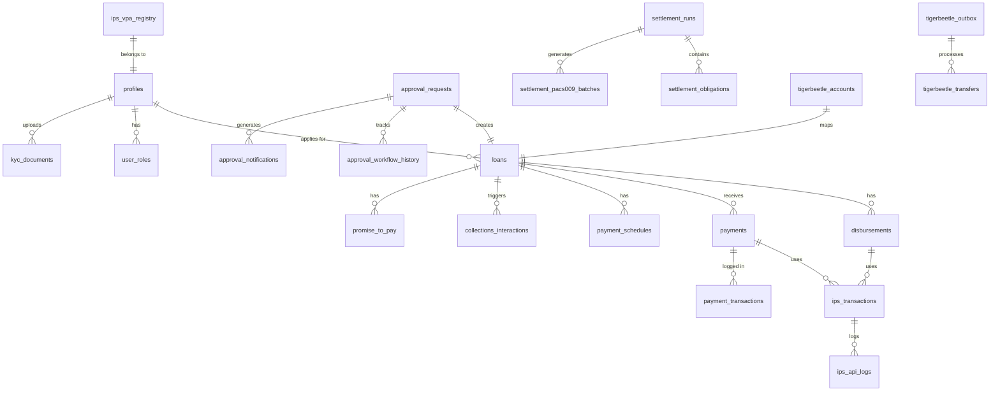

# NamLend Trust - Database Schema Summary

**Doc Revision**: 2026-01-19  \
**Database**: PostgreSQL 15+ (Supabase)  \
**Project**: `puahejtaskncpazjyxqp` (eu-north-1)

---

## Source of Truth

- Schema is defined in `supabase/migrations/`.
- Generated types live in `src/integrations/supabase/types.ts` and should be regenerated after migrations:

```bash
npx supabase gen types typescript --local > src/integrations/supabase/types.ts
```

**Note**: The repo currently has some drift between migrations and generated types/services (see Reconciliation section below). Regenerate types after applying new migrations.

---

## Core Tables (by domain)

### Identity and Access

- `profiles`: user profile data, KYC status, income, risk metadata.
- `user_roles`: role assignments (`client`, `loan_officer`, `admin`).
- `document_verification_requirements`: per-user document requirements.
- `kyc_documents`: document uploads and status.

### Lending Core

- `loans`: loan records with amount, term, interest rate, status, and approval linkage.
- `loan_reviews`: review records for automated/manual decisions.
- `disbursements`: disbursement queue and processing metadata.
- `payments`: repayments with method, reference, status.
- `payment_schedules`: amortization schedule and overdue tracking.

### Approval Workflow

- `approval_requests`: unified approval queue (loan app, KYC, profile updates).
- `approval_workflow_history`: status transitions and audit.
- `approval_notifications`: per-request notifications.
- `approval_workflow_rules`: rules for automatic routing/priority.

### Notifications and Comms

- `notifications`: in-app messages.
- `notification_templates`: reusable message templates.
- `notification_preferences`: per-user channel preferences.
- `notification_queue`: queued delivery payloads.
- `communication_logs`: SMS/WhatsApp delivery log.
- `whatsapp_conversations`: active WhatsApp threads.

### Payments and Webhooks

- `payment_transactions`: provider transaction log.
- `payment_webhooks`: raw webhook payload archive.

### Reconciliation

- `reconciliation_runs`: reconciliation batches/sessions (2026-01-17 migration).
- `bank_transactions`: imported bank statement lines and matching status (2026-01-17 migration).
- `payment_reconciliations`: **legacy table** referenced by current client services/types, but not created in recent migrations (schema drift).

### Collections

- `collections_interactions`: agent interactions and outcomes.
- `promise_to_pay`: promises and status tracking.
- `reschedule_requests`: payment reschedule workflow.
- `payment_reminders`: reminder tracking (if enabled).
- `collections_queue` (view): prioritized queue view.

### IPS/IPP

- `ips_transactions`: IPS disbursement/repayment activity.
- `ips_vpa_registry`: VPA ownership and validation.
- `ips_api_logs`: IPS adapter logging.
- `ips_error_codes`: IPS error lookup.
- `ips_alert_thresholds` / `ips_transaction_alerts`: monitoring alerts.
- `ips_onboarding`: onboarding state machine.
- `ips_device_bindings`, `ips_alias_directory`, `ips_merchants`, `ips_vae_entries`, `ips_keys_cache`, `ips_sov_providers`, `ips_onboarding_history`.

### Settlement (IRCS Back Office)

- `settlement_runs`, `settlement_obligations`, `settlement_net_instructions`.
- `settlement_pacs009_batches`, `settlement_acknowledgements`.
- `settlement_reports`, `settlement_adjustments`, `settlement_timeout_transactions`.
- `settlement_exposures`, `settlement_participants`, `settlement_fee_rules`, `settlement_windows`, `settlement_holiday_calendar`.

### TigerBeetle Outbox

- `tigerbeetle_accounts`: account mappings for entities.
- `tigerbeetle_outbox`: pending TB events.
- `tigerbeetle_transfers`: shadow ledger transfers.
- `tigerbeetle_reconciliation`: reconciliation snapshots.

---

## Views

- `approval_requests_expanded` (admin queue with profile join).
- `profiles_with_roles` (admin user view).
- `loan_applications_unified` (approval + loan join for dashboard).
- `loan_balance_summary` (fallback balances when TB unavailable).
- `collections_queue` (prioritized collections view).

---

## Row Level Security (RLS)

RLS is enabled on core user-data tables with policies for:

- Own-data access (e.g., `auth.uid() = user_id`).
- Staff/admin access via `user_roles`.
- Service-role access for Edge Functions when required.

Review migrations for full policy coverage.

---

## Key RPC Functions

### Loan & Disbursement Flow

| Function | Purpose | Status |
|----------|---------|--------|
| `create_disbursement_on_approval` | Creates disbursement when loan approved | Creates with `approved` status |
| `initiate_ips_disbursement` | Initiates IPS payment | Expects `approved` status |
| `complete_disbursement` | Marks disbursement complete | Updates loan to `disbursed` |
| `process_approval_transaction` | Processes loan approval | Creates loan + disbursement atomically |

### Recent Migrations (2026-01-10)

- `20260110180000_fix_create_disbursement_on_approval_status.sql` - Fixed disbursement status from `pending` to `approved`

### Recent Migrations (2026-01-17)

- `20260117170000_create_reconciliation_system.sql` - Added `reconciliation_runs`, `bank_transactions`, and `payments.bank_transaction_id`

---

## Retention

- Financial data is retained for 7 years (do not hard-delete records).
- Audit and workflow tables are append-only by design.

---

## Entity Relationship Diagram



---

## See Also

- [INDEX.md](./INDEX.md) - Documentation index
- [ARCHITECTURE.md](./ARCHITECTURE.md) - System architecture with flow diagrams
- [SERVICES.md](./SERVICES.md) - Service layer using these tables
- [SECURITY.md](./SECURITY.md) - RLS policy details
- [TYPE_SAFETY_REMEDIATION.md](./TYPE_SAFETY_REMEDIATION.md) - TypeScript types for tables
