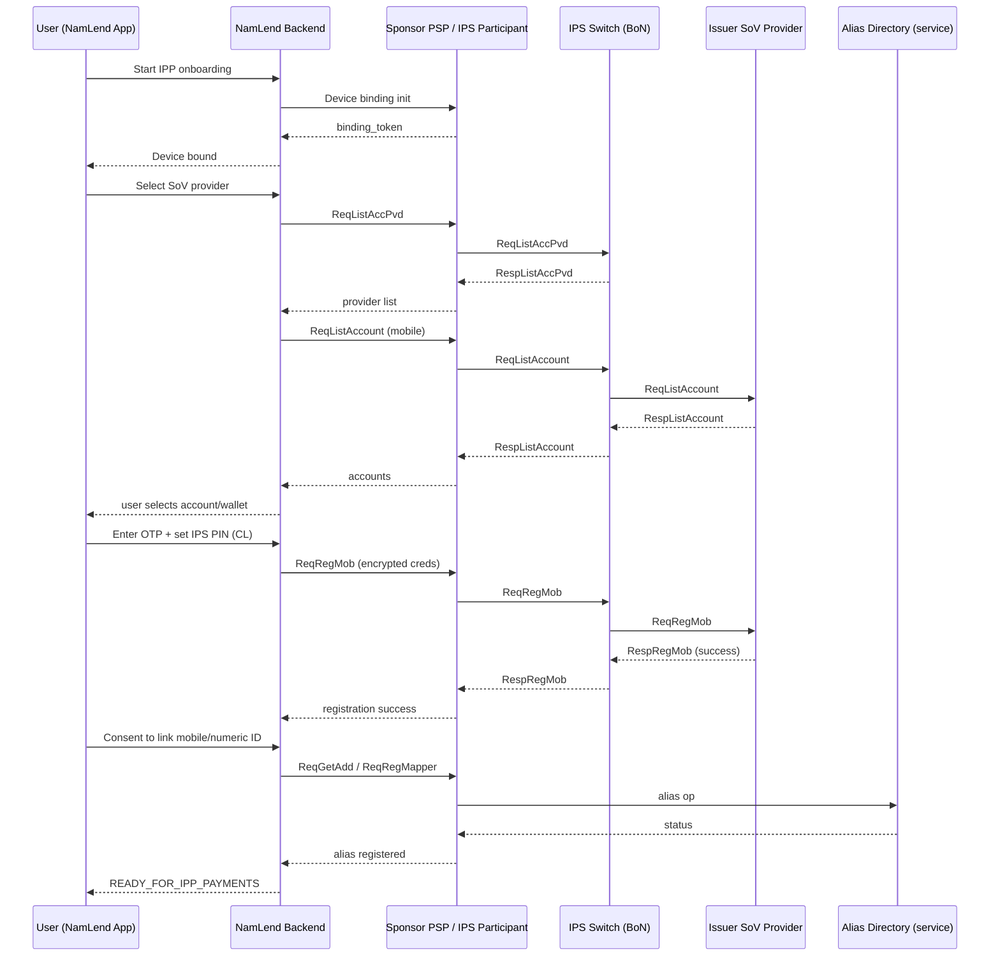
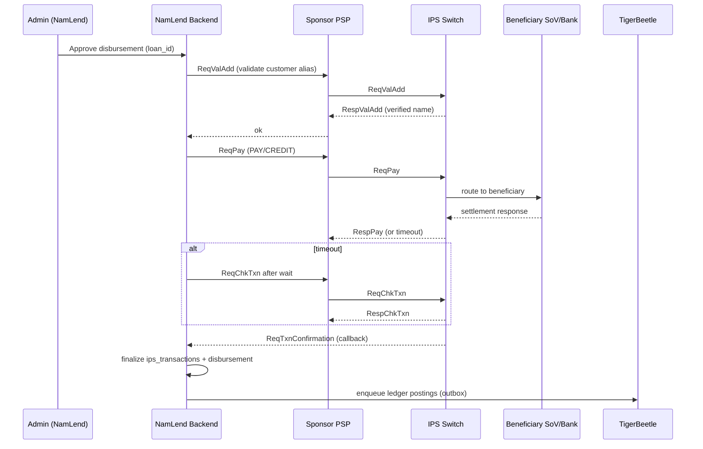

# NamLend ↔ IPP (BoN IPS) Onboarding + Payments Handover

**Doc Revision**: 2026-04-06
**Status**: Reference specification. Current live implementation uses Convex onboarding mutations plus `convex/actions/ipsOnboardingAdapter.ts` and related `api.ips.*` surfaces. Any Supabase service or `ips-adapter` references below are historical context, not the active runtime contract.
**Version**: 1.0 (consolidated, XSD-aligned)  
**Generated**: 2025-12-27  
**Inputs used**: BoN IPS TSD (v0.7), IPP Functional Specification (v10.0), IPN Scheme Rules (v0.3), NamLend repo docs (`ARCHITECTURE.md`, `FLOWS.md`, `SERVICES.md`, `API_REFERENCE.md`, `IPS_IMPLEMENTATION.md`, `IPS_TESTING.md`, `IPS_PRODUCTION_CHECKLIST.md`), and the provided **UPI/IPP XSDs** (Req/Resp schemas).

---

## 0) What this document gives you

A complete, implementation-ready description of:

1. **Customer onboarding** onto IPP/IPS from inside the NamLend app:
   - device binding prerequisites,
   - linking a **Store of Value** (bank account / wallet),
   - setting an **IPS PIN**,
   - registering and maintaining aliases in the **Alias Directory** (mobile + numeric IDs),
   - storing the onboarding state in NamLend.

2. **Merchant onboarding** for IPP/IPS:
   - merchant alias and unique code rules,
   - registering merchant IDs in the Alias Directory,
   - (optional but recommended) **Verified Address Entries (VAE)** to prevent spoofing,
   - QR readiness (static/dynamic).

3. **Disbursement and repayment** flows over the IPP rail:
   - address validation,
   - `ReqPay` for disbursement,
   - status and callback handling (`ChkTxn`, `TxnConfirmation`),
   - reconciliation & ledger posting (TigerBeetle outbox pattern used by NamLend).

All XML shapes below are **validated against your XSDs** (namespace: `http://npci.org/upi/schema/`), and all flows are aligned to the BoN/IPP FSD onboarding sections (notably **User Registration** and **Alias Directory**).

---

## 1) Roles, trust boundaries, and what NamLend actually is in IPP terms

### 1.1 Ecosystem roles (recommended mapping)

| IPP/IPS role (docs)                      | Meaning                                                                 | In the NamLend solution                                     |
| ---------------------------------------- | ----------------------------------------------------------------------- | ----------------------------------------------------------- |
| **IPS Switch / IPP Operator**            | Central routing + alias directory + scheme services                     | BoN/NamClear IPS                                            |
| **IPS Participant / PSP / SoV Provider** | Bank / wallet provider connected to switch                              | Your **Sponsor PSP** (e.g., NamPost/Bank partner)           |
| **Enabler**                              | Third-party app acting on behalf of a participant (with a relationship) | **NamLend** (front-end + orchestration)                     |
| **Customer (Payer/Payee PERSON)**        | Retail user, receives loan / pays repayments                            | NamLend client                                              |
| **Merchant (ENTITY)**                    | Merchant accepting IPP payments                                         | NamLend merchant (BNPL merchants, business borrowers, etc.) |

**Key implication:**  
NamLend should not be a “standalone IPS Participant” unless you have direct scheme participation, settlement sponsorship, and regulatory clearance. The cleanest design is:

- NamLend = **Enabler + Orchestrator**
- Sponsor PSP = **Participant** that signs/sends messages to IPS switch

NamLend still owns:

- onboarding UX,
- consent capture,
- state management,
- callbacks,
- the payments workflow tied to lending (disbursement/repayment),
- and ledger integrity via TigerBeetle.

---

## 2) Message model (UPI schema) — what the XSDs enforce

All requests follow the same outer envelope pattern:

- `Head` (**attributes**, required): `ver`, `ts`, `orgId`, `msgId`, `prodType`, plus pagination/callback fields.
- `Txn` (type `payTrans`): carries `id`, timestamps, `type` enum (`PAY`, `ListAccount`, `ReqRegMob`, `ChkTxn`, etc.) and other reference fields.
- Domain-specific blocks: `Payer`, `Payee/Payees`, `Payers`, `Creds`, `Link`, `RegDetails`, etc.

### 2.1 Critical enums you must obey (from XSD)

- `payTrans/@type` = **`payConstant`** (includes: `PAY`, `COLLECT`, `ListAccPvd`, `ListAccount`, `ReqRegMob`, `SetCre`, `ValAdd`, `ChkTxn`, `TxnConfirmation`, `ManageVae`, `ListVae`, `ListKeys`, `ListPsp`, etc.)
- `Payer/@type` and `Payee/@type` = `payerConstant` (`PERSON` or `ENTITY`)
- Alias directory tags:
  - `regIdDetailsTagNameType`: `MOBILE` or `NUMERICID`
  - `regIdDetailsSetStatusType`: `ACTIVE`, `INACTIVE`, `BLOCK`, `UNBLOCK`, `DEREGISTER`, `PORTED`
  - `regIdStatusType`: `NEW`, `ACTIVE`, `INACTIVE`, `BLOCKED`, `DEREGISTER`
- Registration details (`ReqRegMob`):
  - `MobRegDetailsNameType`: `MOBILE`, `CARDDIGITS`, `EXPDATE`
- Merchant unique ID rules from FSD: **≤ 8 digits**, not all same digit; sole traders treated as individuals (mobile-based), not merchant code based.

---

## 3) Customer onboarding in NamLend (end-to-end)

This section is written as a build plan. If you implement this, a user can be enrolled and you can disburse via IPP.

### 3.1 Customer onboarding state machine (NamLend)

Implement as a persisted state machine per user:

1. `NOT_STARTED`
2. `DEVICE_BOUND` (or `BINDING_REQUIRED`)
3. `SOV_SELECTED`
4. `ACCOUNTS_LISTED`
5. `VERIFIED` (OTP / wallet PIN / ID verified)
6. `IPS_PIN_SET`
7. `ALIAS_REGISTERED` (mobile + optional numeric ID)
8. `READY_FOR_IPP_PAYMENTS`

**Rule:** A user is only eligible for loan disbursement via IPP if state ≥ `READY_FOR_IPP_PAYMENTS` and an alias/VPA is validated.

### 3.2 Step 0 — prerequisites (KYC + data)

Required to even start:

- User has completed NamLend KYC/AML (identity + phone number verification).
- User has an eligible SoV (bank account with debit card OR e-money wallet with a PIN).
- NamLend has the sponsor PSP routing metadata (participant codes, IFSC-equivalent routing key if applicable, etc.).

Store at minimum:

- `user.mobile_e164`
- `user.national_id` (if you support the national-ID onboarding branch)
- `user.preferred_sov_provider` (once selected)
- `user.long_alias` (full-form alias like `jane123@SOV1`)
- `user.short_alias_mobile` (directory mobile mapping, after RegMapper)
- `user.numeric_id` (optional)

### 3.3 Step 1 — device binding (per FSD device binding rules)

Device binding is a **PSP-side control**, but NamLend must drive the UX and persist the result.

**Business rules (from FSD user registration):**

- one mobile number ↔ one device ↔ one app binding at a time,
- mobile number must be prepopulated (SIM present),
- if SIM removed/reinserted, binding must be repeated,
- participant integrates with SMS gateway/MNO for binding flow.

**NamLend implementation:**

- UI: “Bind device” step before onboarding.
- Backend: store a `device_binding_token` (registration token) and `bound_device_fingerprint`.

> Practical: if sponsor PSP gives you a binding SDK/flow, embed it. If not, keep the binding token model because the switch workflow references it later (token to link device ↔ alias).

### 3.4 Step 2 — fetch SoV providers (optional UX, required if user picks a provider)

Call **List Account Providers** (`ReqListAccPvd`) to populate selectable providers.

- Request: `ReqListAccPvd` = `Head + Txn`
- Response: `RespListAccPvd` includes `AccPvdList/AccPvd` entries with versioning.

**Store**: `sov_provider_code`, `sov_provider_handle`, `capabilities`, version flags.

### 3.5 Step 3 — list accounts for the selected provider (ReqListAccount)

Once the user selects a provider, you request the list of accounts/wallets linked to the user.

- Request: `ReqListAccount` = `Head + Txn + Payer + Link`
- `Link/@type="MOBILE"` and `Link/@value="<user_mobile>"`
- `Payer/Ac` may carry `Detail` such as routing key (`IFSC`) depending on sponsor PSP expectations.

**Response:** `RespListAccount` contains `AccountList/Account` with:

- `accType`, `accRefNumber`, `maskedAccnumber`, `ifsc`, `mmid`, `name`, plus allowed credentials.

**NamLend UX:**

- show list of accounts/wallets,
- user selects preferred SoV to link to their alias.

### 3.6 Step 4 — verification + registration (ReqRegMob)

This is the step where:

- the user is verified (debit card path OR wallet pin path OR national-ID + MNO path),
- an **IPS PIN** is registered.

In the FSD flows this happens via:

- `ReqOTP` (not provided in your XSD batch) and then
- **`ReqRegMob`** to submit OTP + IPS PIN (and debit-card digits/expiry or wallet PIN).

**XSD-enforced structure:**  
`ReqRegMob` = `Head + Txn + Payer + RegDetails(Detail*, Creds)`

`RegDetails/Detail` allowed `name` values: `MOBILE`, `CARDDIGITS`, `EXPDATE`  
`RegDetails/Creds` is `credsType` where each `Cred` contains encrypted `Data` plus (optional) `Otp` etc.

**Implementation note (security):**

- The “Common Library (CL)” described in the FSD is what should capture PIN/OTP/card details and produce encrypted `Creds`.
- NamLend should never store raw PIN/OTP. Only store masked/metadata and the final onboarding status.

### 3.7 Step 5 — register Alias Directory mapping (ReqGetAdd + ReqRegMapper)

After PIN setup, the user is prompted to create/register their **User ID** (mobile number and/or numeric ID) in the alias directory (FSD Alias Directory section).

**Flow:**

1. User chooses an ID (mobile is default; numeric optional) and consents.
2. `ReqGetAdd` checks availability/status.
3. `ReqRegMapper` performs the operation (ADD / MODIFY / status changes).

**Rules to implement (from FSD):**

- Mobile numbers stored with country/operator prefix logic.
- Mobile number reuse only after 6 months.
- Only one full-form alias can be Active for a given mobile/numeric ID at a time.
- Mobile IDs can be blocked/unblocked; merchant ID transfer between participants is not allowed.

**XSD mapping:**

- Both `ReqGetAdd` and `ReqRegMapper` carry `Head + Txn + Payer`.
- Alias directory info is carried inside `Payer/RegIdDetails` (`regIdDetailsType`) with:
  - `@addr` = full-form alias (`jane123@SOV1`)
  - `@type` = `PERSON`
  - `Id` entries with:
    - `name="MOBILE"` and `value="<msisdn>"`
    - optional second `Id` with `name="NUMERICID"` and `value="<chosen_id>"`
    - `expiryTs` required, and optional `setStatus`

**NamLend storage:**

- store directory state + lastUpdatedTs, status, expiryTs.
- store `cmId` (numeric ID / mobile ID) if returned in `Resp/RegIdDetails`.

### 3.8 Step 6 — IPS PIN reset/change (ReqSetCre)

Once a user is onboarded, PIN lifecycle operations should be supported.

**Request:** `ReqSetCre` = `Head + Txn + Payer` (PIN change uses `Payer/Creds` + `Payer/NewCred` patterns from `payerType`)

**NamLend UX:** “Reset IPS PIN” flow uses CL library; result updates onboarding record.

---

## 4) Merchant onboarding (ENTITY) inside NamLend

Merchant onboarding is “participant-defined” in the FSD, but the Alias Directory + merchant ID rules are explicit. This section turns those rules into a NamLend process.

### 4.1 Merchant onboarding state machine

1. `MERCHANT_KYC_PENDING`
2. `MERCHANT_KYC_APPROVED`
3. `MERCHANT_ALIAS_CREATED` (full-form alias)
4. `MERCHANT_ID_ASSIGNED` (≤8 digit numeric code)
5. `MERCHANT_DIRECTORY_REGISTERED` (RegMapper)
6. `QR_READY`
7. `MERCHANT_LIVE`

### 4.2 Merchant unique number + merchant code (rules)

- Unique numeric merchant ID must be **≤ 8 digits**.
- Not allowed: IDs with all digits the same.
- Only SMEs/MSMEs/large merchants qualify; sole traders are treated as individuals (mobile-based).
- Merchant code assignment is participant-specific; store it and use it for P2M contexts.

### 4.3 Directory registration for merchant (ReqRegMapper)

Use the same alias directory mechanism, but:

- `Payer/@type="ENTITY"`
- `RegIdDetails/Id name="NUMERICID"` for the merchant unique number
- `RegIdDetails/@addr` = merchant full-form alias (`merchant123@ACQUIRER1`)

### 4.4 Verified Address Entries (VAE) for merchant anti-spoofing (ReqManageVae + ReqListVae)

IPS provides VAE to protect customers from spoofed “well known merchants”.  
NamLend should implement this **at least for NamLend itself** (as a merchant) and optionally for large BNPL merchants.

- Create/update entries via `ReqManageVae`:
  - `VaeList/Vae` attributes: `op`, `seqNum`, `name`, `addr`, `logo`, `url`
  - Each Vae contains a `key` (`upi:keyType`) (public key/cert reference)
- Retrieve entries via `ReqListVae`

**Practical recommendation:**  
Use VAE for all merchants where:

- the brand is known,
- phishing risk exists,
- QR payments will be widely used.

### 4.5 QR readiness (initiation modes)

From the FSD initiation mode table:

- Static QR (offline/online) and dynamic QR modes exist.
- Your merchant QR payload must embed at minimum:
  - merchant alias (addr),
  - merchant code,
  - amount for dynamic QR,
  - and any scheme-required purpose/initiation tags.

**NamLend implementation:**

- `merchant_qr_profiles` table storing static payload,
- dynamic QR generator endpoint that signs/encodes per sponsor PSP format.

---

## 5) Using IPP rail for NamLend lending: disbursement + repayment

### 5.1 Disbursement (NamLend → Customer)

This is the critical flow for lending: pay out the loan to the customer’s alias.

**Recommended steps:**

1. Ensure customer is `READY_FOR_IPP_PAYMENTS`
2. Validate payee alias (`ReqValAdd`) — ensures the alias resolves and returns a verified name/provider
3. Execute payment (`ReqPay`)
4. If timeout: poll `ReqChkTxn` after the prescribed wait
5. Accept asynchronous `ReqTxnConfirmation` callback
6. Finalize internal disbursement record + TigerBeetle posting

**NamLend implementation mapping (from your repo):**

- `DisbursementManager.tsx` → admin initiates
- `ipsService.ts` → `initiateIPSDisbursement()` calls Edge Function
- `ips-adapter` (Edge Function) → constructs XML and calls IPS switch
- `ips_transactions` → persistent status
- `tigerbeetle_outbox` → ledger posting

### 5.2 Repayment (Customer → NamLend merchant alias)

You have two viable models:

**Model A: PAY to merchant alias (simpler, widely supported)**

- Customer initiates a PAY to NamLend’s merchant full-form alias.
- NamLend reconciles incoming payment and applies to loan.

**Model B: COLLECT (request-to-pay)**

- NamLend issues a collect request to the customer.
- Requires collect support, mandates, and extra UX/consent.
- Keep as Phase 2 unless sponsor PSP already supports it.

For Model A, the same primitives apply:

- Validate merchant alias (`ValAdd`)
- Execute `ReqPay` with:
  - `Payer = customer (PERSON)`
  - `Payee = NamLend merchant (ENTITY)`

---

## 6) Required changes to the NamLend codebase (concrete build plan)

### 6.1 Edge Function (`ips-adapter`) — expand API surface

Today you have:

- `POST /validate-vpa`
- `POST /pay`
- `POST /check-status`

To support onboarding you must add:

| Route                   | UPI XSD message  | Purpose                                          |
| ----------------------- | ---------------- | ------------------------------------------------ |
| `POST /list-acc-pvd`    | `ReqListAccPvd`  | list SoV providers                               |
| `POST /list-account`    | `ReqListAccount` | list customer accounts/wallets                   |
| `POST /register-mobile` | `ReqRegMob`      | verify user + set IPS PIN                        |
| `POST /get-alias`       | `ReqGetAdd`      | check alias directory status                     |
| `POST /reg-mapper`      | `ReqRegMapper`   | register/modify alias directory mapping          |
| `POST /set-cred`        | `ReqSetCre`      | reset/change IPS PIN                             |
| `POST /list-keys`       | `ReqListKeys`    | retrieve public keys for encryption/CL           |
| `POST /list-vae`        | `ReqListVae`     | retrieve verified entries                        |
| `POST /manage-vae`      | `ReqManageVae`   | create/update/delete VAE entries                 |
| `POST /list-psp`        | `ReqListPsp`     | participant list sync (optional but recommended) |

### 6.2 Database additions (Supabase)

Add these tables (names can be adapted, but the entities are required):

- `ips_device_bindings`
  - `user_id`, `device_fingerprint`, `binding_token`, `bound_at`, `status`
- `ips_onboarding`
  - `user_id`, `state`, `sov_provider`, `selected_account_ref`, `long_alias`, `mobile_id_status`, `numeric_id_status`, timestamps
- `ips_alias_directory`
  - `user_id` or `merchant_id`, `addr` (full-form alias), `id_type` (MOBILE/NUMERICID), `id_value`, `status`, `expiry_ts`, `last_updated_ts`
- `ips_merchants`
  - `merchant_uuid`, `merchant_code`, `merchant_numeric_id`, `merchant_alias`, `settlement_account_ref`, `kyc_status`
- `ips_vae_entries`
  - `addr`, `name`, `logo`, `url`, `key_ref`, `status`, `last_sync`
- `ips_keys_cache`
  - `org_id`, `key_id/ki`, `public_key`, `valid_from/to`, `fetched_at`

Keep your existing:

- `ips_transactions`
- `ips_api_logs`
- `disbursements`
- `tigerbeetle_outbox`

### 6.3 RPCs you should add (or extend)

- `initiate_ips_onboarding_step(user_id, step, payload)`
- `complete_ips_onboarding_step(user_id, step, result, metadata)`
- `upsert_ips_alias_directory_record(...)`
- `register_merchant_on_ipp(...)`

These should be the “single source of truth” and keep your RLS + audit patterns consistent.

---

## 7) Error handling + idempotency (what to implement so this works in production)

### 7.1 Idempotency

For all switch-facing calls:

- set `Head/@msgId` as an idempotency key (unique per request),
- set `Txn/@id` as your business transaction ID (e.g., `NL-{UUID}`),
- persist both before sending.

If you retry:

- reuse the same `Txn/@id` and **new** `msgId` only if scheme allows; otherwise keep both stable and rely on `ChkTxn`.

### 7.2 Timeouts

If `ReqPay` times out:

- mark as `PENDING_SWITCH_CONFIRMATION`
- wait the scheme-prescribed timeout
- call `ReqChkTxn`
- accept finality either from `RespChkTxn` or `ReqTxnConfirmation`.

### 7.3 What “success” means

A payment is only “final” in NamLend when:

- switch confirms success (sync or async),
- you have persisted the final status,
- and TigerBeetle posting has been queued (or posted) exactly once.

Use your existing **outbox** pattern to guarantee once-only ledger updates.

---

## 8) Testing plan (maps directly to your `IPS_TESTING.md`)

Minimum test suites:

1. **Schema validation** (unit tests)
   - Every outgoing XML validates against its XSD.
2. **Contract tests** (edge function)
   - JSON request → XML request mapping.
3. **Happy path onboarding**
   - list providers → list accounts → reg mob → reg mapper.
4. **Negative paths**
   - invalid mobile format,
   - alias already taken,
   - wrong OTP,
   - PIN mismatch,
   - provider not reachable.
5. **Payments**
   - validate address → pay → status complete,
   - pay timeout → chkTxn → confirmation callback.
6. **Replay/idempotency**
   - resend same Txn id,
   - ensure no duplicate TigerBeetle postings.

---

## 9) Production checklist (maps to your `IPS_PRODUCTION_CHECKLIST.md`)

- mTLS certificates installed for switch connectivity
- `Head/@orgId` and `prodType` configured per environment
- callback endpoint reachable publicly (for TxnConfirmation)
- secrets stored in Supabase:
  - client cert + key,
  - sponsor PSP API keys,
  - switch endpoints (UAT/PROD)
- monitoring dashboards:
  - latency,
  - timeout rates,
  - pending confirmations,
  - error codes by operation,
  - reconciliation drift.

---

# Appendix A — XSD-aligned XML templates (copy/paste scaffolds)

> **Namespace:** all examples assume default namespace `http://npci.org/upi/schema/`.  
> Replace placeholders like `{ORG_ID}`, `{MSG_ID}`, `{TXN_ID}`, etc.

## A1) ReqListAccPvd

```xml
<ReqListAccPvd xmlns="http://npci.org/upi/schema/">
  <Head ver="1.0" ts="{ISO_TS}" orgId="{ORG_ID}" msgId="{MSG_ID}" prodType="{PROD_TYPE}"/>
  <Txn id="{TXN_ID}" ts="{ISO_TS}" type="ListAccPvd"/>
</ReqListAccPvd>
```

## A2) ReqListAccount

```xml
<ReqListAccount xmlns="http://npci.org/upi/schema/">
  <Head ver="1.0" ts="{ISO_TS}" orgId="{ORG_ID}" msgId="{MSG_ID}" prodType="{PROD_TYPE}"/>
  <Txn id="{TXN_ID}" ts="{ISO_TS}" type="ListAccount"/>
  <Payer addr="{FULL_FORM_ALIAS}" name="{USER_NAME}" type="PERSON">
    <Ac addrType="ACCOUNT">
      <Detail name="IFSC" value="{ROUTING_KEY}"/>
      <Detail name="MOBNUM" value="{MSISDN}"/>
    </Ac>
  </Payer>
  <Link type="MOBILE" value="{MSISDN}"/>
</ReqListAccount>
```

## A3) ReqRegMob (registration + IPS PIN set)

```xml
<ReqRegMob xmlns="http://npci.org/upi/schema/">
  <Head ver="1.0" ts="{ISO_TS}" orgId="{ORG_ID}" msgId="{MSG_ID}" prodType="{PROD_TYPE}"/>
  <Txn id="{TXN_ID}" ts="{ISO_TS}" type="ReqRegMob"/>
  <Payer addr="{FULL_FORM_ALIAS}" name="{USER_NAME}" type="PERSON"/>
  <RegDetails type="REGISTER">
    <Detail name="MOBILE" value="{MSISDN}"/>
    <Detail name="CARDDIGITS" value="{LAST6_OR_MASKED}"/>
    <Detail name="EXPDATE" value="{MMYY}"/>
    <Creds>
      <!-- Produced by Common Library: encrypted payloads -->
      <Cred type="OTP">
        <Data code="{ENC_CODE}" ki="{KEY_ID}">{ENCRYPTED_OTP}</Data>
      </Cred>
      <Cred type="PIN">
        <Data code="{ENC_CODE}" ki="{KEY_ID}">{ENCRYPTED_IPS_PIN}</Data>
      </Cred>
      <!-- Optional: wallet PIN or other auth factors as required by SoV -->
    </Creds>
  </RegDetails>
</ReqRegMob>
```

## A4) ReqGetAdd (alias status/availability)

```xml
<ReqGetAdd xmlns="http://npci.org/upi/schema/">
  <Head ver="1.0" ts="{ISO_TS}" orgId="{ORG_ID}" msgId="{MSG_ID}" prodType="{PROD_TYPE}"/>
  <Txn id="{TXN_ID}" ts="{ISO_TS}" type="GetAdd"/>
  <Payer addr="{FULL_FORM_ALIAS}" name="{USER_NAME}" type="PERSON">
    <RegIdDetails addr="{FULL_FORM_ALIAS}" type="PERSON">
      <Id name="MOBILE" value="{MSISDN}" expiryTs="{EXPIRY_TS}"/>
    </RegIdDetails>
  </Payer>
</ReqGetAdd>
```

## A5) ReqRegMapper (register/modify alias mapping)

```xml
<ReqRegMapper xmlns="http://npci.org/upi/schema/">
  <Head ver="1.0" ts="{ISO_TS}" orgId="{ORG_ID}" msgId="{MSG_ID}" prodType="{PROD_TYPE}"/>
  <Txn id="{TXN_ID}" ts="{ISO_TS}" type="ReqRegMapper"/>
  <Payer addr="{FULL_FORM_ALIAS}" name="{USER_NAME}" type="PERSON">
    <RegIdDetails addr="{FULL_FORM_ALIAS}" type="PERSON" channel="Mobile">
      <Id name="MOBILE" value="{MSISDN}" setStatus="ACTIVE" expiryTs="{EXPIRY_TS}"/>
      <!-- Optional numeric user ID -->
      <Id name="NUMERICID" value="{NUMERIC_ID}" setStatus="ACTIVE" expiryTs="{EXPIRY_TS}"/>
    </RegIdDetails>
  </Payer>
</ReqRegMapper>
```

## A6) ReqValAdd (validate beneficiary/alias)

```xml
<ReqValAdd xmlns="http://npci.org/upi/schema/">
  <Head ver="1.0" ts="{ISO_TS}" orgId="{ORG_ID}" msgId="{MSG_ID}" prodType="{PROD_TYPE}"/>
  <Txn id="{TXN_ID}" ts="{ISO_TS}" type="ValAdd"/>
  <Payer addr="{SENDER_ALIAS}" name="{SENDER_NAME}" type="{PERSON_OR_ENTITY}"/>
  <Payee addr="{BENEFICIARY_ALIAS}" name="{BENEFICIARY_NAME}" type="{PERSON_OR_ENTITY}"/>
</ReqValAdd>
```

## A7) ReqPay (payment)

```xml
<ReqPay xmlns="http://npci.org/upi/schema/">
  <Head ver="1.0" ts="{ISO_TS}" orgId="{ORG_ID}" msgId="{MSG_ID}" prodType="{PROD_TYPE}" callbackEndpointIP="{CALLBACK_URL}"/>
  <Meta>
    <Tag name="PURPOSE" value="{PURPOSE_CODE}"/>
    <Tag name="INITIATION_MODE" value="{INIT_MODE}"/>
  </Meta>
  <Txn id="{TXN_ID}" ts="{ISO_TS}" type="PAY" note="{NOTE}"/>

  <!-- High-level payer -->
  <Payer addr="{PAYER_ALIAS}" name="{PAYER_NAME}" type="{PERSON_OR_ENTITY}">
    <Amount value="{AMOUNT}" curr="NAD"/>
    <!-- Creds for payer auth (PIN) produced by CL, typically required when payer is PERSON -->
    <Creds>
      <Cred type="PIN">
        <Data code="{ENC_CODE}" ki="{KEY_ID}">{ENCRYPTED_PIN}</Data>
      </Cred>
    </Creds>
  </Payer>

  <!-- List form (even for single payer/payee, XSD requires these containers) -->
  <Payers>
    <Payer addr="{PAYER_ALIAS}" name="{PAYER_NAME}" type="{PERSON_OR_ENTITY}"/>
  </Payers>

  <Payees>
    <Payee addr="{PAYEE_ALIAS}" name="{PAYEE_NAME}" type="{PERSON_OR_ENTITY}">
      <Amount value="{AMOUNT}" curr="NAD"/>
    </Payee>
  </Payees>
</ReqPay>
```

## A8) ReqChkTxn (check transaction status)

```xml
<ReqChkTxn xmlns="http://npci.org/upi/schema/">
  <Head ver="1.0" ts="{ISO_TS}" orgId="{ORG_ID}" msgId="{MSG_ID}" prodType="{PROD_TYPE}"/>
  <Txn id="{TXN_ID}" ts="{ISO_TS}" type="ChkTxn" refId="{ORIGINAL_REF_ID}"/>
</ReqChkTxn>
```

## A9) ReqTxnConfirmation (asynchronous callback)

```xml
<ReqTxnConfirmation xmlns="http://npci.org/upi/schema/">
  <Head ver="1.0" ts="{ISO_TS}" orgId="{ORG_ID}" msgId="{MSG_ID}" prodType="{PROD_TYPE}"/>
  <Txn id="{TXN_ID}" ts="{ISO_TS}" type="TxnConfirmation"/>
  <TxnConfirmation actn="{ACTION}" orgStatus="{STATUS}" orgErrCode="{ERR_CODE}" note="{NOTE}"/>
</ReqTxnConfirmation>
```

## A10) ReqListKeys (public keys)

```xml
<ReqListKeys xmlns="http://npci.org/upi/schema/">
  <Head ver="1.0" ts="{ISO_TS}" orgId="{ORG_ID}" msgId="{MSG_ID}" prodType="{PROD_TYPE}"/>
  <Meta>
    <Tag name="ORG" value="{TARGET_ORG_ID}"/>
  </Meta>
  <Txn id="{TXN_ID}" ts="{ISO_TS}" type="ListKeys"/>
  <Creds>
    <!-- If required by sponsor PSP / switch -->
    <Cred type="OTP">
      <Data code="{ENC_CODE}" ki="{KEY_ID}">{ENCRYPTED_AUTH}</Data>
    </Cred>
  </Creds>
</ReqListKeys>
```

## A11) ReqManageVae (manage verified merchant entries)

```xml
<ReqManageVae xmlns="http://npci.org/upi/schema/">
  <Head ver="1.0" ts="{ISO_TS}" orgId="{ORG_ID}" msgId="{MSG_ID}" prodType="{PROD_TYPE}"/>
  <Txn id="{TXN_ID}" ts="{ISO_TS}" type="ManageVae"/>
  <VaeList>
    <Vae op="CREATE" seqNum="1" name="{MERCHANT_NAME}" addr="{MERCHANT_ALIAS}" logo="{LOGO_URL}" url="{WEBSITE_URL}">
      <key>{KEY_REFERENCE}</key>
    </Vae>
  </VaeList>
</ReqManageVae>
```

---

# Appendix B — Mermaid diagrams (implementation-friendly)

## B1) Customer onboarding (happy path)



## B2) Loan disbursement (NamLend → Customer)



---

## 10) Implementation notes that will save you pain

- **Do not invent XML**: always validate your generated XML against the XSDs in CI.
- **Treat CL encryption as mandatory**: never send raw OTP/PIN/card data.
- **Make callbacks first-class**: most operational issues come from partial confirmation handling.
- **Keep alias directory state separate** from “VPA book”: directory = scheme truth, VPA table = your UI convenience cache.

---
