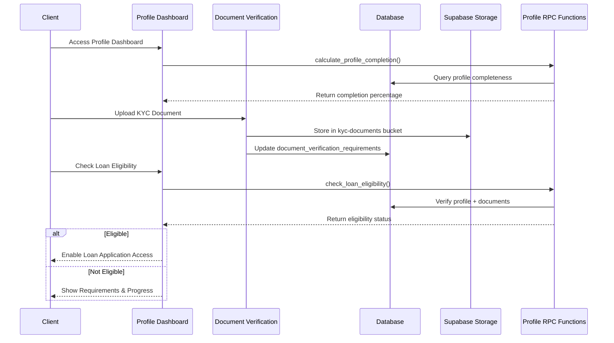
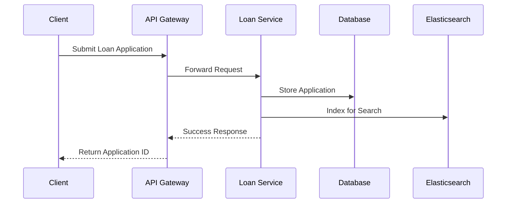

### Current State (v2.6.0) – Supabase-first

The production system uses a Supabase-first architecture with the following core building blocks:

- **Frontend (Web):** React 18 + TypeScript + Tailwind CSS
- **Mobile (iOS/Android):** React Native + Expo (v2.6.0 release)
- **Backend:** Supabase (PostgreSQL with RLS, Auth, Realtime, Storage)
- **Functions:** Supabase Edge Functions for controlled operations (`supabase/functions/process-loan-application`, `send-notification`)
- **Security:** RLS on all tables; APR cap 32%; NAD currency
- **Realtime:** Subscriptions on `approval_requests`, `payments`
- **Storage:** Supabase Storage for KYC documents with RLS policies

Target-cloud sections below (API Gateway, Redis, Elasticsearch, etc.) describe future evolution. For current implementation, these responsibilities are provided by Supabase services unless explicitly noted otherwise.

# Namlend Trust - Architecture Document

**Document Owner**: Chief Architect  
**Version**: 2.6.0  
**Last Updated**: 2025-10-14  
**Status**: Production Ready – Mobile v2.6.0 (Supabase-first)  

## Table of Contents

1. [Introduction](#introduction)
2. [System Context](#system-context)
3. [High-Level Architecture](#high-level-architecture)
4. [Component Architecture](#component-architecture)
5. [Data Architecture](#data-architecture)
6. [Deployment Architecture](#deployment-architecture)
7. [Integration Architecture](#integration-architecture)
8. [Security Architecture](#security-architecture)
9. [Scalability Considerations](#scalability-considerations)
10. [Resilience and Disaster Recovery](#resilience-and-disaster-recovery)
11. [Performance Considerations](#performance-considerations)
12. [Monitoring and Observability](#monitoring-and-observability)
13. [Appendix](#appendix)

## Introduction

This document outlines the architectural decisions and design principles that guide the development and evolution of the Namlend Trust platform. It serves as a reference for developers, architects, and stakeholders to understand the system's structure and behavior.

## System Context

### System Scope

Namlend Trust is a digital lending platform that connects borrowers with lenders, providing end-to-end loan management capabilities including application processing, underwriting, funding, and repayment.

### Key Stakeholders

- **Borrowers**: Individuals or businesses seeking loans
- **Lenders**: Financial institutions providing capital
- **Loan Officers**: Staff managing loan applications
- **Administrators**: System administrators managing the platform
- **Compliance Officers**: Ensuring regulatory requirements are met
- **Developers**: Building and maintaining the platform

### External Systems

- Payment processors (Stripe, Plaid)
- Identity verification services (Persona, Socure)
- Credit bureaus (Experian, Equifax, TransUnion)
- Communication services (SendGrid, Twilio)
- Cloud providers (AWS, Google Cloud)

## High-Level Architecture

### System Overview

```text
+----------------------------------------------------------------+
|                     Client Applications                         |
|  +----------------+    +----------------+    +---------------+ |
|  | Web Frontend   |    | Mobile App     |    | Admin Portal  | |
|  +-------+--------+    +--------+-------+    +-------+-------+ |
|          |                      |                    |         |
+----------|----------------------|--------------------|---------+
           |                      |                    |
           v                      v                    v
+----------------------------------------------------------------+
|                      API Gateway Layer                          |
|  +----------------+    +----------------+    +---------------+ |
|  | Authentication |    | Request        |    | Rate Limiting | |
|  | & Authorization|    | Routing        |    | & Throttling  | |
|  +-------+--------+    +--------+-------+    +-------+-------+ |
|          |                      |                    |         |
+----------|----------------------|--------------------|---------+
           |                      |                    |
           v                      v                    v
+----------------------------------------------------------------+
|                      Application Services                       |
|  +----------------+    +----------------+    +---------------+ |
|  | User Service   |    | Loan Service   |    | Payment       | |
|  |                |    |                |    | Service       | |
|  | - AuthN/AuthZ  |    | - Applications |    | - Processing  | |
|  | - Profile Mgmt |    | - Underwriting |    | - Scheduling  | |
|  +-------+--------+    +--------+-------+    +-------+-------+ |
|          |                      |                    |         |
|  +-------v--------+    +--------v-------+    +-------v-------+ |
|  | KYC Service    |    | Document       |    | Notification | |
|  |                |    | Service        |    | Service      | |
|  | - Verification |    | - Storage      |    | - Emails     | |
|  | - Compliance   |    | - Retrieval    |    | - SMS        | |
|  +----------------+    +----------------+    +-------------+ |
|                                                              |
+--------------------------------------------------------------+
           |                      |                    |
           v                      v                    v
+----------------------------------------------------------------+
|                      Data Layer                                |
|  +----------------+    +----------------+    +---------------+ |
|  | PostgreSQL     |    | Redis Cache    |    | Elasticsearch | |
|  | - Primary Data |    | - Sessions     |    | - Search      | |
|  | - ACID         |    | - Rate Limiting|    | - Analytics   | |
|  +-------+--------+    +--------+-------+    +-------+-------+ |
|          |                      |                    |         |
|  +-------v--------+    +--------v-------+                        |
|  | S3 Storage     |    | RabbitMQ       |                        |
|  | - Documents    |    | - Async Tasks  |                        |
|  | - Media        |    | - Events       |                        |
|  +----------------+    +----------------+                        |
|                                                              |
+--------------------------------------------------------------+
```

## Component Architecture

### Frontend Components

#### Web Application

- **Technologies**: React, TypeScript, Tailwind CSS
- **Key Features**:
  - Responsive design for all device sizes
  - Client-side routing with React Router
  - State management with React Query
  - Form handling with React Hook Form
  - Real-time updates via WebSockets

#### Mobile Application (v2.6.0)

- **Technologies**: React Native (Expo), TypeScript
- **Key Features (Implemented)**:
  - 3-step loan application with APR compliance (≤32%) and NAD formatting
  - KYC document capture (camera/gallery) with compression and progress
  - Payments (mobile money, bank transfer, debit order), schedule, history, receipts
  - Offline-first: queued submissions for applications/payments/documents + auto-sync
  - Biometric session lock and re-authentication
  - Push notifications and deep linking (`namlend://`)
  - Real-time approval badges via Supabase Realtime

### Backend Services

#### API Gateway

- **Technology**: AWS API Gateway
- **Responsibilities**:
  - Request routing
  - Authentication & authorization
  - Rate limiting
  - Request/response transformation
  - CORS handling

#### User Service

- **Technology**: Node.js, Express, TypeScript
- **Responsibilities**:
  - User registration and authentication
  - Profile management
  - Role-based access control
  - Session management

#### Loan Service

- **Technology**: Node.js, Express, TypeScript
- **Responsibilities**:
  - Loan application processing
  - Underwriting workflow
  - Loan lifecycle management
  - Document verification

#### Payment Service

- **Technology**: Node.js, Express, TypeScript
- **Responsibilities**:
  - Payment processing
  - Payment scheduling
  - Payment method management
  - Reconciliation

### Shared Components

#### Notification Service

- **Technology**: Node.js, TypeScript
- **Responsibilities**:
  - Email notifications
  - SMS notifications
  - In-app notifications
  - Notification preferences

#### Document Service

- **Technology**: Node.js, TypeScript, AWS S3
- **Responsibilities**:
  - Document upload and storage
  - Document retrieval
  - Document processing
  - OCR and data extraction

### Client Portal Architecture (v2.2.0)

#### Profile Management System

- **Technology**: React, TypeScript, Supabase
- **Components**:
  - `ClientProfileDashboard.tsx` - Dynamic profile overview with completion tracking
  - Profile completion percentage calculation via RPC functions
  - Tabbed interface (Overview, Personal, Employment, Banking, Documents)
  - Real-time eligibility status updates

#### Document Verification Framework

- **Technology**: React, Supabase Storage, PostgreSQL
- **Components**:
  - `DocumentVerificationSystem.tsx` - KYC document management
  - Private `kyc-documents` storage bucket with RLS policies
  - Document status lifecycle (Required → Under Review → Verified/Rejected)
  - Mandatory verification gating for loan application access

#### Client Profile & Verification Flow



## Data Architecture

### Data Flow



### Data Storage

#### Primary Database (PostgreSQL)

- **Schema**: Relational schema with proper normalization
- **Sharding**: By tenant/organization
- **Backup**: Continuous backup with point-in-time recovery

#### Cache (Redis)

- **Use Cases**:
  - Session storage
  - Rate limiting
  - Temporary data
  - Distributed locks

#### Object Storage (S3)

- **Use Cases**:
  - User uploads
  - Document storage
  - Static assets

#### Search (Elasticsearch)

- **Use Cases**:
  - Full-text search
  - Analytics
  - Logging

## Deployment Architecture

### Development Environment

- **Local Development**:
  - Docker Compose for local services
  - Mock services for external dependencies
  - Hot-reload for frontend and backend
- **CI/CD**:
  - Automated testing on pull requests
  - Preview deployments for feature branches

### Staging Environment

- **Purpose**:
  - Integration testing
  - User acceptance testing (UAT)
  - Performance testing
- **Configuration**:
  - Mirrors production environment
  - Isolated test data
  - Monitoring and logging enabled

### Production Environment

- **Cloud Provider**: AWS
- **Regions**: Multi-region deployment
- **Compute**:
  - EKS (Elastic Kubernetes Service)
  - Auto-scaling node groups
  - Spot instances for non-critical workloads
- **Networking**:
  - VPC with public and private subnets
  - AWS WAF for web application firewall
  - CloudFront CDN for static assets
- **Storage**:
  - RDS PostgreSQL with read replicas
  - ElastiCache for Redis
  - S3 with versioning and lifecycle policies

## Integration Architecture

### External Services

#### Payment Processors (Future)

- **Stripe**:
  - Credit/debit card processing
  - SEPA and ACH transfers
  - Payouts to lenders
- **Plaid**:
  - Bank account verification
  - Transaction history
  - Balance checks

#### Identity Verification (Future)

- **Persona**:
  - Document verification
  - Selfie matching
  - Watchlist screening
- **Socure**:
  - Identity verification
  - Fraud prevention
  - Risk scoring

### Integration Patterns

- **Synchronous**:
  - REST APIs for real-time operations
  - WebSockets for real-time updates
- **Asynchronous**:
  - Message queues for background processing
  - Event-driven architecture for decoupled services

## Security Architecture

### Authentication

- **Methods**:

### Enhanced Authentication Flow (September 2025)

```typescript
// Reactive authentication without page reloads
const signOut = async () => {
  await supabase.auth.signOut({ scope: 'global' });
  setUser(null);
  setSession(null);
  setUserRole(null);
  // No window.location.reload() - SPA-friendly
};

// Enhanced login with proper navigation timing
const handleLogin = async () => {
  const { error } = await signIn(email, password);
  await new Promise(resolve => setTimeout(resolve, 200));
  
  const { data: { user } } = await supabase.auth.getUser();
  const role = await determineUserRole(user.id);
  
  // Navigate based on role
  navigate(role === 'admin' ? '/admin' : '/dashboard');
};
```

### Data Protection

- **Database Security**: PostgreSQL with RLS enabled on all tables
- **API Security**: Supabase automatically handles SQL injection prevention
- **Input Validation**: Client-side and server-side validation for all forms
- **Audit Trail**: Comprehensive logging of all loan-related activities
- **Regulatory Compliance**: APR limits enforced (32% max for Namibian market)

### Development Security (Enhanced 2025)

- **Environment Isolation**: Strict separation of development and production environments
- **API Key Management**: Service role keys never exposed to frontend/mobile bundles
- **Debug Tool Gating (Web)**: Triple-layer protection with `VITE_DEBUG_TOOLS` flag
- **Debug Tool Gating (Mobile)**: `EXPO_PUBLIC_DEBUG_TOOLS=false` for production builds; guarded `safeExposeDevTools()` in app
- **Mock Data**: Safe development environment with comprehensive mock Supabase client
- **Secure Logging**: All development utilities use gated `debugLog()` instead of console

### Back Office Approval Workflow System

The platform implements a comprehensive approval workflow system for regulatory compliance and operational control:

#### Centralized Approval Management

- All user-initiated requests routed through approval workflow
- Configurable approval rules with automated decision support
- Real-time notifications for pending approvals and status changes

#### Request Types and Processing

- **Loan Applications**: Detailed financial data review with automated risk assessment
- **KYC Documents**: Document verification and compliance checking
- **Profile Updates**: Sensitive data modification approvals
- **Payment Processing**: Disbursement and transaction approvals

#### Database Schema

```sql
-- Core approval requests table
CREATE TABLE approval_requests (
  id UUID PRIMARY KEY DEFAULT gen_random_uuid(),
  user_id UUID REFERENCES auth.users(id),
  request_type approval_request_type NOT NULL,
  status approval_status DEFAULT 'pending',
  priority approval_priority DEFAULT 'normal',
  request_data JSONB NOT NULL,
  admin_notes TEXT,
  created_at TIMESTAMPTZ DEFAULT NOW(),
  reviewed_at TIMESTAMPTZ
);

-- Workflow history for audit trail
CREATE TABLE approval_workflow_history (
  id UUID PRIMARY KEY DEFAULT gen_random_uuid(),
  approval_request_id UUID REFERENCES approval_requests(id),
  status approval_status NOT NULL,
  changed_by UUID REFERENCES auth.users(id),
  notes TEXT,
  created_at TIMESTAMPTZ DEFAULT NOW()
);
```

#### Admin Dashboard Integration

- Dedicated approval management interface with filtering and search
- Real-time approval statistics and performance metrics
- Bulk processing capabilities for efficient workflow management
- Notification system with read/unread status tracking

### Development Tool Security Framework

```typescript
// Secure development tool exposure
import { safeExposeWindow, debugLog } from './devToolsHelper';

// Triple-gated protection
if (import.meta.env.DEV && 
    import.meta.env.VITE_DEBUG_TOOLS === 'true' && 
    typeof window !== 'undefined') {
  safeExposeWindow('debugUtility', myDebugFunction);
}

// Gated logging
debugLog('Development info:', data); // Only logs when debug tools enabled
```

- Admin client strictly gated behind development flags
- **Code Security**:
  - No hard reloads in SPA authentication flows
  - Reactive state updates for auth changes
  - APR validation at application and regulatory levels
  - Mandatory approval workflow for regulatory compliance

## Scalability Considerations

### Horizontal Scaling

- **Stateless Services**:
  - Auto-scaling based on CPU/memory usage
  - Container orchestration with Kubernetes
  - Service mesh for traffic management
- **Stateful Services**:
  - Database read replicas
  - Sharding for write scalability
  - Caching strategy

### Performance Optimization

- **Frontend**:
  - Code splitting
  - Lazy loading
  - Asset optimization
- **Backend**:
  - Connection pooling
  - Query optimization
  - Caching strategy

## Resilience and Disaster Recovery

### High Availability

- **Multi-AZ Deployment**:
  - Automatic failover
  - Load balancing
  - Health checks
- **Circuit Breakers**:
  - Failure detection
  - Automatic recovery
  - Fallback mechanisms

### Backup Strategy

- **Database**:
  - Continuous backups with 15-minute RPO
  - Point-in-time recovery (PITR)
  - Cross-region replication
- **Documents**:
  - Versioning
  - Cross-region replication
  - Immutable backups

## Performance Considerations

### Caching Strategy

- **Client-Side**:
  - Browser caching
  - Service workers
  - Local storage
- **Server-Side**:
  - CDN for static assets
  - Redis for frequently accessed data
  - Database query caching

### Database Optimization

- **Indexing Strategy**:
  - B-tree indexes for common queries
  - Partial indexes for filtered queries
  - Composite indexes for multi-column queries
- **Query Optimization**:
  - Query analysis
  - Explain plans
  - Query rewriting

## Monitoring and Observability

### Logging

- **Structured Logging**:
  - JSON format
  - Correlation IDs
  - Log levels
- **Centralized Logging**:
  - ELK Stack (Elasticsearch, Logstash, Kibana)
  - Log rotation and retention
  - Alerting on error patterns

### Metrics

- **Application Metrics**:
  - Request rates
  - Error rates
  - Latency
- **Business Metrics**:
  - Conversion rates
  - Loan approval rates
  - Payment success rates

### Tracing

- **Distributed Tracing**:
  - Request flow across services
  - Performance analysis
  - Dependency mapping
- **Tools**:
  - Jaeger
  - AWS X-Ray
  - OpenTelemetry

## Version 2.2.2 Architecture Updates

### Backend Remediation Artifacts

The v2.2.2 release includes comprehensive backend remediation with new database views and RPCs:

- **Enhanced Data Access**: `approval_requests_expanded` view eliminates N+1 query problems in admin interfaces
- **Atomic Transactions**: `process_approval_transaction` RPC ensures ACID compliance for loan processing
- **User Management**: `profiles_with_roles` view and `get_profiles_with_roles_admin` RPC streamline admin operations
- **Dashboard Optimization**: `get_admin_dashboard_summary` RPC provides efficient metrics aggregation

### Related Documentation

For detailed technical specifications and implementation guidance, refer to:

- [Frontend & Backoffice Architectural Map v2.2](./frontend-backoffice-architectural-map-v2.2.md)
- [Technical Audit Report v2.2](./technical-audit-report-v2.2.md)
- [Implementation Summary v2.2](./implementation-summary-v2.2.md)
- [System Architecture Diagrams](./system-architecture-diagrams.md)

## Appendix

### Technology Decisions

#### Why React?

- Large ecosystem and community
- Strong TypeScript support
- Reusable component architecture
- Excellent developer experience

#### Why Node.js?

- JavaScript/TypeScript across stack
- Non-blocking I/O for high concurrency
- Rich ecosystem of packages
- Strong performance characteristics

#### Why PostgreSQL?

- ACID compliance
- JSONB for flexible schema
- Strong consistency model
- Excellent for complex queries

### Future Considerations

- **Microservices Architecture**:
  - Service decomposition
  - Event-driven architecture
  - Polyglot persistence
- **Machine Learning**:
  - Credit scoring
  - Fraud detection
  - Personalized offers
