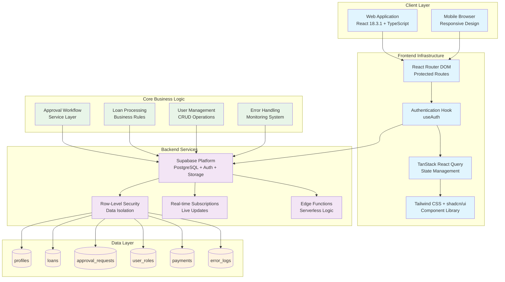
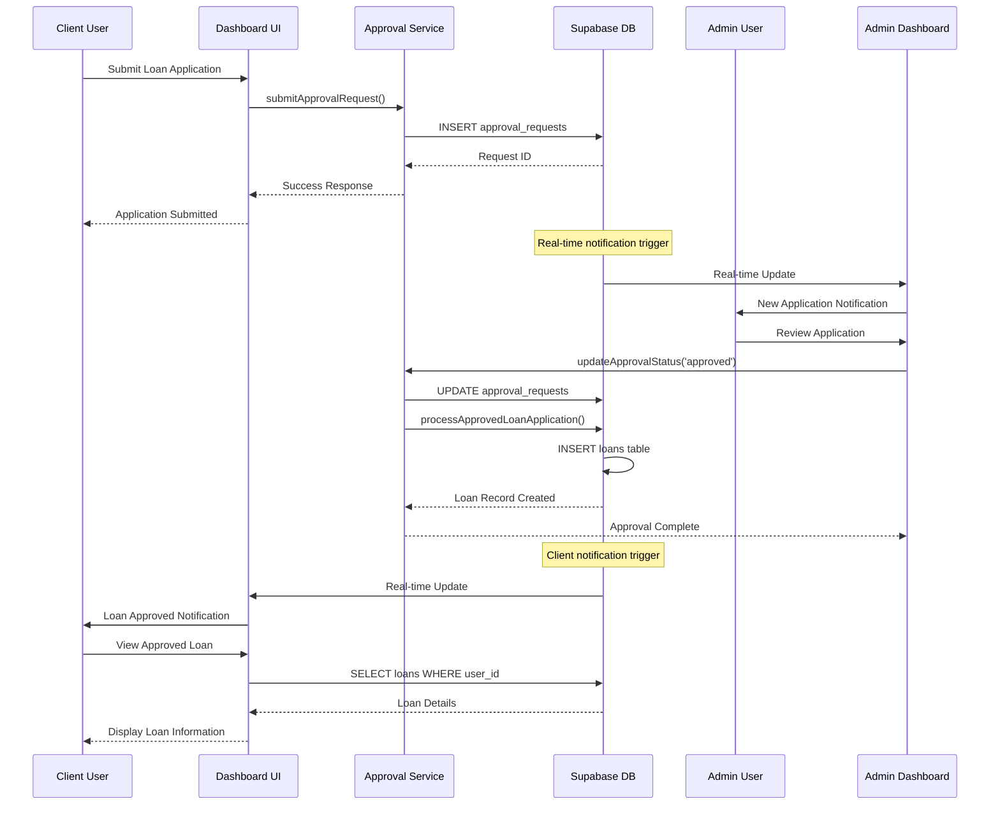
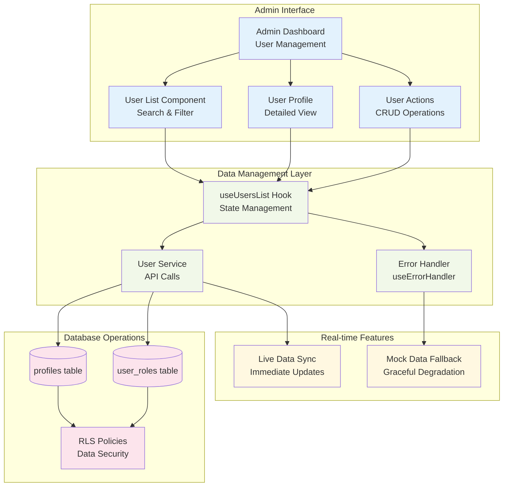
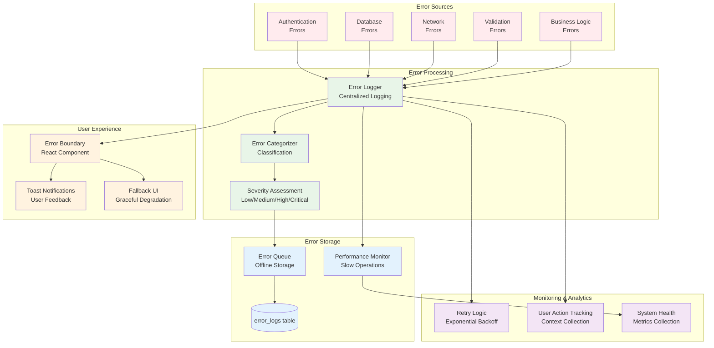
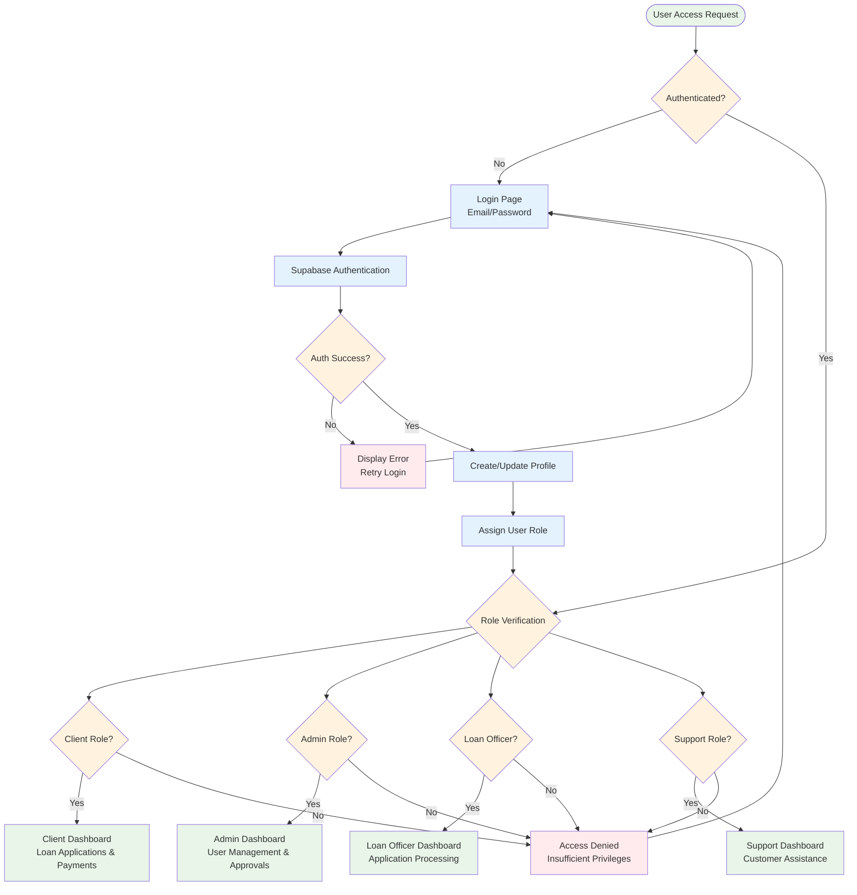
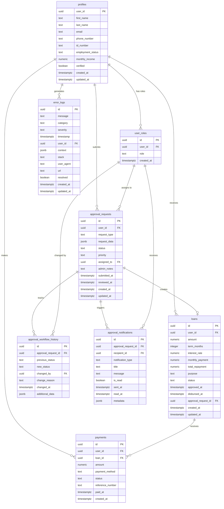
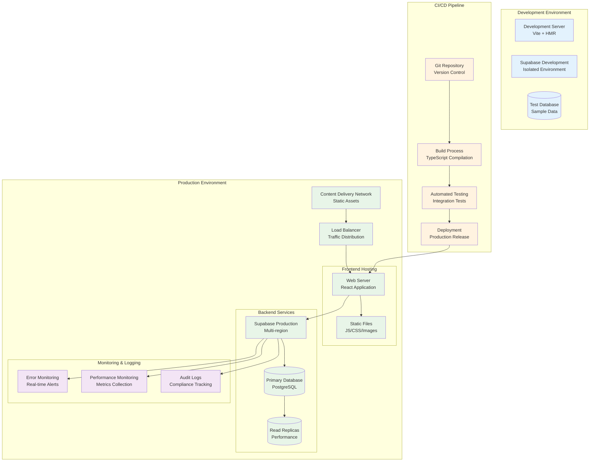
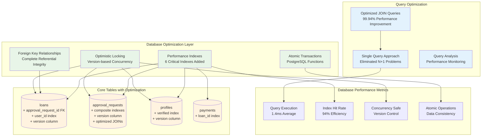
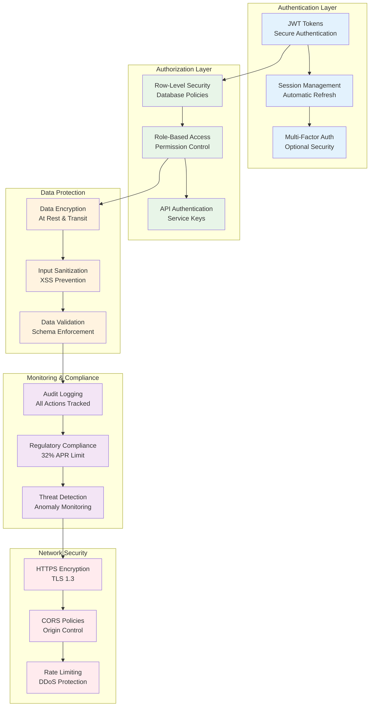

# NamLend Trust Platform - System Architecture Diagrams

**Version:** 2.6.0 | **Date:** October 14, 2025 | **Status:** ✅ PRODUCTION READY – MOBILE v2.6.0

## System Overview Architecture



## Mobile App Architecture (v2.6.0)

```mermaid
graph TB
    subgraph "Mobile App (React Native + Expo)"
        APP[Client App<br/>RN + Expo]
        AUTHRN[Supabase Auth<br/>AsyncStorage]
        OFFLINE[Offline Queue<br/>Applications/Payments/Documents]
        BIOMETRICS[Biometric Lock<br/>Face ID/Touch ID]
        NOTIFY[Push Notifications<br/>Expo Notifications]
        DEEPLINK[Deep Linking<br/>namlend://]
    end

    subgraph "Supabase"
        SB_DB[(PostgreSQL<br/>RLS Policies)]
        SB_AUTH[Auth]
        SB_RLS[RLS]
        SB_REAL[Realtime]
        SB_STORAGE[Storage (KYC Docs)]
        EDGE[Edge Functions]
    end

    APP --> AUTHRN
    AUTHRN --> SB_AUTH
    APP --> OFFLINE
    OFFLINE --> SB_DB
    APP --> NOTIFY
    APP --> DEEPLINK

    APP --> SB_REAL
    APP --> SB_STORAGE
    SB_DB --> SB_RLS
    SB_AUTH --> SB_DB
    EDGE --> SB_DB
```

## Loan Application Workflow



## User Management System Architecture



## Error Handling & Monitoring System



## Authentication & Authorization Flow



## Database Schema Relationships



## Deployment Architecture



## Optimized Database Performance Architecture (v2.1.3)



## Security Architecture


