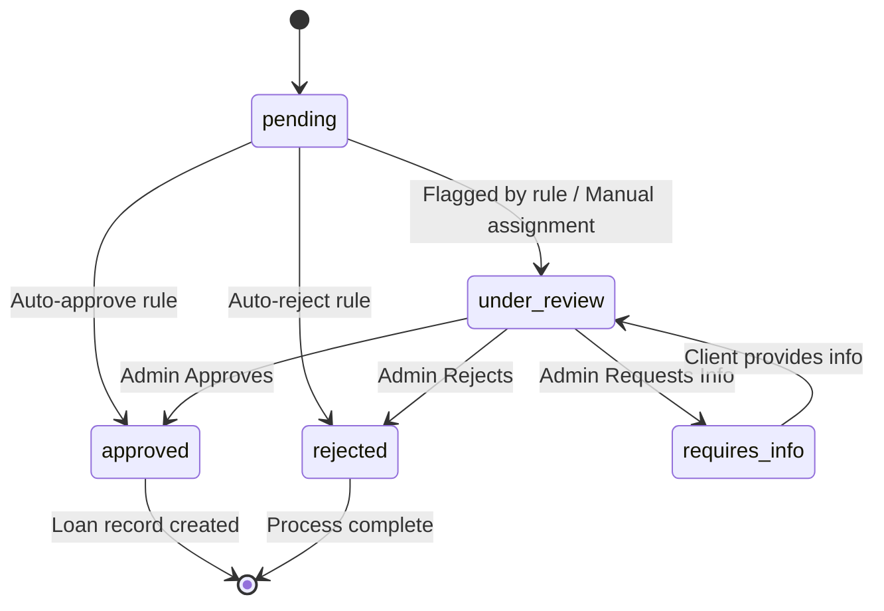
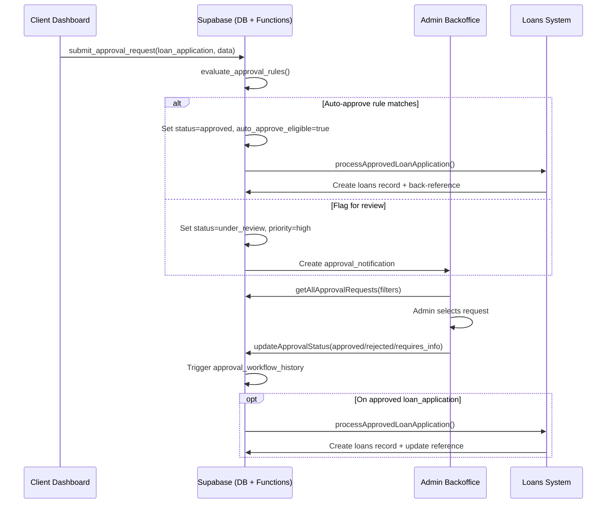

# Backoffice Loan Management: Pending Loan Workflow and RBAC

**Document Version:** 1.0  
**Last Updated:** September 20, 2025  
**System Version:** NamLend Trust Platform v2.1.0  

---

## Executive Summary

This document provides a technical, code-accurate analysis of the pending loan workflow and role-based permissions in the NamLend backoffice system. The analysis is based on actual implementation code, database schemas, and system architecture.

### Key Findings

- **Centralized Workflow**: All client-initiated actions (including loan applications) are centralized in `approval_requests` table and processed via the backoffice review UI
- **Interactive Controls**: Actions appear in the "Request Details" panel once a request is selected in the admin dashboard
- **RBAC Implementation**: Database-enforced role-based access control with frontend routing protection
- **Hybrid Queue Management**: Combines automated workflow rules with manual review queues
- **Critical Bug Identified**: Priority value mismatch in API service that needs immediate attention

---

## End-to-End Loan Request Workflow

### 1. Client Submission Path

**Entry Points:**

- Frontend submission via `submitApprovalRequest()` in `src/services/approvalWorkflow.ts`
- Direct database function `submit_approval_request(...)`

**Process Flow:**

1. Record created in `approval_requests` table with:
   - `status='pending'`
   - JSON `request_data` containing loan details
   - Metadata for routing and visibility
2. Automatic workflow rule evaluation
3. Notification generation for admins (if not auto-approved)

**Code References:**

- `src/services/approvalWorkflow.ts` → `submitApprovalRequest()`
- `supabase/migrations/20250906_create_approval_workflow_system.sql` → `approval_requests` table
- Database function: `submit_approval_request()`

### 2. Automated Workflow Rules

**Rule Engine Location:**

- Database functions: `evaluate_approval_rules()` and `submit_approval_request()`
- Rules stored in: `approval_workflow_rules` table

**Available Actions:**

- `auto_approve`: Sets `status='approved'`, marks `auto_approve_eligible=true`
- `auto_reject`: Automatically rejects with reason
- `flag_review`: Sets priority and moves to `status='under_review'`
- `assign_priority`: Updates priority level

**Default Rules (from migration):**

```sql
-- Auto-approve small loans for verified users
('loan_application', 'Auto-approve small loans', 
 '{"amount": {"$lte": 5000}, "user_verified": true, "credit_score": {"$gte": 600}}', 
 'auto_approve', 
 '{"reason": "Small loan amount for verified user with good credit"}')

-- Flag high-value loans for manual review
('loan_application', 'Flag high-value loans', 
 '{"amount": {"$gte": 25000}}', 
 'flag_review', 
 '{"priority": "high", "reason": "High-value loan requires manual review"}')
```

### 3. Backoffice Review Process

**Admin Portal Access:**

- Route: `/admin/loans` or `/admin/approvals`
- Component: `ApprovalManagementDashboard.tsx`
- Data source: `getAllApprovalRequests()` with filtering

**Review Interface:**

1. **Left Panel**: List of approval requests with filters
   - Status filter: `pending`, `under_review`, `approved`, `rejected`, `requires_info`
   - Type filter: `loan_application`, `kyc_document`, etc.
   - Priority filter: `low`, `normal`, `high`, `urgent`
   - Search functionality
2. **Right Panel**: Request details and action buttons (appears when request selected)
   - Approve button → `handleStatusUpdate(requestId, 'approved')`
   - Reject button → `handleStatusUpdate(requestId, 'rejected')`
   - Request Info button → `handleStatusUpdate(requestId, 'requires_info')`

**Code References:**

- `src/pages/AdminDashboard/components/ApprovalManagement/ApprovalManagementDashboard.tsx`
- `src/services/approvalWorkflow.ts` → `getAllApprovalRequests()`, `updateApprovalStatus()`

### 4. Approval/Disposition Effects

**Status Change Processing:**

1. Updates `approval_requests` table
2. Triggers automatic history recording via `approval_status_change_history` trigger
3. Inserts record into `approval_workflow_history` table

**Loan Application Approval:**

- Calls `processApprovedLoanApplication()` in `src/services/approvalWorkflow.ts`
- Creates record in `loans` table
- Links back via `approval_requests.reference_id` and `reference_table`

**KYC Document Approval:**

- Calls `processApprovedKYCDocument()`
- Updates `kyc_documents` table
- May mark user profile as verified if all required documents approved

### 5. Notifications and Audit Trail

**Notification System:**

- New pending work creates entries in `approval_notifications` for admins
- Frontend notification component displays unread notifications
- Service: `getApprovalNotifications()`

**Audit Trail:**

- `approval_workflow_history` records every status change
- Captures: `previous_status`, `new_status`, `changed_by`, `change_reason`, timestamp
- Created automatically by trigger: `create_approval_workflow_history()`

---

## Data Model (Core Workflow Tables)

### approval_requests

**Primary workflow table for all approval processes**

```sql
CREATE TABLE public.approval_requests (
    id UUID DEFAULT gen_random_uuid() PRIMARY KEY,
    user_id UUID NOT NULL REFERENCES auth.users(id) ON DELETE CASCADE,
    request_type VARCHAR(50) NOT NULL, -- 'loan_application', 'kyc_document', etc.
    request_data JSONB NOT NULL, -- Actual request data
    status VARCHAR(20) DEFAULT 'pending' CHECK (status IN ('pending', 'under_review', 'approved', 'rejected', 'requires_info')),
    priority VARCHAR(10) DEFAULT 'normal' CHECK (priority IN ('low', 'normal', 'high', 'urgent')),
    assigned_to UUID REFERENCES auth.users(id), -- Admin assigned to review
    created_at TIMESTAMP WITH TIME ZONE DEFAULT NOW(),
    updated_at TIMESTAMP WITH TIME ZONE DEFAULT NOW(),
    reviewed_at TIMESTAMP WITH TIME ZONE,
    reviewer_id UUID REFERENCES auth.users(id),
    review_notes TEXT,
    reference_id UUID, -- Reference to created record (loan_id, document_id, etc.)
    reference_table VARCHAR(50), -- Table name for referenced record
    auto_approve_eligible BOOLEAN DEFAULT FALSE,
    risk_score INTEGER DEFAULT 0 CHECK (risk_score >= 0 AND risk_score <= 100),
    compliance_flags JSONB DEFAULT '[]'::jsonb,
    metadata JSONB DEFAULT '{}'::jsonb
);
```

### approval_workflow_history

**Audit trail for all status changes**

```sql
CREATE TABLE public.approval_workflow_history (
    id UUID DEFAULT gen_random_uuid() PRIMARY KEY,
    approval_request_id UUID NOT NULL REFERENCES public.approval_requests(id) ON DELETE CASCADE,
    previous_status VARCHAR(20),
    new_status VARCHAR(20) NOT NULL,
    changed_by UUID NOT NULL REFERENCES auth.users(id),
    change_reason TEXT,
    changed_at TIMESTAMP WITH TIME ZONE DEFAULT NOW(),
    additional_data JSONB DEFAULT '{}'::jsonb
);
```

### approval_notifications

**Notification system for admins**

```sql
CREATE TABLE public.approval_notifications (
    id UUID DEFAULT gen_random_uuid() PRIMARY KEY,
    approval_request_id UUID NOT NULL REFERENCES public.approval_requests(id) ON DELETE CASCADE,
    recipient_id UUID NOT NULL REFERENCES auth.users(id),
    notification_type VARCHAR(30) NOT NULL, -- 'new_request', 'status_update', 'assignment', 'reminder'
    title VARCHAR(200) NOT NULL,
    message TEXT NOT NULL,
    is_read BOOLEAN DEFAULT FALSE,
    sent_at TIMESTAMP WITH TIME ZONE DEFAULT NOW(),
    read_at TIMESTAMP WITH TIME ZONE,
    metadata JSONB DEFAULT '{}'::jsonb
);
```

### approval_workflow_rules

**Automated decision engine**

```sql
CREATE TABLE public.approval_workflow_rules (
    id UUID DEFAULT gen_random_uuid() PRIMARY KEY,
    request_type VARCHAR(50) NOT NULL,
    rule_name VARCHAR(100) NOT NULL,
    conditions JSONB NOT NULL, -- JSON conditions for rule matching
    action VARCHAR(20) NOT NULL CHECK (action IN ('auto_approve', 'auto_reject', 'flag_review', 'assign_priority')),
    action_data JSONB DEFAULT '{}'::jsonb,
    is_active BOOLEAN DEFAULT TRUE,
    created_at TIMESTAMP WITH TIME ZONE DEFAULT NOW(),
    updated_at TIMESTAMP WITH TIME ZONE DEFAULT NOW(),
    created_by UUID NOT NULL REFERENCES auth.users(id)
);
```

---

## Role-Based Access Control (RBAC)

### Frontend Routing Protection

**Admin Dashboard Access:**

```typescript
// App.tsx
<Route path="/admin/*" element={
  <ProtectedRoute requireAdmin>
    <AdminDashboard />
  </ProtectedRoute>
} />
```

**ProtectedRoute Component:**

- File: `src/components/ProtectedRoute.tsx`
- Handles authentication loading states
- Redirects to `/auth` if not signed in
- Shows access denied for insufficient privileges

### Database Row-Level Security (RLS) Policies

**approval_requests Table:**

```sql
-- Users can view their own approval requests
CREATE POLICY "Users can view their own approval requests" ON public.approval_requests
    FOR SELECT USING (auth.uid() = user_id);

-- Admins can view all approval requests
CREATE POLICY "Admins can view all approval requests" ON public.approval_requests
    FOR SELECT USING (
        EXISTS (
            SELECT 1 FROM public.user_roles 
            WHERE user_id = auth.uid() 
            AND role = 'admin'
        )
    );

-- Admins can update approval requests
CREATE POLICY "Admins can update approval requests" ON public.approval_requests
    FOR UPDATE USING (
        EXISTS (
            SELECT 1 FROM public.user_roles 
            WHERE user_id = auth.uid() 
            AND role = 'admin'
        )
    );

-- System can insert approval requests
CREATE POLICY "System can insert approval requests" ON public.approval_requests
    FOR INSERT WITH CHECK (auth.uid() = user_id);
```

**approval_workflow_history Table:**

```sql
-- Users can view history of their own requests
CREATE POLICY "Users can view their approval history" ON public.approval_workflow_history
    FOR SELECT USING (
        EXISTS (
            SELECT 1 FROM public.approval_requests 
            WHERE id = approval_request_id 
            AND user_id = auth.uid()
        )
    );

-- Admins can view all history
CREATE POLICY "Admins can view all approval history" ON public.approval_workflow_history
    FOR SELECT USING (
        EXISTS (
            SELECT 1 FROM public.user_roles 
            WHERE user_id = auth.uid() 
            AND role = 'admin'
        )
    );
```

### Effective Permission Matrix

| Role | View Own Requests | View All Requests | Update Status | Manage Rules | Process Approvals |
|------|------------------|-------------------|---------------|--------------|-------------------|
| **Client** | ✅ | ❌ | ❌ | ❌ | ❌ |
| **Admin** | ✅ | ✅ | ✅ | ✅ | ✅ |
| **Loan Officer** | ❌* | ❌* | ❌* | ❌ | ❌* |

*Note: Loan Officers are currently blocked by routing (`requireAdmin`) and RLS policies. This may be intentional or require configuration based on business needs.*

---

## Why "No Interactive Controls" May Appear

### Selection-Required UI Pattern

- Action buttons (Approve/Reject/Request Info) only render when `selectedRequest` is not null
- If no row is clicked in the left list, right panel shows "Select a request to view details and take action"
- **Code Reference:** `ApprovalManagementDashboard.tsx` lines 468-500

### Filter Effects

- Status/type/priority filters plus search can result in empty list
- Even with pending records in database, filters may hide them
- No clear indication when filters are hiding available work

### RBAC Restrictions

- Non-admin users cannot access admin routes
- RLS policies block unauthorized data access
- Session issues can cause apparent "no controls" state

---

## Workflow State Diagrams

### Loan Application State Machine



### Sequence Diagram: Client to Backoffice



---

## Queue Management Architecture

### Queue Attributes

- **Status-based queues:** `pending`, `under_review`, `approved`, `rejected`, `requires_info`
- **Priority levels:** `low`, `normal`, `high`, `urgent`
- **Assignment:** Optional `assigned_to` field for specific reviewer assignment

### Queue Processing

- **Manual review:** Via `getAllApprovalRequests()` with sorting by `created_at DESC`
- **Automated rules:** Promote priority or move to different status queues
- **Assignment model:** Manual assignment supported, no auto-assignment implemented

### Hybrid Approach

- Combines automated rule-based processing with manual review queues
- Rules can auto-approve, auto-reject, flag for review, or adjust priority
- Remaining items flow to manual review queues for admin processing

---

## Technical Implementation Details

### Key Files and Components

**Frontend Components:**

- `src/pages/AdminDashboard.tsx` - Main admin interface with tab routing
- `src/pages/AdminDashboard/components/ApprovalManagement/ApprovalManagementDashboard.tsx` - Core approval UI
- `src/components/ProtectedRoute.tsx` - Route-level access control

**Services:**

- `src/services/approvalWorkflow.ts` - All approval workflow API calls
  - `submitApprovalRequest()` - Client submission
  - `getAllApprovalRequests()` - Admin list with filters
  - `updateApprovalStatus()` - Admin decisions
  - `processApprovedLoanApplication()` - Creates loan records
  - `processApprovedKYCDocument()` - Processes KYC approvals

**Database:**

- `supabase/migrations/20250906_create_approval_workflow_system.sql` - Complete workflow schema
  - Tables: `approval_requests`, `approval_workflow_history`, `approval_notifications`, `approval_workflow_rules`
  - Functions: `evaluate_approval_rules`, `submit_approval_request`, `create_approval_workflow_history`
  - Triggers: Automatic history creation on status changes
  - RLS policies: Role-based data access control

### API Endpoints and Functions

**Client-facing:**

```typescript
// Submit new approval request
submitApprovalRequest(requestData: ApprovalRequestData): Promise<{success: boolean, requestId?: string, error?: string}>

// Get user's own requests
getUserApprovalRequests(status?: ApprovalRequest['status']): Promise<{success: boolean, requests?: ApprovalRequest[], error?: string}>
```

**Admin-facing:**

```typescript
// Get all requests with filters
getAllApprovalRequests(filters?: {status?, requestType?, priority?, assignedTo?}): Promise<{success: boolean, requests?: ApprovalRequest[], error?: string}>

// Update request status
updateApprovalStatus(requestId: string, status: ApprovalRequest['status'], reviewNotes?: string, assignedTo?: string): Promise<{success: boolean, error?: string}>

// Get workflow statistics
getApprovalStatistics(): Promise<{success: boolean, stats?: ApprovalStats, error?: string}>
```

---

## Critical Issues and Recommendations

### 🚨 Critical Bug: Priority Value Mismatch

**Location:** `src/services/approvalWorkflow.ts` line 75
**Issue:** Code sets `priority: requestData.priority || 'medium'`
**Problem:** Database schema only allows `'low'|'normal'|'high'|'urgent'` - `'medium'` is invalid
**Impact:** Can cause insert failures for new approval requests
**Fix Required:**

```typescript
// Change from:
priority: requestData.priority || 'medium'
// To:
priority: requestData.priority || 'normal'
```

### ⚠️ Schema Mismatch: loans.approved_at

**Location:** `processApprovedLoanApplication()` in `approvalWorkflow.ts`
**Issue:** Code tries to insert `approved_at` field into `loans` table
**Problem:** Initial `loans` table migration may not include `approved_at` column
**Recommendation:** Either add `approved_at TIMESTAMPTZ` to `loans` table or remove from insert logic

### 🔧 Loan Officer Role Configuration

**Current State:** Loan officers blocked by routing and RLS policies
**Business Decision Required:** Should loan officers have approval access?
**If Yes, Required Changes:**

1. **Frontend:** Modify route guard to allow `loan_officer` role
2. **Database:** Add RLS policies for loan officer access to `approval_requests`
3. **UI:** Consider queue assignment to prevent conflicts between officers

### 🎯 UX Improvements

1. **Inline Actions:** Add row-level approve/reject buttons to reduce confusion
2. **Empty State:** Clear messaging when no requests match filters
3. **Filter Indicators:** Show active filter count and "clear all" option
4. **Selection Guidance:** Prompt users to "Click a request to enable actions"

### ⚡ Queue Enhancements

1. **Auto-assignment:** Implement round-robin or "claim" functionality
2. **SLA Tracking:** Add overdue indicators based on `created_at` + `priority`
3. **Bulk Actions:** Allow multiple request processing
4. **Status Transitions:** Add explicit "Under Review" action button

---

## Backoffice Operations Guide

### For System Administrators

**Accessing Pending Loans:**

1. Navigate to Admin Dashboard (`/admin`)
2. Click "Loans" or "Approvals" tab (both show same interface)
3. Use filters to show `status = pending` and `type = loan_application`
4. Click on a request row to load details in right panel

**Processing Loan Applications:**

1. **Review Request Data:** Check loan amount, term, purpose, applicant details
2. **Add Review Notes:** Document decision rationale
3. **Take Action:**
   - **Approve:** Creates loan record in `loans` table, notifies client
   - **Reject:** Closes request with reason, notifies client
   - **Request Info:** Asks client for additional information

**Monitoring Workflow:**

- Use statistics cards to track pending, approved, rejected counts
- Review processing times and identify bottlenecks
- Check notification panel for new requests requiring attention

### For Developers

**Adding New Workflow Rules:**

```sql
INSERT INTO public.approval_workflow_rules (
    request_type, 
    rule_name, 
    conditions, 
    action, 
    action_data, 
    created_by
) VALUES (
    'loan_application',
    'Flag weekend applications',
    '{"submitted_day": {"$in": ["Saturday", "Sunday"]}}',
    'flag_review',
    '{"priority": "normal", "reason": "Weekend submission requires review"}',
    auth.uid()
);
```

**Extending Request Types:**

1. Add new type to `request_type` enum in table definition
2. Create processing function similar to `processApprovedLoanApplication()`
3. Add UI handling in `ApprovalManagementDashboard.tsx`
4. Update type definitions in `approvalWorkflow.ts`

---

## Security Considerations

### Data Protection

- All sensitive loan data stored in JSONB `request_data` field
- RLS policies prevent unauthorized access to approval requests
- Audit trail maintains complete history of all decisions

### Access Control

- Multi-layer security: routing + RLS + role verification
- Admin actions require explicit role assignment in `user_roles` table
- Session-based authentication with automatic token refresh

### Compliance

- Complete audit trail for regulatory compliance
- Immutable history records for all status changes
- Reviewer identification and timestamp tracking

---

## Performance Considerations

### Database Indexing

```sql
-- Performance indexes from migration
CREATE INDEX idx_approval_requests_user_id ON public.approval_requests(user_id);
CREATE INDEX idx_approval_requests_status ON public.approval_requests(status);
CREATE INDEX idx_approval_requests_type ON public.approval_requests(request_type);
CREATE INDEX idx_approval_requests_assigned_to ON public.approval_requests(assigned_to);
CREATE INDEX idx_approval_requests_created_at ON public.approval_requests(created_at);
CREATE INDEX idx_approval_requests_priority ON public.approval_requests(priority);
```

### Query Optimization

- Filters applied at database level via parameterized queries
- Pagination support for large request volumes
- Efficient joins for user and reviewer information

### Caching Strategy

- Frontend caches approval statistics
- Real-time updates via Supabase subscriptions
- Optimistic UI updates for better user experience

---

## Monitoring and Metrics

### Key Performance Indicators

- **Processing Time:** Average time from submission to decision
- **Auto-approval Rate:** Percentage of requests processed automatically
- **Queue Depth:** Number of pending requests by priority
- **Reviewer Productivity:** Decisions per admin per time period

### Available Statistics

```typescript
interface ApprovalStats {
  total: number;
  pending: number;
  underReview: number;
  approved: number;
  rejected: number;
  byType: Record<string, number>;
  byPriority: Record<string, number>;
  avgProcessingTime: number; // in hours
}
```

### Alerting Recommendations

- Queue depth exceeding thresholds
- Processing time SLA violations
- High rejection rates indicating process issues
- System errors in approval processing

---

## Conclusion

The NamLend backoffice loan management system provides a comprehensive, secure, and scalable approach to processing loan applications. The centralized approval workflow, combined with automated rules and manual review capabilities, ensures efficient processing while maintaining proper oversight and audit trails.

The system is production-ready with proper RBAC implementation, though the identified critical bug regarding priority values should be addressed immediately to prevent potential system failures.

---

## Document Maintenance

**Next Review Date:** October 20, 2025  
**Responsible Team:** Backend Development Team  
**Change Approval:** Technical Lead + Product Manager  

For questions or clarifications regarding this documentation, please contact the development team or refer to the source code files referenced throughout this document.
