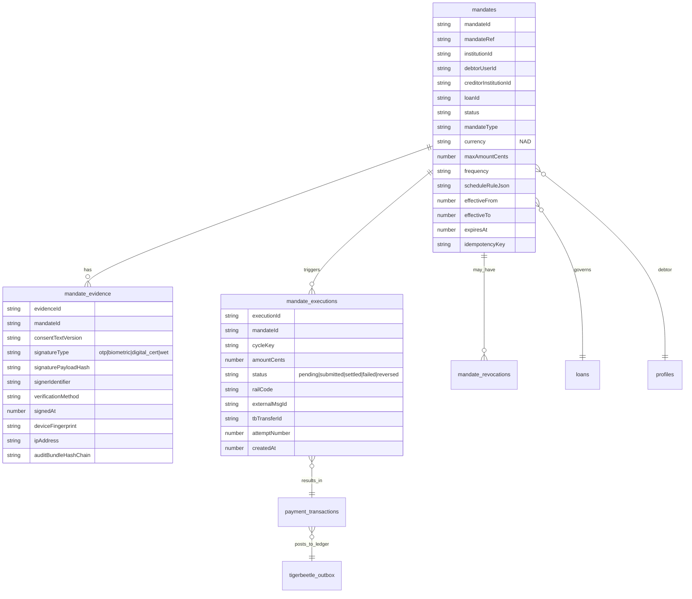
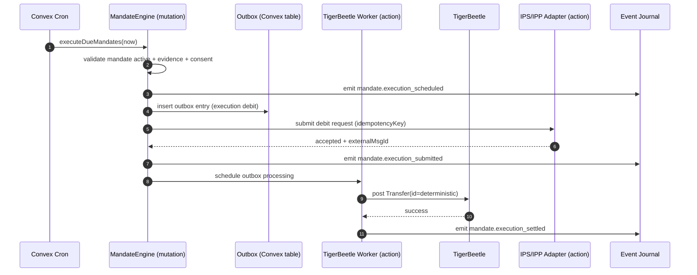
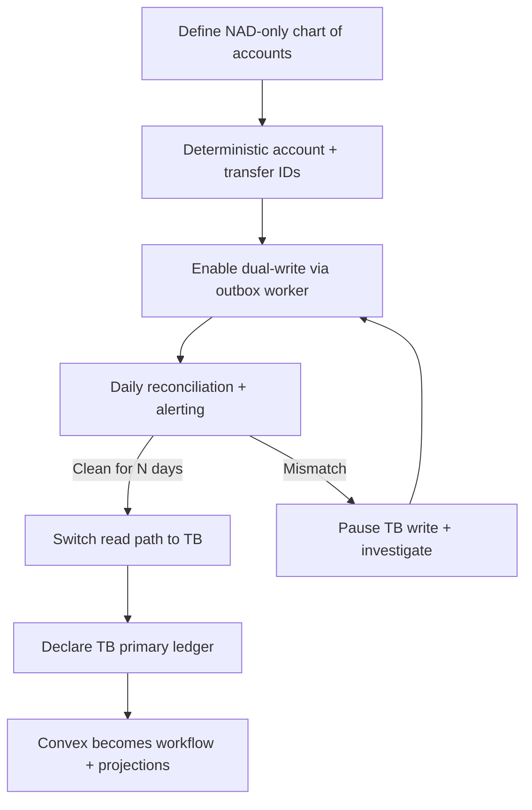

# Executive Summary:

NamLend Trust is best understood as an **institution-grade execution layer** for digital credit in entity["country","Namibia","southern africa country"]: a system that models **obligations (loans), authorizations (mandates), and money movement (payments + settlement)** as first-class, auditable primitives. This positioning is strongly aligned with the entity["organization","Bank of Namibia","central bank"] payments modernization agenda: NISS has migrated to ISO 20022 (effective May 2025), and the Bank is directing industry to implement interoperability through an Instant Payment Switch (IPS) as digital public infrastructure. citeturn8search4turn8search0turn5view0

Your core architectural bet—**Convex** as transactional workflow/state and **TigerBeetle** as the eventual accounting truth—is technically coherent, and maps cleanly to “ontology thinking” used by entity["company","Palantir Technologies","software company"] (objects + links + actions with governance). citeturn10search7turn9search0turn9search3turn9search5

The highest-leverage next step remains the same: **make the Mandate Engine legally and operationally defensible**. In practice, “Section 20 compliant” spans _two_ domains that must be handled together: interoperability obligations in the Payment System Management Act (s.20), and the legal validity of electronic signatures in the Electronic Transactions Act (s.20) as elaborated by the Electronic Signature Regulations (positive act, signer identification, verifiability, tamper-detectability). citeturn0search1turn1search0turn18view0

Assumptions: I do not have direct code execution access; I treat your described architecture and uploaded documentation as authoritative. Deployment is assumed cloud-hosted Convex + a TigerBeetle cluster. This is advisory analysis, **not legal advice**.

### Immediate actions to start now

- Finalize **mandate evidence package** to meet Electronic Signature Regulations validity tests (and dispute-ready audit). citeturn18view0
- Implement strict **idempotency keys** for mandate creation + execution (end-to-end). citeturn9search4turn10search7
- Make IPS/IPP integration plan explicit against PSDIR‑11 plus the amendment timeline. citeturn5view0turn1search44
- Move TigerBeetle worker from “simulated” to “live-posting” in a controlled dual-write phase. citeturn9search4turn9search5
- Define a Namibia NAD-only **chart of accounts** and account mapping rules (do not add multi-currency yet). citeturn9search6turn5view0
- Put settlement transport behind a “transport adapter” boundary (SFTP/file/API readiness), keeping ISO 20022 message generation stable. citeturn8search0turn8search4
- Create a “regulator-ready dossier” export: mandate evidence + event trail + payment/settlement refs. citeturn18view0turn9search0
- Establish QA gates: reconciliation mismatch rate, duplicate execution rate, and mandate evidence completeness. citeturn10search1turn9search4

## Evidence basis and strategic context

The external environment makes an execution-and-truth platform far more valuable than a “loan app.” Three facts matter most:

First, **NISS is RTGS with legal finality**: settlements are “final and irrevocable” and cannot be unwound once posted, and NISS integrates with an interbank card switch and EFT system operated by entity["organization","NamClear","payment system operator na"]. Your platform must treat settlement confirmations as irreversible truth events, with correcting entries rather than mutation of history. citeturn8search0turn9search4

Second, **ISO 20022 is live**: the Bank announced successful migration of NISS to ISO 20022 effective 12 May 2025. This validates your ISO 20022 competence and justifies investing in message correctness and evidence retention. citeturn8search4

Third, **interoperability is mandated**: PSDIR‑11 directs PSPs to ensure e-money interoperability through the instant payment switch by 26 Feb 2026 (later amended to 30 Nov 2026), and frames IPS as “digital public infrastructure.” This reinforces infrastructure-first positioning (institutions, schemes, compliance reporting). citeturn5view0turn1search44

Technically, your stack direction is aligned with best practice patterns:

- **Convex** gives deterministic, serializable transaction semantics (important for payment orchestration and avoiding race-condition ledgers), and supports durable scheduled functions and cron jobs for mandate execution and outbox processing. citeturn10search7turn10search1turn10search0
- **TigerBeetle** provides immutable accounting transfers with unique IDs and reversals via correcting transfers—exactly what you want as your financial source of truth. entity["company","TigerBeetle","financial accounting db"] citeturn9search4turn9search5
- The Palantir-style ontology analogy is concretely supported by “actions” as single governed transactions changing multiple objects/links—very similar to how you want “approve loan,” “authorize mandate,” and “execute mandate” to behave. entity["people","Alex Karp","palantir ceo"] citeturn9search0turn9search2

## Gap analysis and risk mapping

Below is a concise mapping from the _practical_ gaps (even if partially implemented) to business/regulatory risk.

| Gap / Weakness                            | Technical symptom                                                    | Business risk                                                                           | Regulatory / legal risk                                                                          | Why it’s load-bearing                                                                                                       |
| ----------------------------------------- | -------------------------------------------------------------------- | --------------------------------------------------------------------------------------- | ------------------------------------------------------------------------------------------------ | --------------------------------------------------------------------------------------------------------------------------- |
| IPS/IPP integration not productionized    | Mock adapters, missing mTLS, weak webhook verification               | “Operating system” claim collapses without real executions; slow institutional adoption | Non-compliance with interoperability direction; inability to produce mandated reporting evidence | PSDIR‑11 positions IPS as shared infrastructure and expects progress / compliance reporting citeturn5view0turn1search44 |
| Mandate Engine evidence not dispute-ready | Authorization exists but evidence package incomplete or non-standard | Collections fail when borrowers dispute; high default losses                            | E-signatures must be positive act, identify signer, be verifiable and tamper-detectable          | Electronic Signature Regulations define validity tests and evidence expectations citeturn18view0turn18view1             |
| TigerBeetle still “shadow”                | Convex state treated as ledger truth; TB events not authoritative    | Balance drift, settlement mismatch, weak audit story                                    | Accounting corrections require immutable ledger with reversals                                   | TigerBeetle transfers are immutable; corrections are new transfers citeturn9search4turn9search5                         |
| Settlement transport incomplete           | ISO 20022 message generation exists, but no dispatch/ack ingest      | Cannot close the loop on inter-institution obligations                                  | RTGS finality requires robust evidence chain; disputes require traceability                      | NISS finality/irrevocability means your system must preserve the chain-of-truth citeturn8search0turn9search4            |
| Weak correlation/causation threading      | Events exist but causal chains aren’t consistently propagated        | Harder operations and incident response; slower regulatory inquiries                    | Reduced auditability of “who authorized what caused what money movement”                         | Regulators and institutions care about traceability, not just records citeturn9search0turn10search1                     |
| Rules-as-data incomplete coverage         | Some rules externalized; others remain code-only                     | Product changes require redeploy; slows institutional onboarding                        | Microlending compliance depends on term/fee rules that must be provable “as-of”                  | Microlending limits and prohibited conduct require enforceable invariant logic citeturn4search3turn3search1             |
| Temporal modeling partial                 | Not all policies/versioning are effective-dated                      | Historical reporting brittle; disputes hard                                             | Legal/reg compliance often requires “what was true then”                                         | ISO20022 / settlement and lending disputes require point-in-time truth citeturn8search4turn10search7                    |
| Multi-tenancy unproven in production      | Scoping exists, but no second-institution operational proof          | Platform thesis unvalidated; sales cycle stalls                                         | Data-segregation failures can become catastrophic                                                | Institutional adoption hinges on isolation + audit separation citeturn0search1turn9search0                              |
| Ontology UI incomplete                    | Admin/ops cannot inspect evidence, events, relationships easily      | Ops cost rises; weak demos; slow onboarding                                             | Cannot respond fast to regulator evidence requests                                               | “Operational truth” must be explorable and exportable citeturn9search0turn10search2                                     |

### Top risks and mitigations

1. **Mandate dispute loss** → implement evidence package + tamper-evident hashing + consent text versioning. citeturn18view0turn10search7
2. **Double-execution (duplicate debits)** → end-to-end idempotency keys + execution lock per mandate-cycle + TB unique transfer IDs. citeturn9search4turn10search7
3. **Ledger drift (Convex vs TB)** → dual-write + daily reconciliation + block “funds moved” state unless TB posted OK. citeturn9search4turn10search1
4. **Settlement evidence gap** → transport adapter with ack ingest + immutable message/evidence storage. citeturn8search0turn9search4
5. **Regulatory deadline slippage** → publish IPS implementation plan aligned to PSDIR‑11 and amendment. citeturn5view0turn1search44
6. **Microlending compliance bug** → encode constraints as rules-as-data with effective dating and test fixtures. citeturn4search3turn3search1
7. **Data isolation failure** → enforce institution scoping middleware at the query boundary; add tests and red-team cases. citeturn0search1turn10search7
8. **Ops blindness** → event journal + relationship explorer UI + “export dossier” function. citeturn9search0turn10search2
9. **External rail outages** → rail health model + failover routing (NAD-only). citeturn5view0turn10search0
10. **Legal uncertainty on commencement** of Electronic Transactions Act provisions → treat regulations as best practice and confirm commencement status with counsel; design evidence to exceed minimum. citeturn1search0turn18view0

## Technical design for the Mandate Engine

The Mandate Engine must produce something courts, banks, and regulators can understand: a **tamper-evident authorization record** that links a person (identity), an obligation (loan or other), and an execution (payment rail movement).

### Core design objectives

- Authorization certainty: “who agreed to what” with evidence meeting validity tests. citeturn18view0
- Execution certainty: scheduled, idempotent mandate runs that behave like durable workflows. citeturn10search1turn10search0
- Financial truth: mandate execution creates immutable accounting transfers (and reversals if needed). citeturn9search4
- NAD-only: mandate currency fixed to NAD to match Namibia’s e-money framing and reduce risk. citeturn5view0

### Schema (recommended)

Key point: separate the **Mandate** (authorization) from **Evidence** (signature/consent artifacts) and from **Execution** (each debit attempt).

### State machine

State machine must minimize ambiguous states and enforce legal transitions.

- `draft` → `pending_authorization` → `active`
- `active` ↔ `suspended`
- `active` → `revoked` (terminal)
- `active` → `expired` (terminal)
- `pending_authorization` → `cancelled` (terminal, non-executed)

Rules:

- Cannot execute unless `active` AND evidence present AND consent valid.
- Revocation requires written reason and actor attribution.
- Expiry is computed; do not “manually expire” without an event.

### Evidence model (Electronic Signature Regulations mapping)

The Electronic Signature Regulations define validity requirements: positive act, clarity/audibility, signer identification, verifiability, and tamper-detectability. citeturn18view0

Translate those into fields/tests:

- **Positive act of acceptance** → store UI action type (checkbox + confirm), OTP entry, or biometric assertion; store signedAt and session trace. citeturn18view0
- **Identifies signer** → link to KYC identity (idNumber/idType) and phone/email used for OTP; store signerIdentifier and verification method. citeturn18view0
- **Verifiable** → store OTP verification record ID (internal), or certificate chain thumbprint for recognised signatures. citeturn18view0
- **Tamper-detectable** → store hashes: (mandate canonical JSON + consentText + evidence blob) → SHA-256; append a hash chain per evidence update. citeturn18view0turn9search4
- **Supported signature types** → explicitly allow OTP and biometrics as “basic electronic signature” examples; preserve exact method. citeturn18view0

Legal nuance: the Electronic Transactions Act section 20 is presented as “uncommenced” on NamibLII; the regulations themselves state they come into operation on commencement of that section. Treat the regulations as _future enforceability + current best practice_ and confirm commencement status with counsel. citeturn1search0turn5view1

### API endpoints (Convex-style)

Use a clear public/internal split.

Public (client-callable):

- `POST /mandates` → `createMandate({ idempotencyKey, loanId?, maxAmount, scheduleRule, ... })`
- `POST /mandates/{id}/submit` → moves to `pending_authorization`
- `POST /mandates/{id}/authorize` → OTP verify / signature attach → moves to `active`
- `POST /mandates/{id}/suspend` and `/reactivate`
- `POST /mandates/{id}/revoke` → terminal + revocation reason
- `GET /mandates/{id}` and `GET /loans/{loanId}/mandates`

Internal (server-only):

- `POST /mandates/{id}/execute` (used by scheduler/cron)
- `POST /mandateExecutions/{id}/complete` / `/fail` / `/reverse`
- `GET /mandates/due` returns due mandates by `nextExecutionAt`

### Events and integration (Convex + TigerBeetle)

Events should be semantic, past-tense, and correlation-threaded:

- `mandate.created`, `mandate.submitted`, `mandate.authorized`, `mandate.suspended`, `mandate.revoked`, `mandate.expired`
- `mandate.execution_scheduled`, `mandate.execution_submitted`, `mandate.execution_settled`, `mandate.execution_failed`, `mandate.execution_reversed`
- `consent.granted`, `consent.withdrawn`

Convex primitives that matter:

- **Serializable mutations** prevent concurrent double-execution patterns. citeturn10search7
- **Scheduling from mutations is atomic**: if you enqueue an execution after you write state, it is guaranteed to be scheduled if the mutation commits. citeturn10search1

TigerBeetle integration notes:

- Each mandate execution must map to a deterministic TigerBeetle `Transfer.id` derived from `(mandateId, cycleKey, attemptNumber)` so retries cannot duplicate postings. TigerBeetle guarantees at most one transfer per ID. citeturn9search4
- Reversals are correcting transfers; do not delete. citeturn9search4

### Mandate execution sequence

## Migration plan to promote TigerBeetle from shadow to primary ledger

### Rationale

To be credible as “financial operating system,” the ledger must support immutable accounting with corrections—not mutable balances. TigerBeetle is purpose-built for this: transfers are immutable, unique by ID, and reversed via correcting transfers. citeturn9search4turn9search5

### Step-by-step plan (with rollback)

1. **Define chart of accounts (NAD-only)**  
   Enumerate account types (loan principal, interest, fees, clearing, settlement suspense). Validate that every payment/disbursement maps to debit+credit. citeturn9search6turn5view0

2. **Stabilize deterministic IDs**  
   Adopt deterministic IDs for TigerBeetle accounts and transfers (derived from Convex entity IDs + event types). This ensures replays are safe. citeturn9search4turn10search7

3. **Turn on live-posting in “dual-write / shadow-read” mode**  
   Current Convex remains the state-of-record; TigerBeetle postings occur via outbox worker and are reconciled daily. citeturn10search1turn9search5

4. **Daily reconciliation gate**  
   Fail the build/release if mismatch rate exceeds threshold (e.g., >0.05% unmatched, >0.01% value variance). citeturn10search0

5. **Introduce “ledger-posted” invariants**  
   Example: a payment cannot move to “settled” unless TB posting succeeded; otherwise it stays “pending_ledger.” citeturn9search4turn10search7

6. **Switch read-path to TigerBeetle**  
   Portfolio metrics, balances, and loan outstanding become TB-derived; Convex holds projections/caches. citeturn9search4turn9search0

7. **Cutover**  
   After N days of clean reconciliation (e.g., 30), declare TigerBeetle primary. Keep Convex projections for UI speed.

Rollback plan:

- If TB cluster unstable: stop TB posting worker, continue operating from Convex truth, and mark ledger actions as “degraded mode.”
- If mapping wrong: deploy correcting transfers + fix mapping logic; do not delete historical records. citeturn9search4

### Promotion flowchart

## Roadmap and next-code tickets

### 90-day execution roadmap

| Time window | Milestone                                                       | Owner (role)                   | Success metrics                                                             | QA gates                                                           |
| ----------- | --------------------------------------------------------------- | ------------------------------ | --------------------------------------------------------------------------- | ------------------------------------------------------------------ |
| Days 0–30   | Mandate evidence package + idempotency keys + dossier export    | Backend Lead + Compliance Lead | ≥95% mandates have complete evidence bundle; 0 duplicate executions in test | Property-based idempotency tests; “tamper hash” verification tests |
| Days 0–30   | IPS adapter plan aligned to PSDIR‑11 (incl. amendment)          | Integrations Engineer          | Signed integration spec; sandbox handshake plan                             | Threat model + mTLS checklist review                               |
| Days 31–60  | Live TigerBeetle posting in dual-write mode                     | Ledger Engineer + SRE          | ≥99.95% outbox drain within SLA; mismatch <0.05%                            | Daily reconciliation job green for 14 consecutive days             |
| Days 31–60  | Settlement transport “adapter boundary” (dispatch + ack ingest) | Integrations Engineer          | End-to-end message lifecycle tracked; retries documented                    | Replay test; failure mode tests (missing ack, late ack)            |
| Days 61–90  | TigerBeetle read-path pilot (portfolio balances)                | Ledger Engineer                | 100% portfolio balances TB-derived in staging                               | Backtest vs Convex projections; discrepancy threshold gate         |
| Days 61–90  | Multi-institution pilot (1 external sandbox institution)        | Platform Lead                  | Tenant isolation verification suite passes                                  | Cross-tenant access tests; audit log checks                        |
| Days 61–90  | Ontology UI: Mandates + Events + Relationships viewer           | Frontend Lead                  | Demo-ready: “loan dossier in 1 screen”                                      | E2E flows for mandate create→authorize→execute                     |

### Recommended next 5 code-level tickets

| Ticket                           | Description                                                                                          | Acceptance criteria                                                             | Effort (SP) |
| -------------------------------- | ---------------------------------------------------------------------------------------------------- | ------------------------------------------------------------------------------- | ----------- |
| Mandate Evidence Bundle v1       | Implement `mandate_evidence` storage with hash-chain and consent text versioning                     | Evidence meets fields mapped to reg.2 validity; hash verifies; export available | 8           |
| End-to-end Idempotency           | Add idempotency keys for mandate create/authorize/execute and external rail submission               | Duplicate requests return same mandate/execution; no duplicate TB transfers     | 8           |
| IPS Adapter Hardening            | Replace mock with real integration scaffolding (mTLS, webhook signature verification, sandbox flags) | Verified mTLS setup; signed webhook verification; end-to-end sandbox test       | 13          |
| TigerBeetle Live Posting Worker  | Wire TB client into outbox worker with deterministic transfer IDs + retry/backoff                    | Outbox drains; retries safe; reconciliation report generated daily              | 13          |
| Settlement Transport Adapter MVP | Implement transport boundary (file/API) + ack ingest + state machine updates                         | pacs lifecycle states tracked; ack updates persisted; replayable tests          | 13          |

## Regulatory checklist for Namibia

This checklist is framed as engineering requirements, **not legal advice**.

### Payments interoperability and scheme direction

- Payment System Management Act, s.20: the Bank must ensure interoperability and can determine conditions/criteria; preferential treatment prohibited (except statutory deductions). This supports an “open execution layer” posture rather than closed rails. citeturn0search1
- PSDIR‑11: directs PSPs to ensure e-money interoperability through IPS and frames IPS as “digital public infrastructure,” including timelines and monthly reporting expectations. citeturn5view0turn12view0
- Amendment (1) to PSDIR‑11 adjusts the deadline to 30 Nov 2026—your roadmap should track the effective date and update your compliance narrative accordingly. citeturn1search44

### Settlement finality

- NISS is RTGS and runs on finality/irrevocability; settled transactions cannot be unwound. Your design must implement reversals as new correcting events/entries. citeturn8search0turn9search4

### Mandates and electronic signatures

- Electronic Transactions Act s.20: establishes the recognized electronic signature concept (watch commencement status). citeturn1search0
- Electronic Signature Regulations reg.2: validity test (positive act, signer identification, verifiable, tamper-detectable). citeturn18view0
- Regulations reg.3: OTP tokens and biometrics explicitly listed as acceptable “basic electronic signature” examples—strong support for OTP mandate authorization (with evidence). citeturn18view0

### Microlending conduct constraints (if operating under microlending regime)

- Microlending Act: maximum finance charges are capped by rates determined under the Usury Act; prohibited conduct includes unlawful collection methods and other borrower-protective constraints. citeturn4search3turn3search1

### Consent capture (POPIA-like principles)

Namibia’s data protection regime evolves; regardless, institutions will expect POPIA-like controls:

- Explicit consent type + purpose; withdrawal; expiry; and evidence of the exact text agreed to (versioned).
- Data minimization: store only required PII; never retain PINs/cards (and avoid prohibited collection behaviors).
- Retention: you stated a 7-year retention requirement—implement “append-only + no hard delete” and “legal hold” flags.

## Messaging and stakeholder positioning

### Pitch variant for institutions (banks, NamPost, MFIs)

NamLend Trust is **digital credit execution infrastructure**: we originate loans, capture **mandates as verifiable authorization**, route payments across rails, and produce settlement/audit evidence from a single event trail. We are NAD-only today and aligned to the Bank of Namibia’s ISO 20022 and interoperability direction. citeturn8search4turn5view0turn18view0

### Pitch variant for regulators (BoN, NAMFISA)

NamLend Trust provides **programmable compliance and traceability** for digital credit: every obligation, authorization, and execution is event-sourced, attributable, and tamper-evident; mandates are captured with evidence aligned to electronic signature validity tests; settlement is treated as final truth, with correcting entries rather than rewrites. citeturn8search0turn18view0turn9search4
