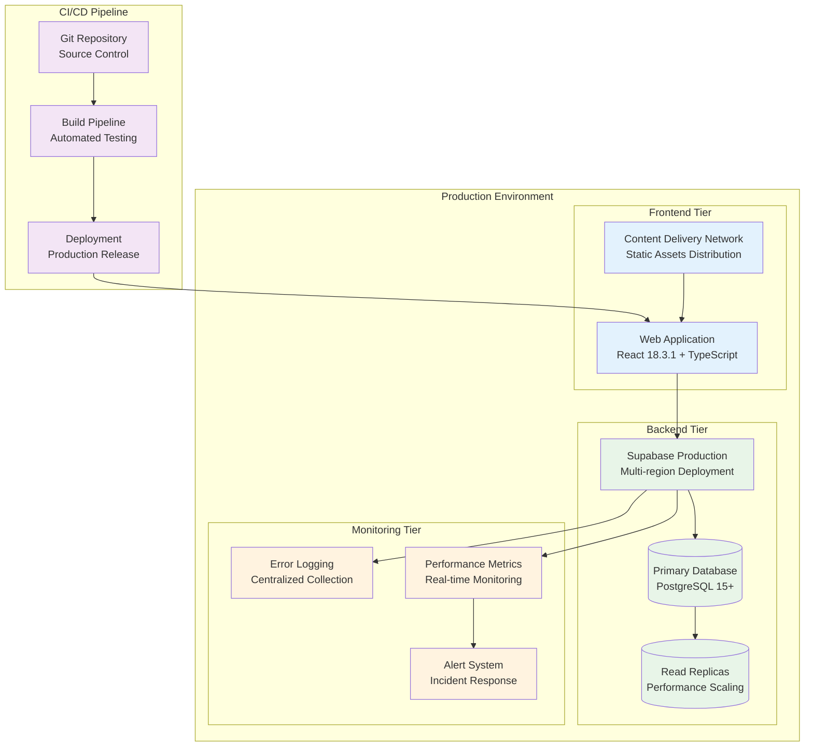
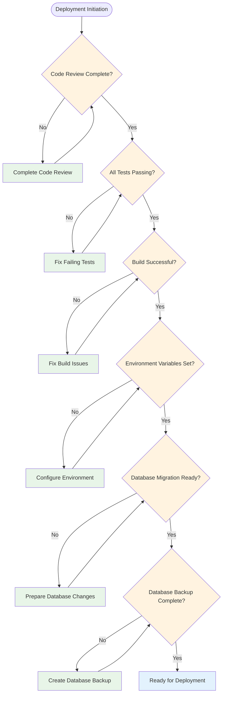
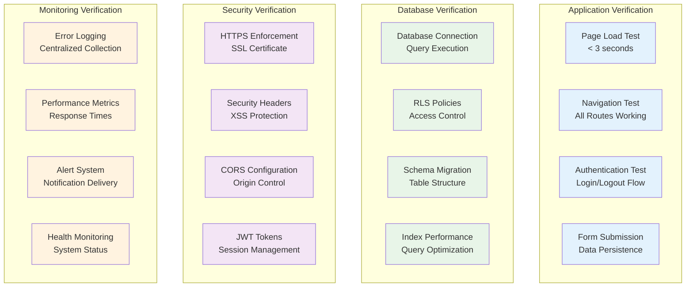
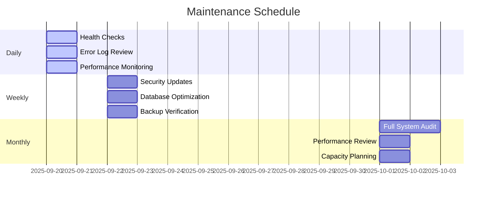
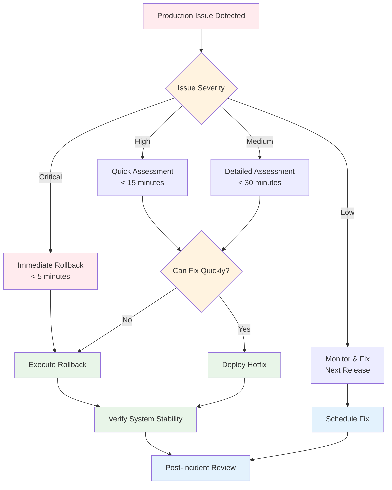
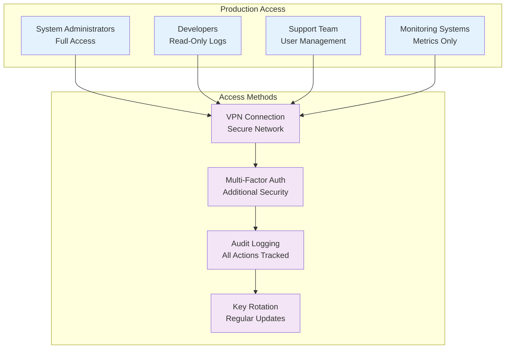

# NamLend Trust Platform - Deployment Guide

**Version:** 2.3.2 | **Date:** October 6, 2025 | **Status:** ✅ PRODUCTION DEPLOYED (Netlify)

## Deployment Architecture Overview



## Prerequisites

### System Requirements

- **Node.js**: v18.0.0 or higher
- **npm**: v9.0.0 or higher
- **Git**: Latest stable version
- **Modern Browser**: Chrome 90+, Firefox 88+, Safari 14+

### Environment Setup

```bash
# Clone repository
git clone <repository-url>
cd namlend-trust-main-3

# Install dependencies
npm install

# Verify installation
npm run build
```

### Required Environment Variables

```env
# Supabase Configuration
VITE_SUPABASE_URL=https://your-project.supabase.co
VITE_SUPABASE_ANON_KEY=your-anon-key
VITE_SUPABASE_SERVICE_ROLE_KEY=your-service-role-key

# Application Configuration
VITE_APP_NAME=NamLend Trust
VITE_APP_VERSION=2.0.0
VITE_APP_ENVIRONMENT=production

# Feature Flags
VITE_DEBUG_TOOLS=false
VITE_RUN_DEV_SCRIPTS=false
VITE_ALLOW_LOCAL_ADMIN=false

# Monitoring Configuration
VITE_ERROR_REPORTING=true
VITE_PERFORMANCE_MONITORING=true
npm i -D netlify-cli

# Link the repo to the existing Netlify site (already linked)
npx netlify link --id=9e80754a-79c0-4cb6-8630-299010039f79
```

### Build & Deploy

```bash
# Ensure production flags are set
export NODE_ENV=production
export VITE_APP_ENVIRONMENT=production
export VITE_DEBUG_TOOLS=false
export VITE_RUN_DEV_SCRIPTS=false

# Build
npm run build

# Deploy to production (uploads dist/)
npx netlify deploy --prod --dir=dist

# Result: Production URL
# https://namlend-trust-portal-v220.netlify.app
```

### Troubleshooting

- Project not found → run `npx netlify link --id=<SITE_ID>` again.
- Permission denied on global CLI → use local CLI via `npx netlify` (no sudo).
- Ensure `netlify.toml` has:

```toml
[build]
  command = "npm run build"

[[redirects]]
  from = "/*"
  to = "/index.html"
  status =  156→
  157→### Rollback

  158→
  159→- Netlify UI: Go to Project → Deploys → select previous deploy → "Rollback to this deploy".
  160→- CLI (open dashboard): `npx netlify open:admin`

  161→#### Migration Deployment Steps

  162→```bash
  163→# 1. Ensure Supabase CLI is installed
  164→npm install -g supabase
  165→
  166→# 2. Navigate to project root
  167→cd /path/to/namlend-trust-main-3
  168→
  169→# 3. Login to Supabase (if not already logged in)
  170→supabase login
  171→
  172→# 4. Link to your production project
  173→supabase link --project-ref YOUR_PROJECT_REF
  174→
  175→# 5. Apply all pending migrations
  176→supabase db push
  177→
  178→# 6. Verify migrations were applied successfully
  179→supabase db diff --schema public
  180→```
#### What These Migrations Add

- **approval_requests_expanded view**: Enriches admin approval queries with user context, eliminates N+1 lookups
- **process_approval_transaction RPC**: Atomic loan processing with 32% APR enforcement and audit trail  
{{ ... }}
- **profiles_with_roles view**: User management with role aggregation for admin dashboard
- **get_profiles_with_roles_admin RPC**: Filtered user queries with search and pagination

#### Migration Verification

```sql
-- Verify new views exist
SELECT table_name, table_type 
FROM information_schema.tables 
WHERE table_schema = 'public' 
AND table_name IN ('approval_requests_expanded', 'profiles_with_roles');

-- Verify new RPCs exist  
SELECT routine_name, routine_type
FROM information_schema.routines
WHERE routine_schema = 'public'
AND routine_name IN ('process_approval_transaction', 'get_profiles_with_roles_admin');
```

## Version 2.2.4 Database Changes Applied

### Summary

- `20250928_admin_metrics_disbursements.sql` (disbursements ledger, RLS, triggers, indexes, admin metrics RPC)
- `fix_get_admin_dashboard_summary_return_types` (align integer vs bigint return types)

### Verification (SQL)

```sql
-- Ledger table exists
select to_regclass('public.disbursements');

-- RLS policies on disbursements
select * from pg_policies where tablename='disbursements';

-- RPC exists
select proname from pg_proc where proname='get_admin_dashboard_summary';

-- Index count (approximate, by naming)
select count(*) from pg_indexes where schemaname='public' and indexname like 'idx_%';
```

### Notes

- RPC uses SECURITY DEFINER with in-function role check for `admin`/`loan_officer`.
- Disbursement trigger sets `loans.status='disbursed'` on completion and timestamps `disbursed_at`.

## Database Setup

### Schema Migration

```sql
-- Core Tables (Already deployed)
-- profiles, user_roles, loans, approval_requests, payments

-- New Error Logging Table
CREATE TABLE IF NOT EXISTS error_logs (
  id UUID PRIMARY KEY DEFAULT gen_random_uuid(),
  message TEXT NOT NULL,
  category TEXT NOT NULL,
  severity TEXT NOT NULL,
  timestamp TIMESTAMPTZ NOT NULL DEFAULT NOW(),
  user_id UUID REFERENCES auth.users(id),
  context JSONB,
  stack TEXT,
  user_agent TEXT,
  url TEXT,
  resolved BOOLEAN DEFAULT FALSE,
  created_at TIMESTAMPTZ DEFAULT NOW(),
  updated_at TIMESTAMPTZ DEFAULT NOW()
);

-- Enable RLS
ALTER TABLE error_logs ENABLE ROW LEVEL SECURITY;

-- RLS Policies
CREATE POLICY "Users can view their own error logs" ON error_logs
  FOR SELECT USING (auth.uid() = user_id);

CREATE POLICY "Service role can insert error logs" ON error_logs
  FOR INSERT WITH CHECK (true);

CREATE POLICY "Admins can view all error logs" ON error_logs
  FOR SELECT USING (
    EXISTS (
      SELECT 1 FROM user_roles 
      WHERE user_id = auth.uid() 
      AND role = 'admin'
    )
  );

-- Performance Indexes
CREATE INDEX IF NOT EXISTS idx_error_logs_user_id ON error_logs(user_id);
CREATE INDEX IF NOT EXISTS idx_error_logs_timestamp ON error_logs(timestamp);
CREATE INDEX IF NOT EXISTS idx_error_logs_severity ON error_logs(severity);
CREATE INDEX IF NOT EXISTS idx_error_logs_category ON error_logs(category);
```

### Data Validation

```sql
-- Verify core tables exist
SELECT table_name FROM information_schema.tables 
WHERE table_schema = 'public' 
AND table_name IN ('profiles', 'user_roles', 'loans', 'approval_requests', 'payments', 'error_logs');

-- Verify RLS is enabled
SELECT schemaname, tablename, rowsecurity 
FROM pg_tables 
WHERE schemaname = 'public' 
AND rowsecurity = true;

-- Check indexes
SELECT indexname, tablename FROM pg_indexes 
WHERE schemaname = 'public' 
AND tablename = 'error_logs';
```

## Deployment Process

### Pre-Deployment Checklist



### Build Process

```bash
# Production build
npm run build

# Verify build output
ls -la dist/

# Test production build locally
npm run preview
```

### Deployment Steps

```bash
# 1. Environment Setup
export NODE_ENV=production
export VITE_APP_ENVIRONMENT=production

# 2. Install production dependencies
npm ci --only=production

# 3. Build application
npm run build

# 4. Deploy to hosting platform
# (Platform-specific commands)

# 5. Verify deployment
curl -I https://your-domain.com
```

## Platform-Specific Deployment

### Netlify Deployment

```yaml
# netlify.toml
[build]
  publish = "dist"
  command = "npm run build"

[build.environment]
  NODE_VERSION = "18"

[[redirects]]
  from = "/*"
  to = "/index.html"
  status = 200

[[headers]]
  for = "/*"
  [headers.values]
    X-Frame-Options = "DENY"
    X-XSS-Protection = "1; mode=block"
    X-Content-Type-Options = "nosniff"
    Referrer-Policy = "strict-origin-when-cross-origin"
```

### Vercel Deployment

```json
{
  "version": 2,
  "builds": [
    {
      "src": "package.json",
      "use": "@vercel/static-build",
      "config": {
        "distDir": "dist"
      }
    }
  ],
  "routes": [
    {
      "handle": "filesystem"
    },
    {
      "src": "/(.*)",
      "dest": "/index.html"
    }
  ],
  "headers": [
    {
      "source": "/(.*)",
      "headers": [
        {
          "key": "X-Frame-Options",
          "value": "DENY"
        },
        {
          "key": "X-XSS-Protection",
          "value": "1; mode=block"
        }
      ]
    }
  ]
}
```

## Post-Deployment Verification

### Health Check Endpoints

```typescript
// Health check implementation
export const healthCheck = {
  database: async () => {
    const { data, error } = await supabase
      .from('profiles')
      .select('count')
      .limit(1);
    return !error;
  },
  
  authentication: async () => {
    const { data: { session } } = await supabase.auth.getSession();
    return session !== null;
  },
  
  errorLogging: async () => {
    const { error } = await supabase
      .from('error_logs')
      .select('id')
      .limit(1);
    return !error;
  }
};
```

### Verification Checklist



## Monitoring & Maintenance

### Performance Monitoring

```typescript
// Performance monitoring setup
const performanceConfig = {
  thresholds: {
    pageLoad: 3000,      // 3 seconds
    apiResponse: 500,    // 500ms
    databaseQuery: 2000, // 2 seconds
  },
  
  alerts: {
    errorRate: 0.1,      // 0.1%
    uptime: 99.9,        // 99.9%
    responseTime: 1000,  // 1 second
  }
};
```

### Log Monitoring

```bash
# Monitor error logs
SELECT 
  category,
  severity,
  COUNT(*) as error_count,
  DATE(timestamp) as error_date
FROM error_logs 
WHERE timestamp >= NOW() - INTERVAL '24 hours'
GROUP BY category, severity, DATE(timestamp)
ORDER BY error_count DESC;

# Monitor performance
SELECT 
  AVG(EXTRACT(EPOCH FROM (updated_at - created_at))) as avg_response_time,
  DATE(created_at) as date
FROM error_logs 
WHERE category = 'performance'
GROUP BY DATE(created_at)
ORDER BY date DESC;
```

### Maintenance Schedule



## Rollback Procedures

### Emergency Rollback

```bash
# 1. Immediate rollback to previous version
git checkout <previous-stable-commit>
npm run build
# Deploy previous version

# 2. Database rollback (if needed)
# Restore from backup
# Revert schema changes

# 3. Notify stakeholders
# Send incident notification
# Update status page
```

### Rollback Decision Matrix



## Security Considerations

### Production Security Checklist

- [ ] ✅ HTTPS enforced with valid SSL certificate
- [ ] ✅ Security headers configured (XSS, CSRF protection)
- [ ] ✅ Environment variables secured (no secrets in code)
- [ ] ✅ Database RLS policies active and tested
- [ ] ✅ API rate limiting configured
- [ ] ✅ Error messages sanitized (no sensitive data exposure)
- [ ] ✅ Audit logging enabled for all critical operations
- [ ] ✅ Regular security updates scheduled

### Access Control



## Conclusion

The NamLend Trust platform deployment guide provides comprehensive instructions for:

- **✅ Production-Ready Architecture**: Scalable, secure, and monitored
- **✅ Automated Deployment**: CI/CD pipeline with quality gates
- **✅ Comprehensive Monitoring**: Real-time health and performance tracking
- **✅ Security Best Practices**: Multi-layer protection and compliance
- **✅ Maintenance Procedures**: Proactive system care and optimization

The platform is ready for production deployment with enterprise-grade reliability and security standards.
