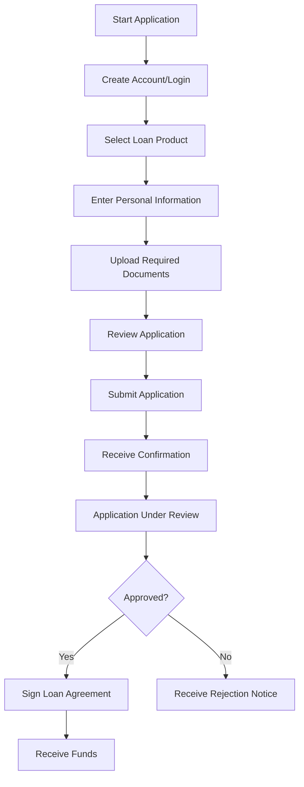
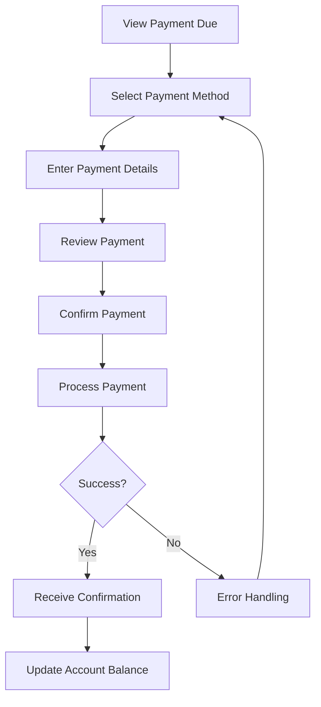

# Namlend Trust - Functional Specification Document

**Document Owner**: Product Manager  
**Version**: 2.6.0  
**Last Updated**: 2025-10-14  
**Status**: Production Ready – Mobile v2.6.0, Workflow & Audit Complete  

## Table of Contents

1. [Introduction](#introduction)
2. [User Personas](#user-personas)
3. [User Flows](#user-flows)
4. [Feature Specifications](#feature-specifications)
5. [User Interface Specifications](#user-interface-specifications)
6. [Error Handling](#error-handling)
7. [Data Validation Rules](#data-validation-rules)
8. [Business Rules](#business-rules)
9. [External Dependencies](#external-dependencies)
10. [Appendix](#appendix)

## Introduction

This document provides a detailed functional specification for the Namlend Trust platform, describing the system's behavior from the user's perspective.

## User Personas

### 1. Borrower (Primary User)

- **Goals**:
  - Apply for loans quickly and easily
  - Track application status
  - Make payments on time
  - Access loan information
- **Pain Points**:
  - Lengthy application processes
  - Lack of transparency
  - Complex payment procedures

### 2. Loan Officer (Internal User)

- **Goals**:
  - Efficiently process loan applications
  - Verify applicant information
  - Make informed lending decisions
  - Manage loan portfolio
- **Pain Points**:
  - Incomplete applications
  - Manual verification processes
  - Lack of centralized information

### 3. Administrator (System User)

- **Goals**:
  - Manage system users and permissions
  - Configure system settings
  - Monitor system health
  - Generate reports
- **Pain Points**:
  - Security risks
  - System downtime
  - Data inconsistencies

## User Flows

### 1. Loan Application Flow



### 2. Payment Flow



## Feature Specifications

### 1. User Authentication (AUTH)

#### AUTH-001: User Registration

- **Description**: Allow new users to create an account
- **Inputs**: Email, password, personal information
- **Process**:
  1. User enters required information
  2. System validates input
  3. System creates user account
  4. System sends verification email
- **Outputs**: User account created, verification email sent

#### AUTH-002: User Login

- **Description**: Allow registered users to authenticate
- **Inputs**: Email/username, password
- **Process**:
  1. User enters credentials
  2. System verifies credentials
  3. System creates session
  4. System logs successful login
- **Outputs**: Authentication token, user redirected to dashboard

### 2. Loan Application (LOAN)

#### LOAN-001: Start New Application

- **Description**: Begin a new loan application
- **Inputs**: Loan amount, purpose, term
- **Process**:
  1. User selects loan parameters
  2. System validates input
  3. System creates draft application
  4. System directs user to next step
- **Outputs**: New loan application in draft status

#### LOAN-002: Document Upload

- **Description**: Upload required documents
- **Inputs**: Document files, document type
- **Process**:
  1. User selects files to upload
  2. System validates file type and size
  3. System uploads to secure storage
  4. System updates application status
- **Outputs**: Documents attached to application

## User Interface Specifications

### 1. Dashboard

#### Layout

```
+---------------------------------------------+
| Header                                      |
+---------------------+-----------------------+
| Navigation |                                |
|            |        Main Content           |
|            |                                |
|            |                                |
+---------------------+-----------------------+
| Footer                                      |
+---------------------------------------------+
```

#### Components

1. **Header**
   - Logo
   - Main navigation
   - User menu
   - Notifications

2. **Navigation**
   - Dashboard
   - My Loans
   - Payments
   - Documents
   - Profile
   - Support

3. **Main Content**
   - Welcome message
   - Quick actions
   - Recent activity
   - Alerts

### 2. Loan Application Form (Namibia)

#### Fields

1. **Personal Information**
   - Full Name (text)
   - Date of Birth (date picker)
   - National ID Number (Namibia) (masked input)
   - Phone Number (formatted input)
   - Email Address (email input)

2. **Loan Details**
   - Loan Amount (currency input with slider)
   - Loan Purpose (dropdown)
   - Term (radio buttons)
   - Desired Disbursement Date (date picker)

3. **Employment Information**
   - Employer Name (text)
   - Job Title (text)
   - Income (currency input)
   - Employment Status (dropdown)

## Error Handling

### AUTH-ERROR-001: Invalid Credentials

- **Message**: "The email or password you entered is incorrect. Please try again or reset your password."
- **Resolution**:
  1. Check email/password for typos
  2. Use "Forgot Password" if needed
  3. Contact support if issue persists

### LOAN-ERROR-001: Incomplete Application

- **Message**: "Please complete all required fields before submitting your application."
- **Resolution**:
  1. Review form for highlighted errors
  2. Complete all required fields
  3. Resubmit application

## Data Validation Rules

### Personal Information

| Field | Type | Required | Validation Rules |
|-------|------|----------|------------------|
| First Name | Text | Yes | 2-50 characters, letters only |
| Last Name | Text | Yes | 2-50 characters, letters only |
| Email | Email | Yes | Valid email format |
| Phone | Phone | Yes | Valid phone number format |
| Date of Birth | Date | Yes | Must be 18+ years old |

### Loan Information (NAD)

| Field | Type | Required | Validation Rules |
|-------|------|----------|------------------|
| Loan Amount | Currency | Yes | N$ 1,000 - N$ 50,000 |
| Loan Term | Integer | Yes | 12, 24, 36, or 60 months |
| Purpose | Dropdown | Yes | Must select from list |

## Business Rules

### Loan Approval Rules

1. **Credit Score Requirements**
   - Minimum score: 600
   - Preferred score: 700+
   - Maximum debt-to-income ratio: 43%

2. **Documentation Requirements**
   - Government-issued ID
   - Proof of income (pay stubs, tax returns)
   - Bank statements (last 3 months)

### Interest Rate (APR) Policy – Namibia

```
APR Cap: 32% p.a. (regulatory limit)

Representative Example: 28% p.a. (used in UI examples; must not exceed cap)

Final APR must never exceed 32% per Namibian regulation.
```

### Mobile Application Features (v2.6.0)

- **Offline Support**: Queue submissions for loan applications, payments, and documents; auto-sync online
- **Biometric Authentication**: Face ID / Touch ID session lock and unlock
- **Push Notifications**: Status updates and reminders
- **Deep Linking**: `namlend://` routes to in-app screens

## External Dependencies

### Payment Processors

- **Stripe**: For credit/debit card payments
- **Plaid**: For bank account verification
- **PayPal**: Alternative payment method

### Identity Verification

- **Persona**: For KYC verification
- **Socure**: For document verification

### Communication

- **SendGrid**: For transactional emails
- **Twilio**: For SMS notifications

## Appendix

### Screen Mockups

*(References to separate mockup files in /docs/functional-specs/mockups/)*

### User Acceptance Test (UAT) Scenarios

#### UAT-001: Successful Loan Application

1. Navigate to loan application
2. Complete all required fields
3. Upload required documents
4. Submit application
5. Verify confirmation message
6. Check email for confirmation

#### UAT-002: Failed Payment Processing

1. Navigate to payments
2. Enter expired card details
3. Submit payment
4. Verify error message
5. Update payment method
6. Retry payment

### Glossary

- **KYC**: Know Your Customer
- **AML**: Anti-Money Laundering
- **APR**: Annual Percentage Rate
- **DTI**: Debt-to-Income Ratio
- **ACH**: Automated Clearing House
