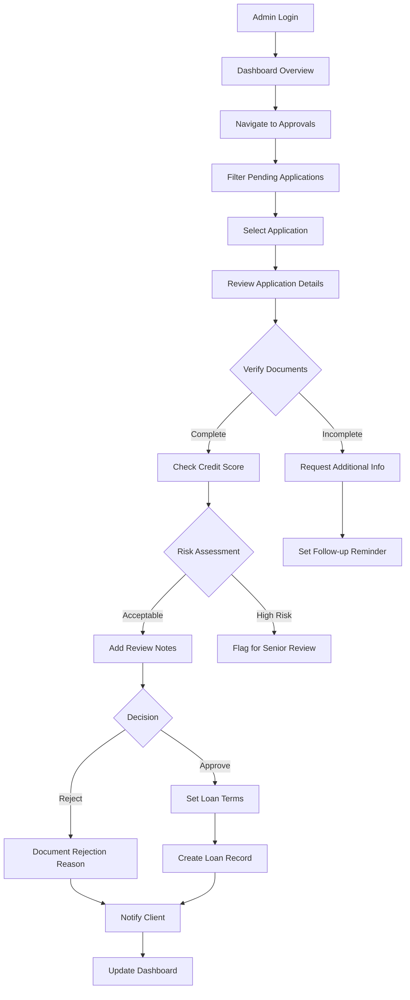
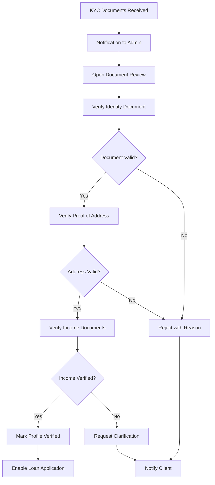
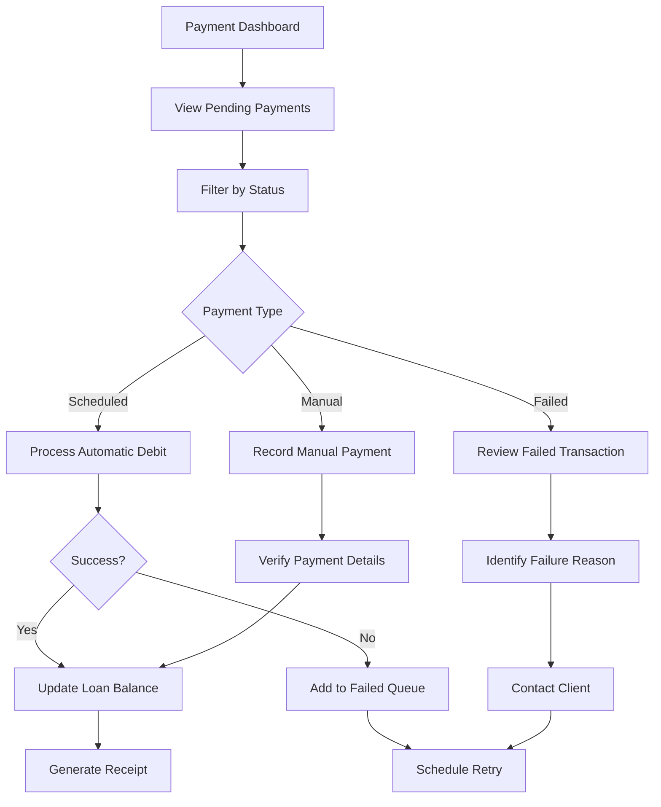
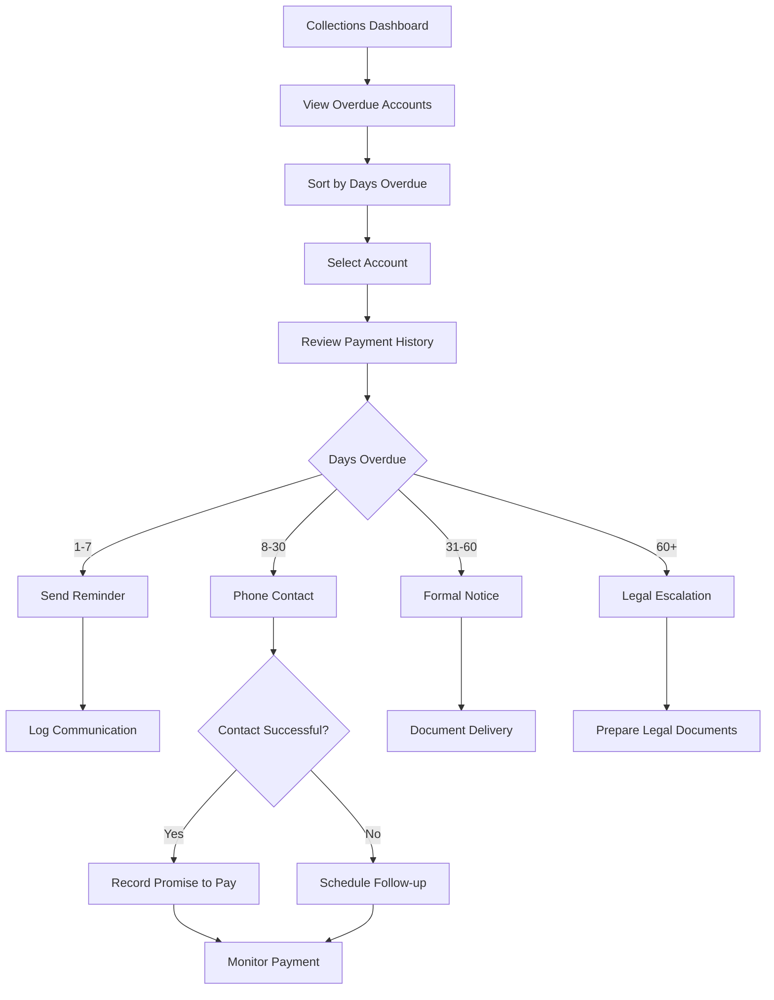

# Namlend Trust - Backoffice Functional Specification Document

**Document Owner**: Product Manager  
**Version**: 1.0.0  
**Last Updated**: 2025-10-04  
**Status**: Active - Production Implementation  

## Table of Contents

1. [Introduction](#introduction)
2. [User Personas](#user-personas)
3. [User Flows](#user-flows)
4. [Feature Specifications](#feature-specifications)
5. [User Interface Specifications](#user-interface-specifications)
6. [Error Handling](#error-handling)
7. [Data Validation Rules](#data-validation-rules)
8. [Business Rules](#business-rules)
9. [External Dependencies](#external-dependencies)
10. [User Acceptance Test Scenarios](#user-acceptance-test-scenarios)
11. [Glossary](#glossary)

## Introduction

This document provides a comprehensive functional specification for the Namlend Trust Backoffice system, describing administrative and operational features from the user's perspective. The backoffice enables staff members to manage loan applications, monitor system health, process approvals, and maintain regulatory compliance.

### Purpose

The Namlend Trust Backoffice serves as the operational hub for:

- Loan application review and approval
- Client management and KYC verification
- Payment processing and collections
- System administration and configuration
- Regulatory compliance and reporting

### Scope

This specification covers all administrative functions accessible through the `/admin` portal, including role-based access controls, workflow management, and operational dashboards.

## User Personas

### 1. System Administrator (Super Admin)

**Profile**: Senior technical staff member responsible for overall system health and configuration

**Goals**:

- Maintain system security and performance
- Configure platform settings and parameters
- Manage user roles and permissions
- Monitor system health and resolve issues
- Generate compliance reports

**Pain Points**:

- Complex configuration requirements
- Security vulnerability concerns
- System downtime impacts
- Audit trail requirements
- Integration management complexity

**Access Level**: Full system access including configuration and user management

### 2. Loan Officer

**Profile**: Financial services professional responsible for loan application processing

**Goals**:

- Efficiently review loan applications
- Make informed lending decisions
- Track application pipeline
- Manage client relationships
- Meet processing SLAs

**Pain Points**:

- High volume of applications
- Incomplete documentation from clients
- Manual verification processes
- Lack of decision support tools
- Time pressure for approvals

**Access Level**: Loan management, client view, limited reporting

### 3. Compliance Officer

**Profile**: Regulatory specialist ensuring adherence to Namibian banking regulations

**Goals**:

- Monitor regulatory compliance (32% APR limit)
- Review high-risk transactions
- Generate regulatory reports
- Maintain audit trails
- Implement AML/KYC policies

**Pain Points**:

- Regulatory change management
- Manual compliance checking
- Report generation complexity
- Audit preparation time
- Risk assessment accuracy

**Access Level**: Read-only access to all data, compliance reporting, audit logs

### 4. Collections Manager

**Profile**: Recovery specialist managing overdue payments and defaults

**Goals**:

- Track overdue payments
- Manage collection workflows
- Communicate with defaulting clients
- Escalate to legal proceedings
- Optimize recovery rates

**Pain Points**:

- Client communication challenges
- Payment tracking complexity
- Legal escalation procedures
- Recovery rate optimization
- Workload prioritization

**Access Level**: Payment management, client communication, collection workflows

## User Flows

### 1. Loan Application Review Flow



### 2. KYC Verification Flow



### 3. Payment Processing Flow



### 4. Collections Management Flow



## Feature Specifications

### 1. Dashboard Management (DASH)

#### DASH-001: Financial Overview

- **Description**: Real-time display of key financial metrics
- **Inputs**: Date range filter, metric selection
- **Process**:
  1. System aggregates financial data
  2. Calculates key metrics
  3. Renders visualization components
  4. Updates in real-time
- **Outputs**:
  - Total loans disbursed (NAD)
  - Outstanding balance
  - Collection rate
  - Default rate
  - Monthly revenue

#### DASH-002: Performance KPIs

- **Description**: Display operational performance indicators
- **Inputs**: KPI selection, comparison period
- **Process**:
  1. Query performance data
  2. Calculate trends
  3. Compare to targets
  4. Generate alerts for anomalies
- **Outputs**:
  - Approval rate
  - Processing time
  - Customer acquisition
  - Portfolio health score

### 2. Approval Management (APPR)

#### APPR-001: Application Queue Management

- **Description**: Manage pending approval requests
- **Inputs**: Filter criteria, sort preferences
- **Process**:
  1. Fetch pending requests
  2. Apply filters and sorting
  3. Display in queue format
  4. Enable batch operations
- **Outputs**: Filtered approval queue with action controls

#### APPR-002: Individual Application Review

- **Description**: Detailed review of single application
- **Inputs**: Application ID
- **Process**:
  1. Load application details
  2. Fetch related documents
  3. Display credit history
  4. Calculate risk score
  5. Show decision interface
- **Outputs**: Complete application view with decision controls

#### APPR-003: Approval Decision Processing

- **Description**: Process approval decision
- **Inputs**: Decision (approve/reject/request-info), notes, conditions
- **Process**:
  1. Validate decision inputs
  2. Update application status
  3. Create audit record
  4. Trigger notifications
  5. Execute post-decision workflows
- **Outputs**: Updated status, notifications sent, audit trail created

### 3. Loan Management (LOAN)

#### LOAN-001: Active Loan Monitoring

- **Description**: Monitor all active loans
- **Inputs**: Filter criteria (status, risk level, officer)
- **Process**:
  1. Query active loans
  2. Calculate current balances
  3. Identify at-risk accounts
  4. Generate performance metrics
- **Outputs**: Loan portfolio dashboard with metrics

#### LOAN-002: Loan Modification

- **Description**: Modify existing loan terms
- **Inputs**: Loan ID, modification type, new terms
- **Process**:
  1. Validate modification request
  2. Calculate new payment schedule
  3. Generate modification agreement
  4. Update loan record
  5. Notify client
- **Outputs**: Modified loan with new terms

#### LOAN-003: Early Settlement Processing

- **Description**: Process early loan settlement
- **Inputs**: Loan ID, settlement amount, date
- **Process**:
  1. Calculate settlement amount
  2. Apply early payment penalties/discounts
  3. Process payment
  4. Close loan account
  5. Generate settlement certificate
- **Outputs**: Closed loan, settlement documentation

### 4. Client Management (CLIENT)

#### CLIENT-001: Client Profile Management

- **Description**: View and manage client profiles
- **Inputs**: Client ID, search criteria
- **Process**:
  1. Load client information
  2. Fetch loan history
  3. Display KYC status
  4. Show communication history
- **Outputs**: Complete client profile with history

#### CLIENT-002: KYC Document Verification

- **Description**: Verify client identity documents
- **Inputs**: Document type, document file
- **Process**:
  1. Display document for review
  2. Validate against requirements
  3. Mark verification status
  4. Update KYC completion
- **Outputs**: Verified status, KYC progress update

#### CLIENT-003: Client Communication

- **Description**: Send communications to clients
- **Inputs**: Client ID, message type, content
- **Process**:
  1. Select communication template
  2. Personalize content
  3. Choose delivery method (email/SMS)
  4. Send message
  5. Log communication
- **Outputs**: Message sent, communication logged

### 5. Payment Management (PAY)

#### PAY-001: Payment Processing

- **Description**: Process loan payments
- **Inputs**: Payment details, method, amount
- **Process**:
  1. Validate payment information
  2. Process transaction
  3. Update loan balance
  4. Generate receipt
  5. Update payment schedule
- **Outputs**: Payment recorded, balance updated

#### PAY-002: Failed Payment Management

- **Description**: Handle failed payment transactions
- **Inputs**: Failed transaction ID
- **Process**:
  1. Identify failure reason
  2. Categorize issue type
  3. Determine retry strategy
  4. Update payment status
  5. Trigger follow-up action
- **Outputs**: Failure documented, retry scheduled

#### PAY-003: Refund Processing

- **Description**: Process payment refunds
- **Inputs**: Payment ID, refund amount, reason
- **Process**:
  1. Validate refund request
  2. Process refund transaction
  3. Update account balance
  4. Generate refund receipt
  5. Log refund reason
- **Outputs**: Refund processed, documentation generated

### 6. System Administration (ADMIN)

#### ADMIN-001: User Management

- **Description**: Manage system users and roles
- **Inputs**: User details, role assignment
- **Process**:
  1. Create/update user account
  2. Assign roles and permissions
  3. Set access restrictions
  4. Configure notifications
- **Outputs**: User account configured with appropriate access

#### ADMIN-002: System Configuration

- **Description**: Configure system parameters
- **Inputs**: Configuration type, values
- **Process**:
  1. Display configuration options
  2. Validate input values
  3. Update system settings
  4. Apply changes
  5. Log configuration change
- **Outputs**: System configuration updated

#### ADMIN-003: Audit Log Review

- **Description**: Review system audit logs
- **Inputs**: Date range, user, action type
- **Process**:
  1. Query audit logs
  2. Apply filters
  3. Display chronologically
  4. Enable export functionality
- **Outputs**: Filtered audit log with export option

## User Interface Specifications

### 1. Admin Dashboard Layout

#### Main Structure

```
+----------------------------------------------------------+
| [Logo] Namlend Admin    [Notifications] [User] [Logout] |
+----------------------------------------------------------+
| Dashboard | Approvals | Loans | Clients | Payments | ⚙️  |
+----------------------------------------------------------+
|                                                          |
| +------------------+  +------------------+              |
| | Total Disbursed  |  | Outstanding      |              |
| | NAD 1,234,567    |  | NAD 987,654      |              |
| | ↑ 12% this month |  | ↓ 3% this month  |              |
| +------------------+  +------------------+              |
|                                                          |
| +------------------+  +------------------+              |
| | Approval Rate    |  | Default Rate     |              |
| | 67%              |  | 2.3%             |              |
| | → Target: 70%    |  | → Target: <3%    |              |
| +------------------+  +------------------+              |
|                                                          |
| +------------------------------------------------+      |
| | [Revenue Chart]                                |      |
| |                                                |      |
| +------------------------------------------------+      |
|                                                          |
| Recent Activity                        Quick Actions    |
| +-------------------------+  +-----------------------+ |
| | • New loan application  |  | [Review Applications] | |
| | • Payment received      |  | [Process Payments]    | |
| | • Document uploaded     |  | [Verify KYC]          | |
| +-------------------------+  +-----------------------+ |
+----------------------------------------------------------+
```

### 2. Approval Management Interface

#### Queue View

```
+----------------------------------------------------------+
| Approval Management                    [Refresh] [Export] |
+----------------------------------------------------------+
| Filters: [Status ▼] [Type ▼] [Priority ▼] [Date Range]  |
+----------------------------------------------------------+
| Queue (8 pending)          | Selected Request Details    |
| +-------------------------+ | +-------------------------+|
| | □ #1234 Loan NAD 10,000 | | | Application #1234       ||
| |   John Doe - 2 hrs ago  | | | Amount: NAD 10,000      ||
| |   [High Priority]       | | | Term: 24 months         ||
| | -------------------------| | | Purpose: Business       ||
| | □ #1235 KYC Documents   | | | Applicant: John Doe     ||
| |   Jane Smith - 5 hrs    | | | Credit Score: 720       ||
| |   [Normal Priority]     | | | Risk Level: Low         ||
| | -------------------------| | |                         ||
| | □ #1236 Loan NAD 5,000  | | | Documents: ✓ Complete   ||
| |   Bob Johnson - 1 day   | | | Income: ✓ Verified      ||
| |   [Low Priority]        | | | Identity: ✓ Confirmed   ||
| +-------------------------+ | |                         ||
|                             | | Review Notes:           ||
| [Select All] [Bulk Action]  | | [___________________]  ||
|                             | |                         ||
|                             | | [Approve] [Reject]      ||
|                             | | [Request More Info]     ||
|                             | +-------------------------+|
+----------------------------------------------------------+
```

### 3. Loan Management Dashboard

#### Portfolio View

```
+----------------------------------------------------------+
| Loan Portfolio Management                                 |
+----------------------------------------------------------+
| Active: 234 | At Risk: 12 | Overdue: 8 | Closed: 567    |
+----------------------------------------------------------+
| Search: [_____________] [🔍]  View: [Grid] [List] [Map]  |
+----------------------------------------------------------+
| +-------------------------------------------------------+ |
| | Loan ID | Client      | Amount    | Status | Action  | |
| |---------|-------------|-----------|--------|----------| |
| | L-001   | John Doe    | NAD 10K   | Active | [View]  | |
| | L-002   | Jane Smith  | NAD 25K   | Late   | [Alert] | |
| | L-003   | Bob Johnson | NAD 5K    | Active | [View]  | |
| +-------------------------------------------------------+ |
|                                                           |
| Performance Metrics:                                      |
| • Average Loan Size: NAD 15,000                         |
| • On-time Payment Rate: 92%                             |
| • Average Interest Rate: 28.5%                          |
+----------------------------------------------------------+
```

### 4. Component Specifications

#### Metric Cards

- **Style**: Material Design elevated cards
- **Content**: Primary metric, trend indicator, comparison value
- **Interaction**: Click for detailed breakdown
- **Update**: Real-time with loading states

#### Data Tables

- **Features**: Sortable columns, pagination, search, filters
- **Row Actions**: Inline action buttons, checkbox selection
- **Export**: CSV, Excel, PDF options
- **Responsive**: Mobile-friendly horizontal scroll

#### Charts

- **Types**: Line (trends), Bar (comparisons), Pie (distributions)
- **Interaction**: Hover tooltips, click to drill down
- **Update**: Animated transitions on data change
- **Export**: PNG/SVG download option

## Error Handling

### APPR-ERROR-001: Duplicate Application

- **Trigger**: Client has pending application
- **Message**: "This client already has a pending loan application (#[ID]). Please review the existing application or contact the client."
- **Resolution**:
  1. Review existing application
  2. Cancel duplicate if needed
  3. Merge applications if different amounts

### APPR-ERROR-002: Insufficient Documentation

- **Trigger**: Missing required documents
- **Message**: "Cannot approve application. Missing documents: [List]. Please request these documents from the client."
- **Resolution**:
  1. Identify missing documents
  2. Send document request to client
  3. Set follow-up reminder

### LOAN-ERROR-001: Exceeds Approval Limit

- **Trigger**: Loan amount exceeds officer's approval limit
- **Message**: "This loan amount (NAD [Amount]) exceeds your approval limit (NAD [Limit]). Escalating to senior review."
- **Resolution**:
  1. Automatic escalation to senior officer
  2. Notification sent to senior team
  3. Original officer notified of escalation

### PAY-ERROR-001: Payment Processing Failed

- **Trigger**: Payment gateway error
- **Message**: "Payment processing failed. Error: [Gateway Error]. Transaction ID: [ID]. Please retry or process manually."
- **Resolution**:
  1. Log error details
  2. Attempt retry with same details
  3. Offer manual processing option
  4. Contact payment provider if persistent

### ADMIN-ERROR-001: Permission Denied

- **Trigger**: Insufficient privileges for action
- **Message**: "You don't have permission to perform this action. Required role: [Role]. Please contact your administrator."
- **Resolution**:
  1. Log attempted action
  2. Notify administrator
  3. Request permission if legitimate

## Data Validation Rules

### Approval Processing

| Field | Type | Required | Validation Rules |
|-------|------|----------|------------------|
| Decision | Enum | Yes | Must be: approved, rejected, requires_info |
| Review Notes | Text | Yes | 10-500 characters |
| Approval Amount | Currency | Conditional | If approved: NAD 500 - NAD 100,000 |
| Interest Rate | Percentage | Conditional | If approved: 10% - 32% (regulatory limit) |
| Loan Term | Integer | Conditional | If approved: 3, 6, 12, 24, 36, 60 months |
| Rejection Reason | Enum | Conditional | If rejected: Select from predefined list |

### User Management

| Field | Type | Required | Validation Rules |
|-------|------|----------|------------------|
| Email | Email | Yes | Valid email format, unique in system |
| Role | Enum | Yes | admin, loan_officer, compliance_officer, collections_manager |
| Department | Text | Yes | 2-50 characters |
| Approval Limit | Currency | Conditional | If loan_officer: NAD 0 - NAD 1,000,000 |
| Phone | Phone | Yes | Valid Namibian phone format |

### System Configuration

| Field | Type | Required | Validation Rules |
|-------|------|----------|------------------|
| Max APR | Percentage | Yes | Cannot exceed 32% (regulatory limit) |
| Min Loan Amount | Currency | Yes | NAD 100 - NAD 10,000 |
| Max Loan Amount | Currency | Yes | NAD 10,000 - NAD 1,000,000 |
| Auto-Approval Threshold | Currency | No | NAD 0 - NAD 50,000 |
| Document Expiry Days | Integer | Yes | 30 - 365 days |

## Business Rules

### Loan Approval Rules

#### Credit Score Requirements

```
Score >= 750: Auto-approve up to NAD 50,000
Score 650-749: Manual review required
Score 600-649: Requires additional documentation
Score < 600: Auto-reject or require guarantor
```

#### Debt-to-Income Ratio

```
DTI < 30%: Low risk
DTI 30-43%: Medium risk, additional review
DTI > 43%: High risk, senior approval required
DTI > 50%: Auto-reject
```

#### Interest Rate Calculation

```
Base Rate: 18% APR

Risk Adjustments:
- Credit Score < 650: +5%
- Credit Score 650-699: +3%
- Credit Score 700-749: +1%
- First-time borrower: +2%
- Repeat customer (good standing): -2%

Term Adjustments:
- 3-6 months: -2%
- 12-24 months: 0%
- 36+ months: +2%

Maximum Rate: 32% APR (regulatory cap)
```

### Escalation Matrix

| Loan Amount | Approval Authority | Review Requirements |
|-------------|-------------------|---------------------|
| < NAD 5,000 | Auto-approval (if eligible) | System validation only |
| NAD 5,000 - 25,000 | Loan Officer | Standard review |
| NAD 25,001 - 50,000 | Senior Loan Officer | Enhanced due diligence |
| NAD 50,001 - 100,000 | Loan Manager | Committee review |
| > NAD 100,000 | Executive Approval | Board notification |

### Collection Rules

#### Overdue Stages

```
Day 1-3: Grace period, soft reminder
Day 4-7: First notice via SMS/Email
Day 8-14: Phone contact attempt
Day 15-30: Formal warning letter
Day 31-60: Final notice, account restriction
Day 61-90: Legal proceedings initiation
Day 91+: Write-off consideration
```

#### Communication Frequency

- Maximum 1 contact per day
- No contact on Sundays or public holidays
- Contact hours: 8 AM - 8 PM local time

### Compliance Requirements

#### Document Retention

- Loan applications: 7 years after closure
- Payment records: 5 years
- Communication logs: 3 years
- Audit trails: Permanent

#### Regulatory Reporting

- Monthly: Portfolio performance to Bank of Namibia
- Quarterly: Compliance certification
- Annual: Full audit report
- Ad-hoc: Suspicious activity reports

## External Dependencies

### Payment Gateways

- **Primary**: Standard Bank Namibia API
  - Used for: Direct debits, account verification
  - SLA: 99.9% uptime
- **Secondary**: PayGate
  - Used for: Card payments, mobile money
  - Fallback for primary gateway

### Identity Verification

- **Service**: Namibian ID Verification Service (NIDVS)
  - Purpose: Validate national ID numbers
  - Required for: All new applications
- **Backup**: Manual verification process

### Credit Bureau

- **Primary**: TransUnion Namibia
  - Data: Credit scores, payment history
  - Update frequency: Monthly
- **Secondary**: Compuscan
  - Used when: Primary unavailable

### Communication Services

- **SMS**: Twilio
  - Purpose: OTP, payment reminders
  - Fallback: Local SMS gateway
- **Email**: SendGrid
  - Purpose: Statements, notifications
  - Backup: SMTP relay

## User Acceptance Test Scenarios

### UAT-001: Complete Loan Approval Process

**Objective**: Verify end-to-end loan approval workflow

**Steps**:

1. Login as Loan Officer
2. Navigate to Approval Queue
3. Select pending application
4. Review all documentation
5. Check credit score integration
6. Add review notes
7. Approve with standard terms
8. Verify loan record creation
9. Confirm client notification sent
10. Check audit trail entry

**Expected Results**:

- Application status changes to "Approved"
- Loan record created in database
- Client receives approval notification
- Audit trail shows complete history

### UAT-002: Bulk Payment Processing

**Objective**: Test batch payment processing capability

**Steps**:

1. Login as Payment Processor
2. Navigate to Payment Management
3. Upload payment batch file
4. Validate payment details
5. Process batch
6. Review success/failure report
7. Verify account updates
8. Generate receipts
9. Check reconciliation report

**Expected Results**:

- 95%+ success rate for valid payments
- Failed payments properly logged
- All balances correctly updated
- Receipts generated for successful payments

### UAT-003: KYC Document Rejection and Resubmission

**Objective**: Test document rejection and resubmission flow

**Steps**:

1. Login as Compliance Officer
2. Review KYC documents
3. Reject document with reason
4. Verify client notification
5. Client resubmits document
6. Review resubmitted document
7. Approve document
8. Verify KYC status update

**Expected Results**:

- Rejection reason clearly communicated
- Client can resubmit easily
- Resubmission appears in queue
- KYC status updates correctly

### UAT-004: Role-Based Access Control

**Objective**: Verify access restrictions by role

**Steps**:

1. Login as Loan Officer
2. Attempt to access System Configuration (should fail)
3. Attempt to access Loan Approvals (should succeed)
4. Login as Compliance Officer
5. Attempt to approve loan (should fail)
6. Attempt to view audit logs (should succeed)
7. Login as Administrator
8. Verify full system access

**Expected Results**:

- Each role can only access permitted features
- Unauthorized access attempts are logged
- Error messages clearly indicate permission issues

### UAT-005: Collections Workflow with Escalation

**Objective**: Test overdue account management

**Steps**:

1. Login as Collections Manager
2. View overdue accounts
3. Select account 7 days overdue
4. Send payment reminder
5. Log promise to pay
6. Monitor for payment
7. If no payment, escalate to next stage
8. Generate collection report
9. Verify all communications logged

**Expected Results**:

- Overdue accounts correctly categorized
- Communications sent successfully
- Escalation follows defined rules
- Complete history maintained

### UAT-006: System Configuration Change

**Objective**: Test system parameter updates

**Steps**:

1. Login as Administrator
2. Navigate to System Configuration
3. Update minimum loan amount
4. Update auto-approval threshold
5. Save changes
6. Verify audit log entry
7. Test new configuration with loan application
8. Rollback change if needed

**Expected Results**:

- Configuration changes take effect immediately
- Audit trail captures all changes
- System behaves according to new parameters
- Rollback functionality works correctly

## Glossary

### Business Terms

- **APR**: Annual Percentage Rate - The yearly interest rate charged on loans
- **DTI**: Debt-to-Income Ratio - Borrower's monthly debt payments divided by gross monthly income
- **KYC**: Know Your Customer - Identity verification process
- **AML**: Anti-Money Laundering - Regulations to prevent money laundering
- **NAD**: Namibian Dollar - Local currency
- **SLA**: Service Level Agreement - Performance standards
- **NPL**: Non-Performing Loan - Loan in default or close to default
- **LTV**: Loan-to-Value - Ratio of loan amount to collateral value

### System Terms

- **RLS**: Row-Level Security - Database access control at row level
- **RBAC**: Role-Based Access Control - Permission system based on user roles
- **API**: Application Programming Interface - System integration points
- **UUID**: Universally Unique Identifier - Database record identifiers
- **JSONB**: JSON Binary - Database format for structured data
- **WebSocket**: Real-time communication protocol
- **JWT**: JSON Web Token - Authentication token format

### Status Definitions

- **Pending**: Awaiting review or action
- **Under Review**: Currently being processed by staff
- **Approved**: Positive decision, proceeding to next stage
- **Rejected**: Negative decision, process terminated
- **Requires Info**: Additional information needed from client
- **Active**: Currently operational (loans)
- **Overdue**: Payment not received by due date
- **Closed**: Completed or terminated

### Role Definitions

- **Administrator**: Full system access and configuration
- **Loan Officer**: Loan application processing and approval
- **Compliance Officer**: Regulatory compliance and reporting
- **Collections Manager**: Overdue account management
- **Auditor**: Read-only access for audit purposes

---

## Document Control

**Version History**:

- v1.0.0 (2025-10-04): Initial comprehensive specification

**Review Schedule**: Quarterly or upon major feature changes

**Approval Required From**:

- Product Manager
- Technical Lead
- Compliance Officer
- Operations Manager

**Distribution**:

- Development Team
- QA Team
- Operations Team
- Compliance Department
- Executive Management

---

*This document is confidential and proprietary to Namlend Trust. Distribution is limited to authorized personnel only.*
