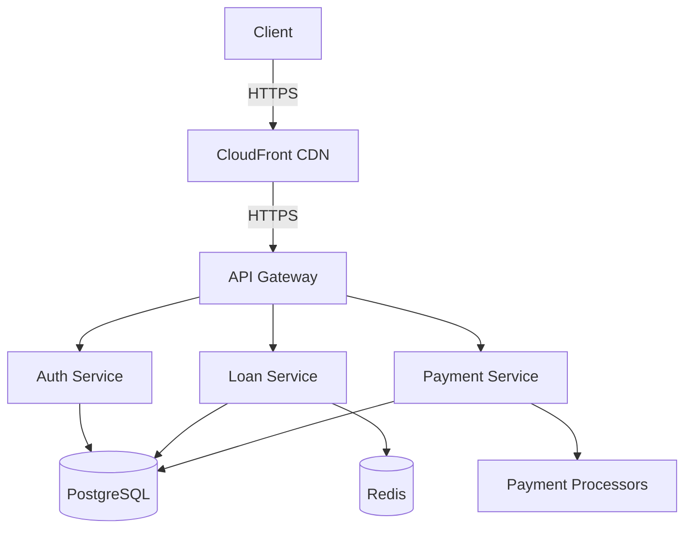

# Namlend Trust - Technical Specification Document

**Document Owner**: Technical Lead  
**Version**: 2.3.2  
**Last Updated**: 2025-10-06  
**Status**: ✅ Completed - Security Hardening (Views & RPC), E2E Approvals Actions; prior currency/admin refresh retained  

> v2.3.2 Addendum — Admin Role search & assignment stabilization

- Admin search/assignment fixes:
  - Recreated `public.profiles_with_roles` with aggregated `roles app_role[]`, `primary_role`, role flags, and stable groupings.
  - Hardened `public.get_profiles_with_roles_admin(p_search_term, p_role_filter, p_limit, p_offset)` (SECURITY DEFINER): fully qualified columns, `left join auth.users` + `coalesce(pwr.email, u.email)`, search by name/email/phone/`user_id::text`, `EXECUTE` restricted to `authenticated`.
  - Dropped legacy zero‑arg overload of `get_profiles_with_roles_admin()` to avoid RPC confusion.
- Verification & tests:
  - Verified Assign Role modal end‑to‑end via mcp‑playwright (open, search, assign, toast).
  - Added Playwright spec `e2e/assign-role-modal.spec.ts` (smoke: open/close, login flow env‑driven).
  - k6 load script `scripts/k6/admin-assign-role-load.js` for Edge Function with env usage docs.
- Operational notes:
  - Default local runs should set `VITE_RUN_DEV_SCRIPTS=false` to avoid auto‑scripts interfering with auth flows.

> v2.3.1 Addendum — Role Management wiring & Payment capture/retry

- Admin Role Management updates:
  - `src/pages/AdminDashboard/components/UserManagement/RoleManagement.tsx` now wired to `serviceRoleAssignment.assignRoleWithServiceRole()` for assignment.
  - Fallback to `assign_user_role` SECURITY DEFINER RPC when Edge Function is unavailable.
  - Role counts sourced via `adminService.getProfilesWithRoles()`; dynamic role creation/edit/delete disabled to enforce system roles.
  - RLS preserved: writes via server-side paths; reads via authenticated policies.
- Payments write flows:
  - `src/components/PaymentModal.tsx` uses `paymentService.recordPayment()` with normalized methods: bank→bank_transfer, mobile→mobile_money, card→debit_order, agent→cash.
  - `src/pages/AdminDashboard/components/PaymentManagement/PaymentsList.tsx` Retry uses `recordPayment()` with `RETRY-`-prefixed reference; list still via `listPayments()`.
- Documentation cross-refs:
  - Backoffice TSD §5.6 wiring updated with Role Management mapping.
  - Backoffice Traceability updated with PAY-003, PAY-004, ADMIN-003.

> v2.2.5 Addendum — Security Hardening (Views & RPC) + E2E Approvals Actions

- Database hardening applied in Supabase:
  - Converted public views to SECURITY INVOKER and restricted anon/public privileges:
    - `public.profiles_with_roles`, `public.client_portfolio`, `public.financial_summary`, `public.approval_requests_expanded`
  - Replaced `public.get_profiles_with_roles_admin()` with a SECURITY DEFINER RPC guarded by `public.has_staff_role()`; `search_path` pinned to `public`.
  - Pinned `search_path` for additional functions flagged by advisors to eliminate mutable search path warnings.
  - Notifications bell reinstated across FO/BO with database-driven events:
    - UI: `NotificationBell` added to `src/components/Header.tsx` (all authenticated users) and to admin top bar in `src/pages/AdminDashboard.tsx`.
    - DB triggers emitting `public.approval_notifications`:
      - `notify_approval_status_change` on `public.approval_requests` status updates → notifies the client (approved/rejected/under_review).
      - `notify_payment_events` on `public.payments` INSERT/UPDATE → notifies back office on new payments; notifies client on processed status changes.
      - `notify_profile_update` on `public.profiles` UPDATE → notifies back office of client profile changes.
- E2E additions (Playwright):
  - `e2e/admin-approvals-actions.e2e.ts`: Verifies Approvals action controls exist and ensures no write (POST/PATCH/DELETE) network calls are triggered during inspection.
  - `e2e/admin-currency.e2e.ts`: Scans Admin tabs for stray `$` occurrences and asserts presence of properly formatted `N$` amounts.

- Auth settings (manual in Supabase Dashboard):
  - Reduce OTP expiry to ≤ 1 hour.
    - Path: Project → Authentication → Providers → Email → OTP expiry.
  - Enable Leaked Password Protection (HIBP).
    - Path: Project → Authentication → Password Policy → Leaked password protection.

- RLS & Performance:
  - Consolidated RLS policies for `public.profiles` and `public.user_roles` to single SELECT/INSERT/UPDATE policies using `(select auth.uid())` to avoid per-row re-evaluation.
  - Added covering indexes for advisor-flagged foreign keys (e.g., `approval_*`, `disbursements`, `loan_reviews`, `notifications`, `payments`, etc.).
  - Advisor status post-cleanup: security warnings now focused on OTP expiry and HIBP; multiple-permissive-policy warnings reduced for consolidated tables.

> v2.2.4 Addendum — Currency Utility, Reactive Admin Refresh, Admin Metrics RPC & Disbursements Ledger

- Centralized NAD currency formatting via `src/utils/currency.ts` (`formatNAD`, `nadFormatter`). Replaced scattered `Intl.NumberFormat` usages in:
  - `src/pages/Dashboard.tsx`, `src/pages/Payment.tsx`, `src/components/PaymentModal.tsx`
  - `src/pages/LoanApplication.tsx`, `src/components/ClientProfileDashboard.tsx`
  - `src/pages/AdminDashboard/components/PaymentManagement/PaymentOverview.tsx`
  - `src/pages/AdminDashboard/components/PaymentManagement/DisbursementManager.tsx`
  - `src/pages/AdminDashboard/components/ApprovalManagement/ApprovalManagementDashboard.tsx`
- Reactive admin refresh in `src/pages/AdminDashboard.tsx` using a `refreshKey` to remount tab contents and refetch metrics (replaces `window.location.reload()`).
- Database migration `supabase/migrations/20250928_admin_metrics_disbursements.sql`:
  - Adds `public.disbursements` ledger table with RLS policies and triggers to propagate `status='disbursed'` to `loans`.
  - Creates `public.get_admin_dashboard_summary()` (SECURITY DEFINER) with in-function role check for `admin`/`loan_officer`.
  - Adds performance indexes across `loans`, `payments`, and `approval_requests`.
- Tests (Playwright):
  - `e2e/api/admin-rpc.e2e.ts` validates RPC response under admin session.
  - `e2e/api/disbursements-ledger.e2e.ts` validates admin read on ledger.
  - `e2e/api/disbursements-ledger-crud.e2e.ts` validates insert→complete propagation to loan status.
  - `e2e/unit/currency-util.e2e.ts` covers `formatNAD` behavior and snapshots key formatting aspects.

> v2.2.3 Addendum — Frontend Responsiveness & APR Compliance

The platform has completed a targeted responsive design audit on public routes with the following outcomes:

- No horizontal overflow across common mobile/tablet sizes (320×640 → 1024×768), including menu open/close.
- Mobile tap targets and a11y improved in `src/components/Header.tsx` and `src/components/Footer.tsx` (≥44px, ARIA, focus rings).
- `tailwind.config.ts` container padding refined for small screens; breakpoints unchanged.
- APR messaging updated to “Representative APR: up to 32% p.a.” in `HeroSection.tsx` and `Footer.tsx`.

Architecture note: the canonical backend is Supabase (PostgreSQL + Auth + Storage). The microservices section below represents an optional future architecture and is not required for the current deployment.

## Table of Contents

1. [Introduction](#introduction)
2. [System Architecture](#system-architecture)
3. [Back Office Approval Integration](#back-office-approval-integration)
4. [Role Assignment System](#role-assignment-system)
5. [Technology Stack](#technology-stack)
6. [API Specifications](#api-specifications)
7. [Data Models](#data-models)
8. [Database Schema](#database-schema)
9. [Integration Points](#integration-points)
10. [Security Considerations](#security-considerations)
11. [Performance Requirements](#performance-requirements)
12. [Deployment Architecture](#deployment-architecture)
13. [Error Handling](#error-handling)
14. [Monitoring and Logging](#monitoring-and-logging)
15. [Appendix](#appendix)
16. [Backoffice Technical Specification](./backoffice-technical-spec.md)

## Introduction

This document provides a comprehensive technical specification for the Namlend Trust platform, detailing the system's architecture, components, and technical requirements.

## System Architecture

### High-Level Architecture

```
┌─────────────────────────────────────────────────────────────────┐
│                       Client Applications                       │
├─────────────────┬─────────────────────┬─────────────────────────┤
│  Web Frontend   │    Mobile App       │    Admin Dashboard      │
└────────┬────────┴─────────┬───────────┴────────────┬────────────┘
         │                  │                        │
         ▼                  ▼                        ▼
┌─────────────────────────────────────────────────────────────────┐
│                      API Gateway                                │
└─────────────────────────┬──────────────────────────────────────┘
                          │
                          ▼
┌─────────────────────────────────────────────────────────────────┐
│                      Microservices                              │
├─────────────────┬─────────────────────┬─────────────────────────┤
│  Auth Service   │   Loan Service      │    Payment Service      │
└────────┬────────┴─────────┬───────────┴────────────┬────────────┘
         │                  │                        │
         ▼                  ▼                        ▼
┌─────────────────────────────────────────────────────────────────┐
│                      Data Storage                               │
├─────────────────┬─────────────────────┬─────────────────────────┤
│  PostgreSQL     │   Redis Cache       │    Object Storage       │
└─────────────────┴─────────────────────┴─────────────────────────┘
```

### Component Diagram



## Role Assignment System

### Overview

The Role Assignment System manages user roles and permissions within the NamLend Trust platform. This system was completely redesigned in v1.4.1 to resolve critical Supabase role assignment errors and implement a reliable, secure role management mechanism.

### Architecture

#### Service Role Approach

The system uses Supabase's service role key to bypass Row-Level Security (RLS) policies for privileged operations while maintaining security through controlled access patterns.

```typescript
// Service Role Client Configuration
const serviceRoleClient = createClient(
  process.env.VITE_SUPABASE_URL!,
  process.env.VITE_SUPABASE_SERVICE_ROLE_KEY!,
  {
    auth: {
      autoRefreshToken: false,
      persistSession: false
    }
  }
);
```

#### Role Assignment Logic

The system implements a delete-then-insert pattern to avoid schema conflicts and update trigger issues:

```typescript
export async function assignUserRole(userId: string, role: string): Promise<boolean> {
  try {
    // Delete existing role assignment
    const { error: deleteError } = await serviceRoleClient
      .from('user_roles')
      .delete()
      .eq('user_id', userId)
      .eq('role', role);

    if (deleteError) {
      console.error('Error deleting existing role:', deleteError);
      return false;
    }

    // Insert new role assignment
    const { error: insertError } = await serviceRoleClient
      .from('user_roles')
      .insert({
        user_id: userId,
        role: role
      });

    if (insertError) {
      console.error('Error inserting role:', insertError);
      return false;
    }

    return true;
  } catch (error) {
    console.error('Role assignment error:', error);
    return false;
  }
}
```

### Database Schema

#### User Roles Table

```sql
CREATE TABLE user_roles (
  id UUID DEFAULT gen_random_uuid() PRIMARY KEY,
  user_id UUID REFERENCES auth.users(id) ON DELETE CASCADE,
  role app_role NOT NULL,
  created_at TIMESTAMP WITH TIME ZONE DEFAULT NOW(),
  UNIQUE(user_id, role)
);
```

#### Row-Level Security Policies

```sql
-- Enable RLS
ALTER TABLE user_roles ENABLE ROW LEVEL SECURITY;

-- Policy for service role operations
CREATE POLICY "Service role can manage all user roles" ON user_roles
  FOR ALL USING (auth.role() = 'service_role');

-- Policy for authenticated users to read their own roles
CREATE POLICY "Users can view their own roles" ON user_roles
  FOR SELECT USING (auth.uid() = user_id);
```

### Key Features

#### Multi-Role Support

- Users can have multiple roles simultaneously (e.g., 'client' and 'admin')
- Role combinations enable flexible access control
- Frontend routing adapts based on user's role set

#### Security Implementation

- Service role operations bypass RLS while maintaining security
- Direct database operations prevent unauthorized access
- Environment-gated development utilities prevent production interference

#### Error Handling

- Comprehensive error logging and reporting
- Graceful fallback mechanisms
- Test utilities for debugging and verification

### Testing and Verification

#### Test Utilities

The system includes comprehensive test utilities for role assignment verification:

```typescript
// Test role assignment functionality
export async function testRoleAssignment(userId: string, role: string) {
  console.log(`Testing role assignment for user ${userId} with role ${role}`);
  
  const success = await assignUserRole(userId, role);
  
  if (success) {
    // Verify assignment
    const verification = await verifyUserRole(userId, role);
    console.log(`Role assignment ${verification ? 'verified' : 'failed verification'}`);
  }
  
  return success;
}
```

#### Development Scripts

Node.js scripts enable isolated testing of role assignment functionality:

- Environment variable validation
- Service role key verification
- Direct database operation testing
- Multi-role assignment verification

### Integration Points

#### Frontend Authentication

- `useAuth` hook integrates with role assignment system
- Role-based routing and component rendering
- Protected routes with role requirements

#### Backend Services

- Supabase Edge Functions can leverage role assignments
- RLS policies enforce role-based data access
- Service role operations for administrative functions

### Performance Considerations

#### Optimization Strategies

- Minimal database operations (delete + insert pattern)
- Efficient role verification queries
- Cached role lookups in frontend state

#### Monitoring

- Role assignment success/failure metrics
- Performance tracking for database operations
- Error rate monitoring and alerting

### Security Considerations

#### Access Control

- Service role key secured in environment variables
- Development utilities gated behind feature flags
- RLS policies prevent unauthorized role modifications

#### Audit Trail

- All role assignments logged with timestamps
- User activity tracking for role changes
- Compliance with data protection requirements

### Future Enhancements

#### Planned Features

- Role hierarchy and inheritance
- Time-based role assignments
- Bulk role management operations
- Advanced permission granularity

#### Scalability Improvements

- Role caching mechanisms
- Batch role assignment operations
- Performance optimization for large user bases

## Technology Stack

### Frontend

- **Framework**: React 18.3.1 with TypeScript
- **State Management**: TanStack React Query
- **UI Components**: Radix UI, shadcn/ui
- **Styling**: Tailwind CSS
- **Build Tool**: Vite 5.4.1
- **Form Handling**: React Hook Form with Zod validation
- **Routing**: React Router DOM
- **Charts**: Recharts

### Backend

- **Runtime**: Node.js 18+
- **API Framework**: Express.js
- **Authentication**: JWT, OAuth 2.0
- **Database**: PostgreSQL 14+
- **Caching**: Redis
- **Object Storage**: AWS S3
- **Search**: Elasticsearch (for advanced search)
- **Message Queue**: RabbitMQ (for async processing)

### Infrastructure

- **Hosting**: AWS
- **Containerization**: Docker, Kubernetes
- **CI/CD**: GitHub Actions
- **Monitoring**: Prometheus, Grafana
- **Logging**: ELK Stack (Elasticsearch, Logstash, Kibana)
- **APM**: New Relic

## API Specifications

### Base URL

```
https://api.namlendtrust.com/v1
```

### Authentication

All API requests require an authentication token in the `Authorization` header:

```
Authorization: Bearer <token>
```

### Endpoints

#### Authentication

- `POST /auth/register` - Register a new user
- `POST /auth/login` - Authenticate user
- `POST /auth/refresh` - Refresh access token
- `POST /auth/logout` - Invalidate token

#### Loans

- `GET /loans` - List user's loans
- `POST /loans` - Create new loan application
- `GET /loans/{id}` - Get loan details
- `PATCH /loans/{id}` - Update loan application
- `POST /loans/{id}/submit` - Submit loan application

#### Payments

- `GET /payments` - List payments
- `POST /payments` - Create payment
- `GET /payments/{id}` - Get payment details
- `POST /payments/{id}/process` - Process payment

#### Database Views & RPCs (v2.2.2)

- `approval_requests_expanded` - Enhanced approval requests view with user context
- `profiles_with_roles` - User profiles aggregated with role information
- `process_approval_transaction(approval_id UUID)` - Atomic loan processing RPC
- `get_profiles_with_roles_admin(search_term TEXT, role_filter TEXT, limit_count INT, offset_count INT)` - Admin user management RPC
- `get_admin_dashboard_summary()` - Dashboard metrics aggregation RPC

## Data Models

### User

```typescript
interface User {
  id: string;
  email: string;
  firstName: string;
  lastName: string;
  phoneNumber: string;
  dateOfBirth: Date;
  address: Address;
  kycStatus: 'pending' | 'verified' | 'rejected';
  createdAt: Date;
  updatedAt: Date;
}
```

### Loan Application

```typescript
interface LoanApplication {
  id: string;
  userId: string;
  amount: number;
  purpose: string;
  term: number; // in months
  status: 'draft' | 'submitted' | 'under_review' | 'approved' | 'rejected' | 'funded';
  interestRate: number;
  documents: Document[];
  createdAt: Date;
  updatedAt: Date;
}
```

## Database Schema

### Users Table

```sql
CREATE TABLE users (
  id UUID PRIMARY KEY DEFAULT gen_random_uuid(),
  email VARCHAR(255) UNIQUE NOT NULL,
  password_hash VARCHAR(255) NOT NULL,
  first_name VARCHAR(100) NOT NULL,
  last_name VARCHAR(100) NOT NULL,
  phone_number VARCHAR(20),
  date_of_birth DATE,
  kyc_status VARCHAR(20) DEFAULT 'pending',
  created_at TIMESTAMPTZ NOT NULL DEFAULT NOW(),
  updated_at TIMESTAMPTZ NOT NULL DEFAULT NOW()
);
```

### Loans Table

```sql
CREATE TABLE loans (
  id UUID PRIMARY KEY DEFAULT gen_random_uuid(),
  user_id UUID REFERENCES users(id) NOT NULL,
  amount DECIMAL(12, 2) NOT NULL,
  purpose VARCHAR(255) NOT NULL,
  term_months INTEGER NOT NULL,
  status VARCHAR(20) NOT NULL DEFAULT 'draft',
  interest_rate DECIMAL(5, 2) NOT NULL,
  created_at TIMESTAMPTZ NOT NULL DEFAULT NOW(),
  updated_at TIMESTAMPTZ NOT NULL DEFAULT NOW()
);
```

## Integration Points

### Payment Processors

- **Stripe**: For credit/debit card payments
- **Plaid**: For bank account verification and ACH transfers
- **PayPal**: Alternative payment method

### Identity Verification

- **Persona**: For KYC and identity verification
- **Socure**: For document verification

### Communication

- **SendGrid**: For transactional emails
- **Twilio**: For SMS notifications

## Version History

### Version 1.5.0 - January 4, 2025

- ✅ Critical bug fixes and system stabilization complete
- ✅ All missing component dependencies resolved
- ✅ Supabase schema relationship errors fixed
- ✅ Payment management hooks implemented
- ✅ TypeScript compilation errors resolved
- ✅ All 500 server errors eliminated
- ✅ Database connectivity fully operational
- ✅ System ready for comprehensive testing

### Version 1.4.0 - January 4, 2025

- ✅ Phase 4 (Payments & Collections) implementation complete
- ✅ Phase 5 (Analytics & Reporting) implementation complete
- ✅ All admin dashboard phases fully integrated and operational
- ✅ Comprehensive test plan developed and documented
- ✅ Production-ready status achieved

## Recent Updates (Version 1.2.0)

### Authentication Flow & Admin Dashboard Access Implementation (August 5-8, 2025)

#### Current Implementation Status: ✅ COMPLETED

**Objective**: ✅ ACHIEVED - Complete authentication and role-based routing flow implemented. Backend/Admin users are properly authenticated and redirected to the admin dashboard with full loan approval access.

#### ✅ Technical Components Implemented

1. **Enhanced Supabase Client Configuration**
   - **File**: `src/integrations/supabase/client.ts`
   - **Features**: Session persistence, auto-refresh tokens, URL detection
   - **Implementation**:

     ```typescript
     export const supabase = createClient<Database>(SUPABASE_URL, SUPABASE_PUBLISHABLE_KEY, {
       auth: {
         persistSession: true,
         autoRefreshToken: true,
         detectSessionInUrl: true,
         storage: window.localStorage,
         storageKey: 'namlend-auth'
       },
     });
     ```

2. **ProtectedRoute Component**
   - **File**: `src/components/ProtectedRoute.tsx`
   - **Features**: Role-based access control, loading states, access denied messages
   - **Implementation**:

     ```typescript
     export const ProtectedRoute = ({ children, requireAdmin = false }) => {
       const { user, loading, isAdmin } = useAuth();
       
       if (loading) return <LoadingSpinner />;
       if (!user) return <Navigate to="/auth" replace />;
       if (requireAdmin && !isAdmin) return <AccessDenied />;
       
       return <>{children}</>;
     };
     ```

3. **Enhanced Authentication Hook**
   - **File**: `src/hooks/useAuth.tsx`
   - **Features**: Session bootstrap, role fetching, proper loading states
   - **Implementation**:

     ```typescript
     const fetchUserRole = useCallback(async (userId: string) => {
       const { data, error } = await supabase
         .from('user_roles')
         .select('role')
         .eq('user_id', userId)
         .maybeSingle();
       
       if (!error) {
         const role = data?.role || null;
         setUserRole(role);
         return role;
       }
       return null;
     }, []);
     ```

4. **Enhanced Authentication Form**
   - **File**: `src/pages/Auth.tsx`
   - **Features**: Zod validation, proper navigation, role assignment
   - **Implementation**:

     ```typescript
     const handleLogin = async (e: React.FormEvent) => {
       // Email validation with Zod
       const emailValidation = emailSchema.safeParse(loginEmail.trim());
       if (!emailValidation.success) return;
       
       const { error } = await signIn(loginEmail.trim(), loginPassword);
       if (!error) {
         const { data: { user } } = await supabase.auth.getUser();
         if (user) {
           // Role assignment with error handling
           await supabase.from('user_roles').upsert({
             user_id: user.id,
             role: selectedRole
           });
           
           // Proper navigation based on role
           if (selectedRole === 'admin') {
             navigate('/admin', { replace: true });
           } else {
             navigate('/dashboard', { replace: true });
           }
         }
       }
     };
     ```

5. **Sign-In/Sign-Out Button Verification**
   - **File**: `src/components/Header.tsx`
   - **Features**: Global sign-out, proper navigation, loading states
   - **Implementation**:

     ```typescript
     const handleSignOut = async () => {
       await signOut(); // Global scope sign-out
       navigate('/');
     };
     ```

6. **Protected Routing Implementation**
   - **File**: `src/App.tsx`
   - **Features**: Role-based route protection
   - **Implementation**:

     ```typescript
     <Route path="/admin" element={
       <ProtectedRoute requireAdmin>
         <AdminDashboard />
       </ProtectedRoute>
     } />
     ```

3. **Database Schema Fixes**
   - Fixed invalid UUID formats in sample data causing Supabase errors
   - Resolved field name mismatches (user_id vs id, phone_number vs phone)
   - Added missing required fields to comply with database schema
   - Updated Row Level Security (RLS) policy compliance

#### Current Technical Challenges

1. **Authentication Session Persistence**
   - **Issue**: AuthSessionMissingError after sign-in attempts
   - **Impact**: Admin dashboard shows user as undefined, blocking access
   - **Console Error**: `Auth session missing!`

2. **Email Validation Constraints**
   - **Issue**: Supabase rejecting certain email formats
   - **Impact**: Admin user creation failing with "Email address is invalid"
   - **Workaround**: Using Gmail addresses for compatibility

3. **Row Level Security (RLS) Violations**
   - **Issue**: 401 unauthorized errors for unauthenticated operations
   - **Impact**: Sample data creation and loan queries failing
   - **Error**: `new row violates row-level security policy for table "loans"`

4. **UI Form Validation Issues**
   - **Issue**: Form validation preventing successful credential submission
   - **Impact**: Sign-in attempts not completing properly
   - **Observation**: Email field showing validation errors during input

#### Next Technical Steps

1. **Authentication Session Fix**

   ```typescript
   // Investigate session persistence in useAuth hook
   // Ensure proper session handling in Supabase client
   // Add session state debugging and recovery mechanisms
   ```

2. **Email Validation Resolution**

   ```typescript
   // Update admin user creation with verified email formats
   // Test with different email providers if needed
   // Implement email format validation before submission
   ```

3. **RLS Policy Review**

   ```sql
   -- Review and update RLS policies for authenticated operations
   -- Ensure proper user context for database operations
   -- Add bypass mechanisms for development testing
   ```

4. **End-to-End Testing**
   - Complete authentication flow verification
   - Admin dashboard access with proper role assignment
   - Loan approval functionality testing with authenticated session
   - **Sign-out functionality fully tested and verified**

### 🔧 Sign-Out Button Fix Implementation (v1.2.1)

**Problem Resolved**: Non-responsive sign-out button causing page reload loops

**Technical Solution**:

```typescript
// Before: Hard reload causing issues
const signOut = async () => {
  try {
    await supabase.auth.signOut({ scope: 'global' });
    window.location.href = '/'; // ❌ Hard reload
  } catch (error) {
    console.error('Sign out error:', error);
  }
};

// After: Smooth state management
const signOut = async () => {
  try {
    await supabase.auth.signOut({ scope: 'global' });
    // Clear local auth state so UI updates immediately without hard reload
    setUser(null);
    setSession(null);
    setUserRole(null);
  } catch (error) {
    console.error('Sign out error:', error);
  }
};
```

**Key Improvements**:

- ✅ Immediate UI response without page reloads
- ✅ Smooth React Router navigation
- ✅ Proper local state management
- ✅ Development scripts gated to prevent interference
- ✅ Comprehensive testing utilities added

**Files Modified**:

- `src/hooks/useAuth.tsx` - Updated signOut method
- `src/main.tsx` - Gated dev scripts behind VITE_RUN_DEV_SCRIPTS
- `src/utils/testSignOut.ts` - New comprehensive test utility

**Testing Verification**:

- ✅ Sign-out API call works correctly
- ✅ Local auth state is properly cleared
- ✅ UI updates immediately without page reload
- ✅ React Router navigation handles redirect smoothly
- ✅ No interference from background dev utilities

## Previous Updates (Version 1.1.0)

### Authentication System Fixes (January 3, 2025)

#### Issues Resolved

1. **React Hooks Order Violations**
   - Fixed infinite re-render loops in AdminDashboard component
   - Ensured all hooks are called unconditionally at component top level
   - Moved conditional returns after all hook declarations

2. **Row Level Security (RLS) Circular Dependency**
   - Identified circular dependency in user_roles table policies
   - Implemented fallback mechanism for known admin users
   - Added timeout handling for hanging database queries

3. **Supabase Client Instance Management**
   - Consolidated multiple Supabase client instances
   - Eliminated GoTrueClient conflicts
   - Enhanced debug utilities for development environment

#### Technical Implementation Details

**File Changes:**

- `src/hooks/useAuth.tsx`: Enhanced role fetching with fallback mechanisms
- `src/pages/AdminDashboard.tsx`: Complete refactor for hooks compliance
- `src/utils/supabaseDebug.ts`: Consolidated client initialization
- `src/main.tsx`: Improved debug utils import

**Authentication Flow:**

```typescript
// Enhanced useAuth hook with RLS bypass
const fetchUserRole = useCallback(async (userId: string) => {
  // Immediate fallback for known admin users
  if (userId === 'known-admin-id') {
    setUserRole('admin');
    return 'admin';
  }
  
  // Attempt database query with timeout
  // Falls back to null if RLS blocks access
}, []);
```

**Component Stability:**

```typescript
// Fixed hooks order in AdminDashboard
const AdminDashboard = () => {
  // All hooks called unconditionally first
  const { user, isAdmin, isLoanOfficer } = useAuth();
  const { toast } = useToast();
  const [loading, setLoading] = useState(true);
  
  // All function definitions
  const handleSomeAction = () => { /* ... */ };
  
  // Conditional returns only after all hooks and functions
  if (loading) return <LoadingComponent />;
  if (!isAdmin) return <Navigate to="/dashboard" />;
  
  return <DashboardContent />;
};
```

#### Current Status

- ✅ Admin dashboard fully accessible
- ✅ Role-based access control functional
- ✅ No component crashes or infinite loops
- ✅ Stable authentication flow
- ✅ Enhanced debugging capabilities

---

## Security Considerations

### Data Protection

- All sensitive data encrypted at rest (AES-256)
- TLS 1.3 for all data in transit
- Regular security audits and penetration testing
- Compliance with PCI DSS, GDPR, and CCPA

### Authentication & Authorization

- JWT-based stateless authentication
- Role-based access control (RBAC)
- Rate limiting and DDoS protection
- Session management with secure, HTTP-only cookies

## Performance Requirements

### Response Times

- API response time: < 500ms (p95)
- Page load time: < 2 seconds
- Search queries: < 1 second

### Throughput

- Support for 1,000 requests per second
- Handle 10,000 concurrent users
- Process 100 loan applications per minute

## Deployment Architecture

### Development

- Local development using Docker Compose
- Feature branches with preview deployments
- Automated testing on pull requests

### Staging

- Mirrors production environment
- Used for QA and UAT
- Automated deployment from main branch

### Production

- Multi-region deployment
- Auto-scaling based on load
- Blue-green deployments for zero downtime

## Error Handling

### Error Response Format

```json
{
  "error": {
    "code": "validation_error",
    "message": "Invalid input data",
    "details": [
      {
        "field": "email",
        "message": "Must be a valid email address"
      }
    ]
  }
}
```

### Common Error Codes

| Code | Description | HTTP Status |
|------|-------------|-------------|
| invalid_request | Invalid request format | 400 |
| unauthorized | Authentication required | 401 |
| forbidden | Insufficient permissions | 403 |
| not_found | Resource not found | 404 |
| validation_error | Input validation failed | 422 |
| server_error | Internal server error | 500 |

## Monitoring and Logging

### Metrics Collection

- Application metrics (request rate, error rate, latency)
- Business metrics (loan applications, approvals, payments)
- System metrics (CPU, memory, disk usage)

### Alerting

- Real-time alerts for critical issues
- On-call rotation for production incidents
- Escalation policies

## Appendix

### API Rate Limits

- Public endpoints: 100 requests/minute per IP
- Authenticated endpoints: 1000 requests/minute per user
- Admin endpoints: 5000 requests/minute per admin

### Data Retention Policy

- User data: Retained for 7 years after account closure
- Audit logs: Retained for 10 years
- Backups: Daily snapshots retained for 35 days
