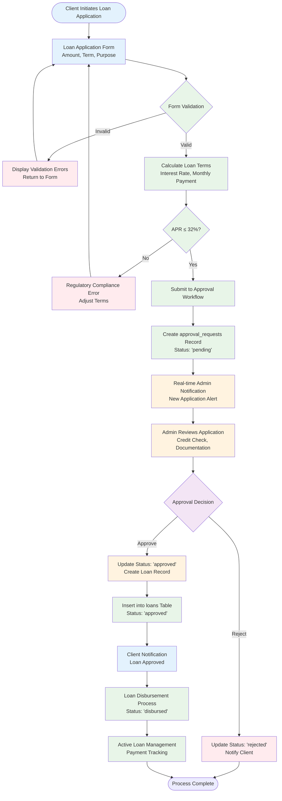
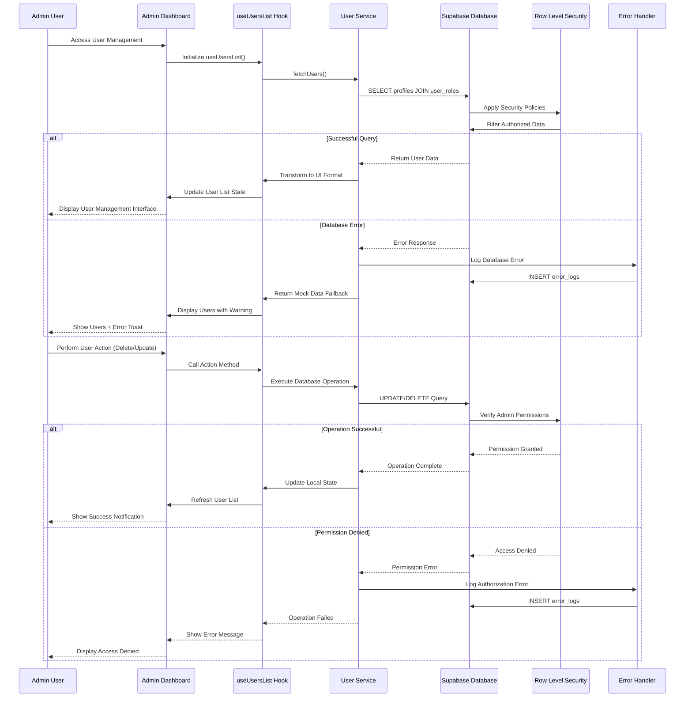
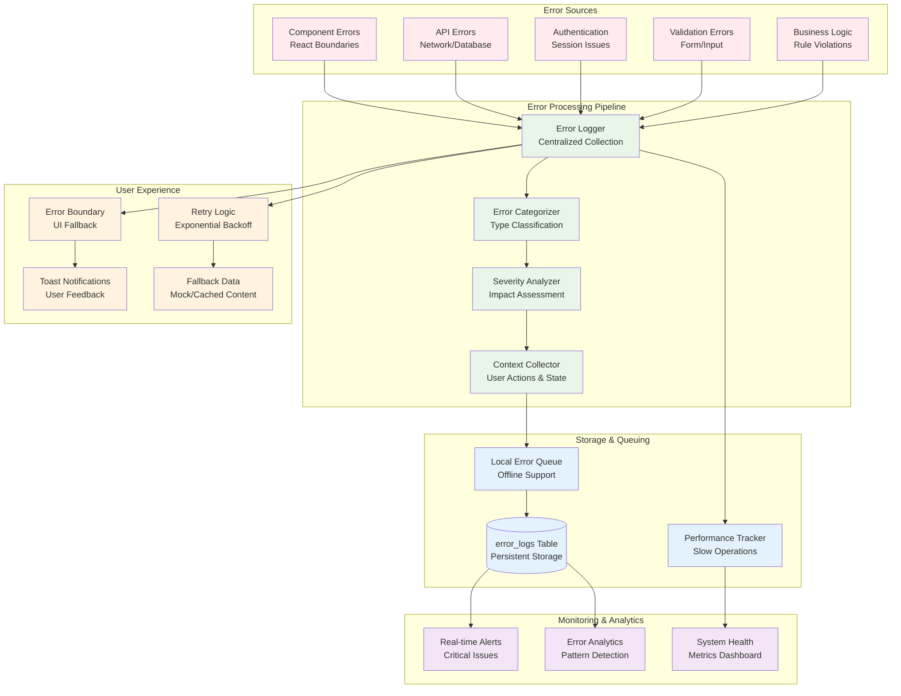
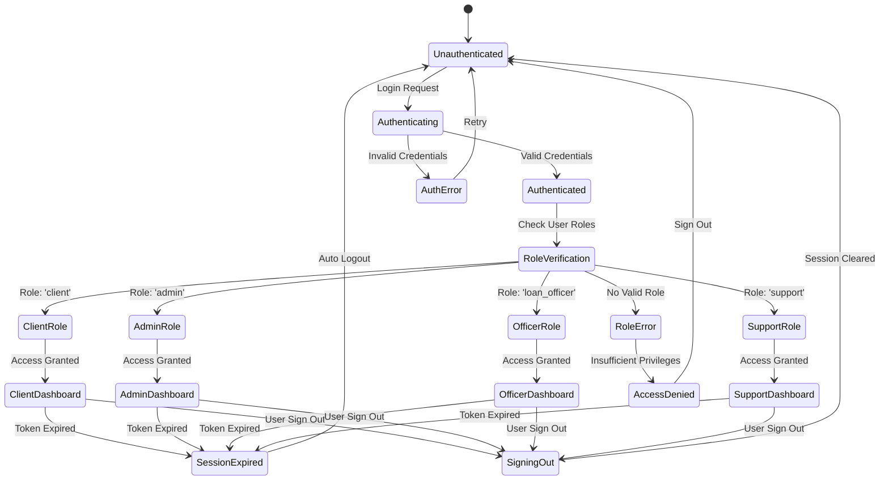
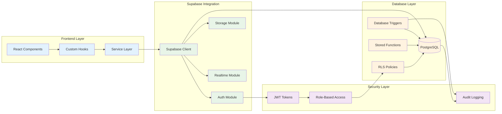
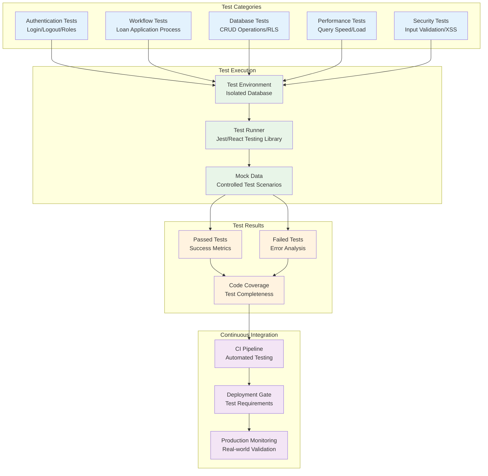
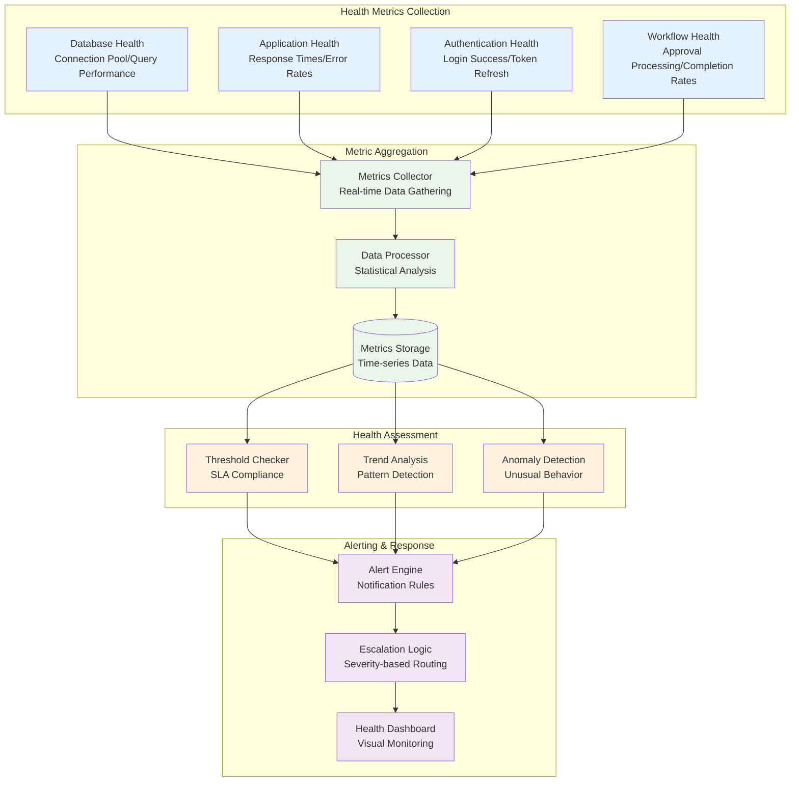

# NamLend Trust Platform - System Integration Workflows

**Version:** 2.2.0 | **Date:** September 21, 2025 | **Status:** ✅ OPERATIONAL

## Loan Application Processing Workflow



## Client Portal & Document Verification Workflow (v2.2.0)

```mermaid
flowchart TD
    START([Client Accesses Portal]) --> PROFILE_CHECK{Profile Complete?}
    
    PROFILE_CHECK -->|No| PROFILE_FORM[Complete Profile Information<br/>Personal, Employment, Banking]
    PROFILE_FORM --> CALC_COMPLETION[Calculate Profile Completion<br/>RPC: calculate_profile_completion()]
    CALC_COMPLETION --> PROFILE_UPDATE[Update Profile Status<br/>Trigger: update_profile_status()]
    
    PROFILE_CHECK -->|Yes| DOC_CHECK{Required Documents<br/>Verified?}
    PROFILE_UPDATE --> DOC_CHECK
    
    DOC_CHECK -->|No| DOC_REQUIREMENTS[Display Document Requirements<br/>ID, Bank Statements, Payslip]
    DOC_REQUIREMENTS --> DOC_UPLOAD[Upload Documents<br/>Private kyc-documents Bucket]
    DOC_UPLOAD --> DOC_STORE[Store Document Metadata<br/>document_verification_requirements]
    DOC_STORE --> ADMIN_NOTIFY[Notify Admin<br/>Document Review Required]
    
    ADMIN_NOTIFY --> ADMIN_REVIEW[Admin Reviews Documents<br/>Verify Authenticity]
    ADMIN_REVIEW --> ADMIN_DECISION{Verification Decision}
    
    ADMIN_DECISION -->|Reject| DOC_REJECT[Update Status: 'rejected'<br/>Provide Rejection Reason]
    ADMIN_DECISION -->|Approve| DOC_APPROVE[Update Status: 'verified'<br/>Set verification_date]
    
    DOC_REJECT --> DOC_REQUIREMENTS
    DOC_APPROVE --> ELIGIBILITY_CHECK[Check Loan Eligibility<br/>RPC: check_loan_eligibility()]
    
    DOC_CHECK -->|Yes| ELIGIBILITY_CHECK
    
    ELIGIBILITY_CHECK --> ELIGIBLE{Eligible for Loan?}
    ELIGIBLE -->|No| REQUIREMENTS_DISPLAY[Show Missing Requirements<br/>Profile/Document Status]
    ELIGIBLE -->|Yes| LOAN_ACCESS[Enable Loan Application<br/>Access Granted]
    
    REQUIREMENTS_DISPLAY --> PROFILE_CHECK
    LOAN_ACCESS --> LOAN_APPLICATION[Proceed to Loan Application<br/>Standard Workflow]
    
    classDef client fill:#e3f2fd
    classDef system fill:#e8f5e8
    classDef admin fill:#fff3e0
    classDef decision fill:#f3e5f5
    classDef success fill:#e8f5e8
    classDef blocked fill:#ffebee

    class START,PROFILE_FORM,DOC_REQUIREMENTS,DOC_UPLOAD,REQUIREMENTS_DISPLAY client
    class CALC_COMPLETION,PROFILE_UPDATE,DOC_STORE,ELIGIBILITY_CHECK,LOAN_ACCESS system
    class ADMIN_NOTIFY,ADMIN_REVIEW,DOC_APPROVE,DOC_REJECT admin
    class PROFILE_CHECK,DOC_CHECK,ADMIN_DECISION,ELIGIBLE decision
    class LOAN_APPLICATION success
```

## User Management Integration Flow



## Error Handling Integration Workflow



## Authentication & Authorization Integration



## Database Integration Patterns



## Performance Monitoring Integration

```mermaid
flowchart TD
    START([Application Operation]) --> MEASURE[Performance Measurement<br/>measurePerformance()]
    
    MEASURE --> OPERATION[Execute Operation<br/>Database Query/API Call]
    OPERATION --> TIMING[Record Execution Time]
    
    TIMING --> THRESHOLD{Duration > Threshold?}
    THRESHOLD -->|No| SUCCESS[Operation Complete<br/>Normal Performance]
    THRESHOLD -->|Yes| SLOW_OP[Log Slow Operation<br/>Performance Warning]
    
    SLOW_OP --> ERROR_LOG[Insert error_logs<br/>Category: 'system']
    ERROR_LOG --> METRICS[Update Performance Metrics]
    
    SUCCESS --> METRICS
    METRICS --> ANALYTICS[Performance Analytics<br/>Trend Analysis]
    
    ANALYTICS --> DASHBOARD[Health Dashboard<br/>Real-time Monitoring]
    DASHBOARD --> ALERTS{Critical Threshold?}
    
    ALERTS -->|No| CONTINUE[Continue Monitoring]
    ALERTS -->|Yes| NOTIFICATION[Send Alert<br/>Admin Notification]
    
    NOTIFICATION --> INVESTIGATION[Performance Investigation<br/>Root Cause Analysis]
    INVESTIGATION --> OPTIMIZATION[System Optimization<br/>Query/Code Improvements]
    
    OPTIMIZATION --> CONTINUE
    CONTINUE --> START

    classDef operation fill:#e3f2fd
    classDef monitoring fill:#e8f5e8
    classDef analysis fill:#fff3e0
    classDef alert fill:#ffebee
    classDef action fill:#f3e5f5

    class START,MEASURE,OPERATION,TIMING,SUCCESS operation
    class THRESHOLD,SLOW_OP,ERROR_LOG,METRICS monitoring
    class ANALYTICS,DASHBOARD,CONTINUE analysis
    class ALERTS,NOTIFICATION alert
    class INVESTIGATION,OPTIMIZATION action
```

## Testing Integration Workflow



## System Health Monitoring


