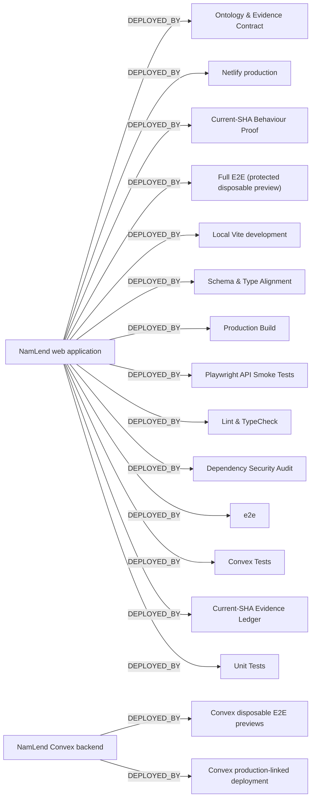

# NamLend proof graph

Generated from active web, Convex, test, workflow, document, and redacted source-manifest inputs at commit `d7fc2fc915da030a28e0b830c13c3ee300986880`.

| Inventory               | Count |
| ----------------------- | ----: |
| Effective Convex tables |    92 |
| Convex indexes          |   198 |
| Convex functions        |   504 |
| Web routes              |    40 |
| React components        |   257 |
| Features                |    32 |
| Seeded plans            |     4 |
| Named tests             |   852 |

Evidence precedence is `E0 > E1 > E2 > E3 > ∅`. The machine graph retains every supporting or contradicting reference; diagrams below are bounded audit views rather than the full graph.

### Authentication and routing

```mermaid
flowchart LR
  n_function_convex_ontology_relationships_listRelationshipsByType["listRelationshipsByType"]
  n_role_tenant_admin["admin"]
  n_function_convex_loanApprovals_getLoanApprovals["getLoanApprovals"]
  n_role_tenant_tenant_admin["tenant_admin"]
  n_function_convex_collections_markReminderSent["markReminderSent"]
  n_access_policy_authenticated["Authenticated access"]
  n_function_convex_users_adminUpdateProfile["adminUpdateProfile"]
  n_function_convex_users_updateMyProfile["updateMyProfile"]
  n_function_convex_settlement_settlementObligations_getObligation["getObligation"]
  n_function_convex_ontology_consentRecords_getMyConsents["getMyConsents"]
  n_function_convex_approvalWorkflow_getApprovalRequest["getApprovalRequest"]
  n_function_convex_ontology_products_checkEligibility["checkEligibility"]
  n_function_convex_ips_ipsAliasDirectory_blockAlias["blockAlias"]
  n_function_convex_ippOperations_listHandleListings["listHandleListings"]
  n_function_convex_disbursements_completeDisbursement["completeDisbursement"]
  n_function_convex_loanApprovals_adminListApprovalDecisions["adminListApprovalDecisions"]
  n_role_tenant_loan_officer["loan_officer"]
  n_function_convex_loanProcessing_reconcileInFlightLoansForKycReadiness["reconcileInFlightLoansForKycReadiness"]
  n_function_convex_ontology_accounts_getAccountsByOwner["getAccountsByOwner"]
  n_function_convex_ontology_products_getVersionHistory["getVersionHistory"]
  n_function_convex_ontology_mandates_createMandate["createMandate"]
  n_route__admin_consent["/admin/consent"]
  n_function_convex_settlement_settlementAcknowledgements_listAcknowledgementsByRun["listAcknowledgementsByRun"]
  n_function_convex_analytics_getPaymentsTotalSince["getPaymentsTotalSince"]
  n_function_convex_systemConfig_getConfigValue["getConfigValue"]
  n_function_convex_collections_getCollectionsStats["getCollectionsStats"]
  n_function_convex_tigerbeetle_outbox_getReconciliationReport["getReconciliationReport"]
  n_role_platform_platform_owner["platform_owner"]
  n_function_convex_ips_ipsAlerts_getActiveAlerts["getActiveAlerts"]
  n_function_convex_tigerbeetle_outbox_listDeadLetterEntries["listDeadLetterEntries"]
  n_function_convex_ontology_relationships_seedExistingRelationships["seedExistingRelationships"]
  n_function_convex_ips_ipsTransactions_initiateIpsRepayment["initiateIpsRepayment"]
  n_function_convex_notifications_listNotificationTemplates["listNotificationTemplates"]
  n_function_convex_settlement_settlementAdjustments_listPendingAdjustments["listPendingAdjustments"]
  n_function_convex_ontology_eventJournal_getEventsByCorrelation["getEventsByCorrelation"]
  n_route__admin_products["/admin/products"]
  n_function_convex_ontology_relationships_listRelationshipsByType -- "GATED_BY" --> n_role_tenant_admin
  n_function_convex_loanApprovals_getLoanApprovals -- "GATED_BY" --> n_role_tenant_tenant_admin
  n_function_convex_collections_markReminderSent -- "GATED_BY" --> n_access_policy_authenticated
  n_function_convex_users_adminUpdateProfile -- "GATED_BY" --> n_access_policy_authenticated
  n_function_convex_users_updateMyProfile -- "GATED_BY" --> n_access_policy_authenticated
  n_function_convex_settlement_settlementObligations_getObligation -- "GATED_BY" --> n_role_tenant_admin
  n_function_convex_ontology_consentRecords_getMyConsents -- "GATED_BY" --> n_access_policy_authenticated
  n_function_convex_approvalWorkflow_getApprovalRequest -- "GATED_BY" --> n_role_tenant_tenant_admin
  n_function_convex_ontology_products_checkEligibility -- "GATED_BY" --> n_access_policy_authenticated
  n_function_convex_ips_ipsAliasDirectory_blockAlias -- "GATED_BY" --> n_role_tenant_tenant_admin
  n_function_convex_ippOperations_listHandleListings -- "GATED_BY" --> n_access_policy_authenticated
  n_function_convex_disbursements_completeDisbursement -- "GATED_BY" --> n_role_tenant_admin
  n_function_convex_loanApprovals_adminListApprovalDecisions -- "GATED_BY" --> n_role_tenant_loan_officer
  n_function_convex_loanProcessing_reconcileInFlightLoansForKycReadiness -- "GATED_BY" --> n_access_policy_authenticated
  n_function_convex_ontology_accounts_getAccountsByOwner -- "GATED_BY" --> n_role_tenant_loan_officer
  n_function_convex_ontology_products_getVersionHistory -- "GATED_BY" --> n_role_tenant_tenant_admin
  n_function_convex_ontology_mandates_createMandate -- "GATED_BY" --> n_access_policy_authenticated
  n_route__admin_consent -- "GATED_BY" --> n_role_tenant_tenant_admin
  n_function_convex_settlement_settlementAcknowledgements_listAcknowledgementsByRun -- "GATED_BY" --> n_access_policy_authenticated
  n_function_convex_analytics_getPaymentsTotalSince -- "GATED_BY" --> n_role_tenant_tenant_admin
  n_function_convex_systemConfig_getConfigValue -- "GATED_BY" --> n_role_tenant_admin
  n_function_convex_collections_getCollectionsStats -- "GATED_BY" --> n_role_tenant_loan_officer
  n_function_convex_tigerbeetle_outbox_getReconciliationReport -- "GATED_BY" --> n_role_platform_platform_owner
  n_function_convex_ips_ipsAlerts_getActiveAlerts -- "GATED_BY" --> n_role_tenant_admin
  n_function_convex_tigerbeetle_outbox_listDeadLetterEntries -- "GATED_BY" --> n_role_platform_platform_owner
  n_function_convex_ontology_relationships_seedExistingRelationships -- "GATED_BY" --> n_role_tenant_admin
  n_function_convex_ips_ipsTransactions_initiateIpsRepayment -- "GATED_BY" --> n_role_tenant_admin
  n_function_convex_notifications_listNotificationTemplates -- "GATED_BY" --> n_role_tenant_tenant_admin
  n_function_convex_settlement_settlementAdjustments_listPendingAdjustments -- "GATED_BY" --> n_role_tenant_admin
  n_function_convex_ontology_eventJournal_getEventsByCorrelation -- "GATED_BY" --> n_access_policy_authenticated
  n_route__admin_products -- "GATED_BY" --> n_role_tenant_admin
  n_function_convex_ontology_accounts_getAccountsByOwner -- "GATED_BY" --> n_access_policy_authenticated
  n_function_convex_ontology_relationships_seedExistingRelationships -- "GATED_BY" --> n_role_tenant_tenant_admin
```

### Tenancy and entitlements

```mermaid
flowchart LR
  n_function_convex_ips_ipsOnboarding_adminListOnboarding["adminListOnboarding"]
  n_feature_ippOnboarding["IPP / IPS Onboarding"]
  n_function_convex_tenantConfig_setMyCreditPolicy["setMyCreditPolicy"]
  n_feature_creditPolicy["Credit Policy"]
  n_function_convex_ips_ipsOnboarding_submitOtp["submitOtp"]
  n_function_convex_approvalWorkflow_listWorkflowDefinitions["listWorkflowDefinitions"]
  n_feature_workflows["Workflow Builder"]
  n_function_convex_analytics_getRevenueMetrics["getRevenueMetrics"]
  n_feature_advancedAnalytics["Advanced Analytics"]
  n_function_convex_collections_getCollectionsStats["getCollectionsStats"]
  n_feature_collections["Collections"]
  n_function_convex_reconciliation_listBankTransactions["listBankTransactions"]
  n_feature_tenantReconciliation["Reconciliation"]
  n_function_convex_reconciliation_getBankTransaction["getBankTransaction"]
  n_function_convex_reconciliation_createReconciliationRun["createReconciliationRun"]
  n_function_convex_ips_ipsOnboarding_completeDeviceBinding["completeDeviceBinding"]
  n_function_convex_ontology_mandates_getMandatesByLoan["getMandatesByLoan"]
  n_feature_mandates["Mandates / Debit Orders"]
  n_function_convex_analytics_getIpsAnalytics["getIpsAnalytics"]
  n_function_convex_collections_listOverdueReminders["listOverdueReminders"]
  n_function_convex_collections_createPromiseToPay["createPromiseToPay"]
  n_function_convex_collections_markPromiseFulfilled["markPromiseFulfilled"]
  n_function_convex_ips_ipsAliasDirectory_adminListAliases["adminListAliases"]
  n_function_convex_reconciliation_disputeTransaction["disputeTransaction"]
  n_function_convex_ontology_mandates_authorizeMandate["authorizeMandate"]
  n_function_convex_ips_ipsAliasDirectory_blockAlias["blockAlias"]
  n_function_convex_ontology_mandates_listMandates["listMandates"]
  n_function_convex_collections_markReminderSent["markReminderSent"]
  n_function_convex_ips_ipsTransactions_adminListIpsTransactions["adminListIpsTransactions"]
  n_function_convex_collections_reviewRescheduleRequest["reviewRescheduleRequest"]
  n_function_convex_ips_ipsVpa_deleteVpa["deleteVpa"]
  n_function_convex_reconciliation_importBankTransactions["importBankTransactions"]
  n_function_convex_reconciliation_listReconciliationRuns["listReconciliationRuns"]
  n_function_convex_ontology_mandates_suspendMandate["suspendMandate"]
  n_function_convex_ips_ipsVpa_upsertVpa["upsertVpa"]
  n_function_convex_ips_ipsAliasDirectory_registerLocalAlias["registerLocalAlias"]
  n_function_convex_ips_ipsOnboarding_adminListOnboarding -- "DEPENDS_ON" --> n_feature_ippOnboarding
  n_function_convex_tenantConfig_setMyCreditPolicy -- "DEPENDS_ON" --> n_feature_creditPolicy
  n_function_convex_ips_ipsOnboarding_submitOtp -- "DEPENDS_ON" --> n_feature_ippOnboarding
  n_function_convex_approvalWorkflow_listWorkflowDefinitions -- "DEPENDS_ON" --> n_feature_workflows
  n_function_convex_analytics_getRevenueMetrics -- "DEPENDS_ON" --> n_feature_advancedAnalytics
  n_function_convex_collections_getCollectionsStats -- "DEPENDS_ON" --> n_feature_collections
  n_function_convex_reconciliation_listBankTransactions -- "DEPENDS_ON" --> n_feature_tenantReconciliation
  n_function_convex_reconciliation_getBankTransaction -- "DEPENDS_ON" --> n_feature_tenantReconciliation
  n_function_convex_reconciliation_createReconciliationRun -- "DEPENDS_ON" --> n_feature_tenantReconciliation
  n_function_convex_ips_ipsOnboarding_completeDeviceBinding -- "DEPENDS_ON" --> n_feature_ippOnboarding
  n_function_convex_ontology_mandates_getMandatesByLoan -- "DEPENDS_ON" --> n_feature_mandates
  n_function_convex_analytics_getIpsAnalytics -- "DEPENDS_ON" --> n_feature_advancedAnalytics
  n_function_convex_collections_listOverdueReminders -- "DEPENDS_ON" --> n_feature_collections
  n_feature_mandates -- "DEPENDS_ON" --> n_feature_collections
  n_function_convex_collections_createPromiseToPay -- "DEPENDS_ON" --> n_feature_collections
  n_function_convex_collections_markPromiseFulfilled -- "DEPENDS_ON" --> n_feature_collections
  n_function_convex_ips_ipsAliasDirectory_adminListAliases -- "DEPENDS_ON" --> n_feature_ippOnboarding
  n_function_convex_reconciliation_disputeTransaction -- "DEPENDS_ON" --> n_feature_tenantReconciliation
  n_function_convex_ontology_mandates_authorizeMandate -- "DEPENDS_ON" --> n_feature_mandates
  n_function_convex_ontology_mandates_authorizeMandate -- "DEPENDS_ON" --> n_feature_collections
  n_function_convex_ips_ipsAliasDirectory_blockAlias -- "DEPENDS_ON" --> n_feature_ippOnboarding
  n_function_convex_ontology_mandates_listMandates -- "DEPENDS_ON" --> n_feature_mandates
  n_function_convex_collections_markReminderSent -- "DEPENDS_ON" --> n_feature_collections
  n_function_convex_ips_ipsTransactions_adminListIpsTransactions -- "DEPENDS_ON" --> n_feature_ippOnboarding
  n_function_convex_collections_reviewRescheduleRequest -- "DEPENDS_ON" --> n_feature_collections
  n_function_convex_ips_ipsVpa_deleteVpa -- "DEPENDS_ON" --> n_feature_ippOnboarding
  n_function_convex_reconciliation_importBankTransactions -- "DEPENDS_ON" --> n_feature_tenantReconciliation
  n_function_convex_reconciliation_listReconciliationRuns -- "DEPENDS_ON" --> n_feature_tenantReconciliation
  n_function_convex_ontology_mandates_suspendMandate -- "DEPENDS_ON" --> n_feature_mandates
  n_function_convex_ips_ipsVpa_upsertVpa -- "DEPENDS_ON" --> n_feature_ippOnboarding
  n_function_convex_ips_ipsAliasDirectory_registerLocalAlias -- "DEPENDS_ON" --> n_feature_ippOnboarding
  n_function_convex_ontology_mandates_suspendMandate -- "DEPENDS_ON" --> n_feature_collections
```

### Lending lifecycle

```mermaid
flowchart LR
  n_function_convex_loans_submitLoan["submitLoan"]
  n_function_convex_projections_portfolioProjection_onLoanCreated["onLoanCreated"]
  n_function_convex_collections_markPromiseFulfilled["markPromiseFulfilled"]
  n_function_convex_projections_portfolioProjection_onPaymentFailed["onPaymentFailed"]
  n_function_convex_loans_approveLoan["approveLoan"]
  n_function_convex_projections_portfolioProjection_onDisbursementCompleted["onDisbursementCompleted"]
  n_function_convex_ips_ipsTransactions_updateIpsTransactionStatus["updateIpsTransactionStatus"]
  n_function_convex_collections_reviewRescheduleRequest["reviewRescheduleRequest"]
  n_function_convex_audit_writeStateTransition["writeStateTransition"]
  n_function_convex_ips_ipsTransactions_startLoanDisbursement["startLoanDisbursement"]
  n_function_convex_ontology_relationships_createRelationship["createRelationship"]
  n_function_convex_collections_markReminderSent["markReminderSent"]
  n_function_convex_ontology_eventJournal_writeEvent["writeEvent"]
  n_function_convex_payments_failPayment["failPayment"]
  n_function_convex_projections_portfolioProjection_onLoanApproved["onLoanApproved"]
  n_function_convex_loans_createLoan["createLoan"]
  n_function_convex_projections_portfolioProjection_onLoanRejected["onLoanRejected"]
  n_function_convex_loans_markFunded["markFunded"]
  n_function_convex_ips_ipsTransactions_updateIpsTransactionStatusInternal["updateIpsTransactionStatusInternal"]
  n_function_convex_disbursements_reverseDisbursement["reverseDisbursement"]
  n_function_convex_kycDocuments_submitMyKyc["submitMyKyc"]
  n_function_convex_audit_writeAuditEntry["writeAuditEntry"]
  n_function_convex_disbursements_initiateDisbursement["initiateDisbursement"]
  n_function_convex_projections_portfolioProjection_onLoanPaidOff["onLoanPaidOff"]
  n_function_convex_approvalWorkflow_submitForApproval["submitForApproval"]
  n_function_convex_users_assignRole["assignRole"]
  n_function_convex_payments_recordPayment["recordPayment"]
  n_function_convex_loans_moveToReview["moveToReview"]
  n_function_convex_projections_portfolioProjection_onLoanFunded["onLoanFunded"]
  n_function_convex_loans_recordCreditScore["recordCreditScore"]
  n_function_convex_loanProcessing_recordProcessingFailure["recordProcessingFailure"]
  n_function_convex_notifications_createNotification["createNotification"]
  n_function_convex_collections_createPromiseToPay["createPromiseToPay"]
  n_function_convex_actions_processLoanApplication_processLoanApplication["processLoanApplication"]
  n_function_convex_projections_portfolioProjection_onDisbursementFailed["onDisbursementFailed"]
  n_function_convex_disbursements_completeDisbursement["completeDisbursement"]
  n_function_convex_loans_submitLoan -- "CALLS" --> n_function_convex_projections_portfolioProjection_onLoanCreated
  n_function_convex_collections_markPromiseFulfilled -- "CALLS" --> n_function_convex_projections_portfolioProjection_onPaymentFailed
  n_function_convex_loans_approveLoan -- "CALLS" --> n_function_convex_projections_portfolioProjection_onDisbursementCompleted
  n_function_convex_ips_ipsTransactions_updateIpsTransactionStatus -- "CALLS" --> n_function_convex_projections_portfolioProjection_onLoanCreated
  n_function_convex_collections_reviewRescheduleRequest -- "CALLS" --> n_function_convex_audit_writeStateTransition
  n_function_convex_ips_ipsTransactions_startLoanDisbursement -- "CALLS" --> n_function_convex_ontology_relationships_createRelationship
  n_function_convex_collections_markReminderSent -- "CALLS" --> n_function_convex_ontology_eventJournal_writeEvent
  n_function_convex_payments_failPayment -- "CALLS" --> n_function_convex_projections_portfolioProjection_onLoanApproved
  n_function_convex_loans_createLoan -- "CALLS" --> n_function_convex_audit_writeStateTransition
  n_function_convex_loans_submitLoan -- "CALLS" --> n_function_convex_projections_portfolioProjection_onLoanRejected
  n_function_convex_loans_markFunded -- "CALLS" --> n_function_convex_ontology_eventJournal_writeEvent
  n_function_convex_ips_ipsTransactions_updateIpsTransactionStatusInternal -- "CALLS" --> n_function_convex_projections_portfolioProjection_onLoanRejected
  n_function_convex_ips_ipsTransactions_startLoanDisbursement -- "CALLS" --> n_function_convex_projections_portfolioProjection_onDisbursementCompleted
  n_function_convex_disbursements_reverseDisbursement -- "CALLS" --> n_function_convex_projections_portfolioProjection_onLoanApproved
  n_function_convex_collections_reviewRescheduleRequest -- "CALLS" --> n_function_convex_ontology_eventJournal_writeEvent
  n_function_convex_kycDocuments_submitMyKyc -- "CALLS" --> n_function_convex_audit_writeAuditEntry
  n_function_convex_disbursements_initiateDisbursement -- "CALLS" --> n_function_convex_projections_portfolioProjection_onLoanPaidOff
  n_function_convex_approvalWorkflow_submitForApproval -- "CALLS" --> n_function_convex_projections_portfolioProjection_onLoanPaidOff
  n_function_convex_loans_approveLoan -- "CALLS" --> n_function_convex_projections_portfolioProjection_onLoanApproved
  n_function_convex_users_assignRole -- "CALLS" --> n_function_convex_projections_portfolioProjection_onLoanRejected
  n_function_convex_ips_ipsTransactions_updateIpsTransactionStatusInternal -- "CALLS" --> n_function_convex_projections_portfolioProjection_onLoanPaidOff
  n_function_convex_payments_recordPayment -- "CALLS" --> n_function_convex_projections_portfolioProjection_onLoanPaidOff
  n_function_convex_loans_moveToReview -- "CALLS" --> n_function_convex_projections_portfolioProjection_onLoanCreated
  n_function_convex_approvalWorkflow_submitForApproval -- "CALLS" --> n_function_convex_projections_portfolioProjection_onLoanFunded
  n_function_convex_loans_recordCreditScore -- "CALLS" --> n_function_convex_audit_writeAuditEntry
  n_function_convex_loanProcessing_recordProcessingFailure -- "CALLS" --> n_function_convex_notifications_createNotification
  n_function_convex_approvalWorkflow_submitForApproval -- "CALLS" --> n_function_convex_projections_portfolioProjection_onLoanRejected
  n_function_convex_collections_createPromiseToPay -- "CALLS" --> n_function_convex_projections_portfolioProjection_onLoanPaidOff
  n_function_convex_actions_processLoanApplication_processLoanApplication -- "CALLS" --> n_function_convex_loans_recordCreditScore
  n_function_convex_loans_submitLoan -- "CALLS" --> n_function_convex_projections_portfolioProjection_onDisbursementFailed
  n_function_convex_disbursements_completeDisbursement -- "CALLS" --> n_function_convex_projections_portfolioProjection_onLoanRejected
  n_function_convex_loans_approveLoan -- "CALLS" --> n_function_convex_projections_portfolioProjection_onPaymentFailed
  n_function_convex_collections_markPromiseFulfilled -- "CALLS" --> n_function_convex_projections_portfolioProjection_onLoanCreated
  n_function_convex_loans_markFunded -- "CALLS" --> n_function_convex_projections_portfolioProjection_onPaymentFailed
  n_function_convex_collections_markPromiseFulfilled -- "CALLS" --> n_function_convex_projections_portfolioProjection_onLoanFunded
  n_function_convex_loans_createLoan -- "CALLS" --> n_function_convex_projections_portfolioProjection_onLoanCreated
  n_function_convex_loans_createLoan -- "CALLS" --> n_function_convex_projections_portfolioProjection_onLoanRejected
  n_function_convex_ips_ipsTransactions_updateIpsTransactionStatus -- "CALLS" --> n_function_convex_projections_portfolioProjection_onLoanPaidOff
  n_function_convex_loans_moveToReview -- "CALLS" --> n_function_convex_projections_portfolioProjection_onLoanFunded
  n_function_convex_actions_processLoanApplication_processLoanApplication -- "CALLS" --> n_function_convex_loanProcessing_recordProcessingFailure
  n_function_convex_disbursements_completeDisbursement -- "CALLS" --> n_function_convex_projections_portfolioProjection_onLoanFunded
  n_function_convex_loans_approveLoan -- "CALLS" --> n_function_convex_projections_portfolioProjection_onLoanRejected
  n_function_convex_ips_ipsTransactions_updateIpsTransactionStatusInternal -- "CALLS" --> n_function_convex_projections_portfolioProjection_onLoanFunded
  n_function_convex_users_assignRole -- "CALLS" --> n_function_convex_projections_portfolioProjection_onLoanCreated
  n_function_convex_collections_createPromiseToPay -- "CALLS" --> n_function_convex_projections_portfolioProjection_onLoanApproved
  n_function_convex_ips_ipsTransactions_startLoanDisbursement -- "CALLS" --> n_function_convex_projections_portfolioProjection_onPaymentFailed
```

### Money movement

```mermaid
flowchart LR
  n_function_convex_actions_ipsAdapter_initiateOutboundTransfer["initiateOutboundTransfer"]
  n_function_convex_actions_ipsAdapter_resolveDeemedTransaction["resolveDeemedTransaction"]
  n_function_convex_collections_markPromiseFulfilled["markPromiseFulfilled"]
  n_function_convex_projections_portfolioProjection_onPaymentFailed["onPaymentFailed"]
  n_function_convex_loans_approveLoan["approveLoan"]
  n_function_convex_projections_portfolioProjection_onDisbursementCompleted["onDisbursementCompleted"]
  n_function_convex_scheduled_tigerBeetleOutboxWorker_processOutbox["processOutbox"]
  n_function_convex_tigerbeetle_outbox_claimPendingEntries["claimPendingEntries"]
  n_function_convex_ips_ipsTransactions_updateIpsTransactionStatus["updateIpsTransactionStatus"]
  n_function_convex_projections_portfolioProjection_onLoanCreated["onLoanCreated"]
  n_function_convex_ips_ipsTransactions_startLoanDisbursement["startLoanDisbursement"]
  n_function_convex_ontology_relationships_createRelationship["createRelationship"]
  n_function_convex_actions_ipsAdapter_handleWebhook["handleWebhook"]
  n_function_convex_ips_ipsTransactions_getTransactionByMsgIdInternal["getTransactionByMsgIdInternal"]
  n_function_convex_actions_ipsAdapter_queryAuthDetail["queryAuthDetail"]
  n_function_convex_lib_ruleEvaluator_getStringRuleQuery["getStringRuleQuery"]
  n_function_convex_ips_ipsAliasDirectory_blockAlias["blockAlias"]
  n_function_convex_audit_writeStateTransition["writeStateTransition"]
  n_function_convex_payments_failPayment["failPayment"]
  n_function_convex_projections_portfolioProjection_onLoanApproved["onLoanApproved"]
  n_function_convex_ips_ipsTransactions_updateIpsTransactionStatusInternal["updateIpsTransactionStatusInternal"]
  n_function_convex_projections_portfolioProjection_onLoanRejected["onLoanRejected"]
  n_function_convex_disbursements_reverseDisbursement["reverseDisbursement"]
  n_function_convex_ontology_mandateExecutions_executeMandateDebit["executeMandateDebit"]
  n_function_convex_disbursements_initiateDisbursement["initiateDisbursement"]
  n_function_convex_projections_portfolioProjection_onLoanPaidOff["onLoanPaidOff"]
  n_function_convex_ontology_paymentRails_createRail["createRail"]
  n_function_convex_ontology_eventJournal_writeEvent["writeEvent"]
  n_function_convex_actions_ipsOnboardingAdapter_startVerification["startVerification"]
  n_function_convex_actions_ipsOnboardingAdapter_reqListAccount["reqListAccount"]
  n_function_convex_ips_ipsOnboarding_updateOnboardingStatus["updateOnboardingStatus"]
  n_function_convex_payments_completePayment["completePayment"]
  n_function_convex_projections_portfolioProjection_onPaymentCompleted["onPaymentCompleted"]
  n_function_convex_actions_ipsAdapter_initiateReversal["initiateReversal"]
  n_function_convex_approvalWorkflow_submitForApproval["submitForApproval"]
  n_function_convex_settlement_settlementActions_createSettlementRun["createSettlementRun"]
  n_function_convex_actions_ipsAdapter_initiateOutboundTransfer -- "CALLS" --> n_function_convex_actions_ipsAdapter_resolveDeemedTransaction
  n_function_convex_collections_markPromiseFulfilled -- "CALLS" --> n_function_convex_projections_portfolioProjection_onPaymentFailed
  n_function_convex_loans_approveLoan -- "CALLS" --> n_function_convex_projections_portfolioProjection_onDisbursementCompleted
  n_function_convex_scheduled_tigerBeetleOutboxWorker_processOutbox -- "CALLS" --> n_function_convex_tigerbeetle_outbox_claimPendingEntries
  n_function_convex_ips_ipsTransactions_updateIpsTransactionStatus -- "CALLS" --> n_function_convex_projections_portfolioProjection_onLoanCreated
  n_function_convex_ips_ipsTransactions_startLoanDisbursement -- "CALLS" --> n_function_convex_ontology_relationships_createRelationship
  n_function_convex_actions_ipsAdapter_handleWebhook -- "CALLS" --> n_function_convex_ips_ipsTransactions_getTransactionByMsgIdInternal
  n_function_convex_actions_ipsAdapter_queryAuthDetail -- "CALLS" --> n_function_convex_lib_ruleEvaluator_getStringRuleQuery
  n_function_convex_ips_ipsAliasDirectory_blockAlias -- "CALLS" --> n_function_convex_audit_writeStateTransition
  n_function_convex_payments_failPayment -- "CALLS" --> n_function_convex_projections_portfolioProjection_onLoanApproved
  n_function_convex_ips_ipsTransactions_updateIpsTransactionStatusInternal -- "CALLS" --> n_function_convex_projections_portfolioProjection_onLoanRejected
  n_function_convex_ips_ipsTransactions_startLoanDisbursement -- "CALLS" --> n_function_convex_projections_portfolioProjection_onDisbursementCompleted
  n_function_convex_disbursements_reverseDisbursement -- "CALLS" --> n_function_convex_projections_portfolioProjection_onLoanApproved
  n_function_convex_ontology_mandateExecutions_executeMandateDebit -- "CALLS" --> n_function_convex_ontology_relationships_createRelationship
  n_function_convex_disbursements_initiateDisbursement -- "CALLS" --> n_function_convex_projections_portfolioProjection_onLoanPaidOff
  n_function_convex_ontology_paymentRails_createRail -- "CALLS" --> n_function_convex_ontology_eventJournal_writeEvent
  n_function_convex_actions_ipsOnboardingAdapter_startVerification -- "CALLS" --> n_function_convex_lib_ruleEvaluator_getStringRuleQuery
  n_function_convex_actions_ipsOnboardingAdapter_reqListAccount -- "CALLS" --> n_function_convex_ips_ipsOnboarding_updateOnboardingStatus
  n_function_convex_payments_completePayment -- "CALLS" --> n_function_convex_projections_portfolioProjection_onPaymentCompleted
  n_function_convex_ips_ipsTransactions_updateIpsTransactionStatusInternal -- "CALLS" --> n_function_convex_projections_portfolioProjection_onLoanPaidOff
  n_function_convex_actions_ipsAdapter_initiateReversal -- "CALLS" --> n_function_convex_lib_ruleEvaluator_getStringRuleQuery
  n_function_convex_approvalWorkflow_submitForApproval -- "CALLS" --> n_function_convex_projections_portfolioProjection_onPaymentFailed
  n_function_convex_ips_ipsTransactions_updateIpsTransactionStatus -- "CALLS" --> n_function_convex_ontology_eventJournal_writeEvent
  n_function_convex_payments_completePayment -- "CALLS" --> n_function_convex_projections_portfolioProjection_onDisbursementCompleted
  n_function_convex_loans_approveLoan -- "CALLS" --> n_function_convex_projections_portfolioProjection_onPaymentFailed
  n_function_convex_disbursements_reverseDisbursement -- "CALLS" --> n_function_convex_ontology_eventJournal_writeEvent
  n_function_convex_payments_failPayment -- "CALLS" --> n_function_convex_audit_writeStateTransition
  n_function_convex_payments_completePayment -- "CALLS" --> n_function_convex_ontology_relationships_createRelationship
  n_function_convex_ips_ipsTransactions_updateIpsTransactionStatus -- "CALLS" --> n_function_convex_projections_portfolioProjection_onPaymentCompleted
  n_function_convex_ips_ipsTransactions_updateIpsTransactionStatus -- "CALLS" --> n_function_convex_audit_writeStateTransition
  n_function_convex_ips_ipsAliasDirectory_blockAlias -- "CALLS" --> n_function_convex_ontology_eventJournal_writeEvent
```

### Notifications

```mermaid
flowchart LR
  n_function_convex_platform_lendingWorkflowRepair_backfillPendingStaffNotifications["backfillPendingStaffNotifications"]
  n_function_convex_ontology_eventJournal_writeEvent["writeEvent"]
  n_function_convex_communications_resendCommunication["resendCommunication"]
  n_function_convex_notifications_createNotification["createNotification"]
  n_function_convex_loanProcessing_recordProcessingFailure["recordProcessingFailure"]
  n_function_convex_loans_updateLoanBalance["updateLoanBalance"]
  n_function_convex_scheduled_dailyTasks_processNotificationQueue["processNotificationQueue"]
  n_function_convex_actions_sendWhatsapp_sendWhatsappText["sendWhatsappText"]
  n_function_convex_supportTickets_resolveTicket["resolveTicket"]
  n_function_convex_scheduled_dailyTasks_runDailyTasks["runDailyTasks"]
  n_function_convex_platform_lendingWorkflowRepair_backfillBlockedDisbursementStaffNotifications["backfillBlockedDisbursementStaffNotifications"]
  n_function_convex_audit_writeAuditEntry["writeAuditEntry"]
  n_function_convex_actions_sendNotification_sendNotification["sendNotification"]
  n_function_convex_actions_sendSms_sendTemplateSms["sendTemplateSms"]
  n_function_convex_payments_completePayment["completePayment"]
  n_function_convex_payments_applyPaymentWebhook["applyPaymentWebhook"]
  n_function_convex_actions_sendWhatsapp_sendWhatsappTemplate["sendWhatsappTemplate"]
  n_function_convex_approvalWorkflow_submitForApproval["submitForApproval"]
  n_function_convex_platform_lendingWorkflowRepair_backfillPendingIpsStaffNotifications["backfillPendingIpsStaffNotifications"]
  n_function_convex_actions_sendSms_sendSms["sendSms"]
  n_function_convex_audit_writeStateTransition["writeStateTransition"]
  n_function_convex_notifications_claimPendingNotifications["claimPendingNotifications"]
  n_function_convex_ips_ipsTransactions_updateIpsTransactionStatusInternal["updateIpsTransactionStatusInternal"]
  n_function_convex_notifications_createStaffNotifications["createStaffNotifications"]
  n_function_convex_collections_reviewRescheduleRequest["reviewRescheduleRequest"]
  n_function_convex_communications_sendCommunication["sendCommunication"]
  n_function_convex_ips_ipsTransactions_updateIpsTransactionStatus["updateIpsTransactionStatus"]
  n_function_convex_notifications_markNotificationRead["markNotificationRead"]
  n_function_convex_approvalWorkflow_processApprovalRequest["processApprovalRequest"]
  n_function_convex_approvalWorkflow_createSystemApprovalRequest["createSystemApprovalRequest"]
  n_function_convex_actions_processLoanApplication_processLoanApplication["processLoanApplication"]
  n_function_convex_ips_ipsTransactions_initiateIpsDisbursement["initiateIpsDisbursement"]
  n_function_convex_kycDocuments_completeReview["completeReview"]
  n_function_convex_notifications_markAllNotificationsRead["markAllNotificationsRead"]
  n_function_convex_notifications_getPreferencesForUser["getPreferencesForUser"]
  n_function_convex_disbursements_completeDisbursement["completeDisbursement"]
  n_function_convex_platform_lendingWorkflowRepair_backfillPendingStaffNotifications -- "CALLS" --> n_function_convex_ontology_eventJournal_writeEvent
  n_function_convex_communications_resendCommunication -- "CALLS" --> n_function_convex_notifications_createNotification
  n_function_convex_loanProcessing_recordProcessingFailure -- "CALLS" --> n_function_convex_notifications_createNotification
  n_function_convex_loans_updateLoanBalance -- "CALLS" --> n_function_convex_notifications_createNotification
  n_function_convex_scheduled_dailyTasks_processNotificationQueue -- "CALLS" --> n_function_convex_actions_sendWhatsapp_sendWhatsappText
  n_function_convex_supportTickets_resolveTicket -- "CALLS" --> n_function_convex_notifications_createNotification
  n_function_convex_scheduled_dailyTasks_runDailyTasks -- "CALLS" --> n_function_convex_scheduled_dailyTasks_processNotificationQueue
  n_function_convex_platform_lendingWorkflowRepair_backfillBlockedDisbursementStaffNotifications -- "CALLS" --> n_function_convex_audit_writeAuditEntry
  n_function_convex_actions_sendNotification_sendNotification -- "CALLS" --> n_function_convex_actions_sendSms_sendTemplateSms
  n_function_convex_payments_completePayment -- "CALLS" --> n_function_convex_notifications_createNotification
  n_function_convex_payments_applyPaymentWebhook -- "CALLS" --> n_function_convex_notifications_createNotification
  n_function_convex_actions_sendNotification_sendNotification -- "CALLS" --> n_function_convex_actions_sendWhatsapp_sendWhatsappTemplate
  n_function_convex_approvalWorkflow_submitForApproval -- "CALLS" --> n_function_convex_notifications_createNotification
  n_function_convex_platform_lendingWorkflowRepair_backfillPendingStaffNotifications -- "CALLS" --> n_function_convex_audit_writeAuditEntry
  n_function_convex_platform_lendingWorkflowRepair_backfillPendingIpsStaffNotifications -- "CALLS" --> n_function_convex_audit_writeAuditEntry
  n_function_convex_scheduled_dailyTasks_processNotificationQueue -- "CALLS" --> n_function_convex_actions_sendSms_sendSms
  n_function_convex_communications_resendCommunication -- "CALLS" --> n_function_convex_audit_writeStateTransition
  n_function_convex_scheduled_dailyTasks_processNotificationQueue -- "CALLS" --> n_function_convex_notifications_claimPendingNotifications
  n_function_convex_ips_ipsTransactions_updateIpsTransactionStatusInternal -- "CALLS" --> n_function_convex_notifications_createStaffNotifications
  n_function_convex_communications_resendCommunication -- "CALLS" --> n_function_convex_ontology_eventJournal_writeEvent
  n_function_convex_collections_reviewRescheduleRequest -- "CALLS" --> n_function_convex_notifications_createNotification
  n_function_convex_communications_sendCommunication -- "CALLS" --> n_function_convex_ontology_eventJournal_writeEvent
  n_function_convex_actions_sendSms_sendSms -- "CALLS" --> n_function_convex_notifications_createNotification
  n_function_convex_ips_ipsTransactions_updateIpsTransactionStatus -- "CALLS" --> n_function_convex_notifications_createNotification
  n_function_convex_notifications_markNotificationRead -- "CALLS" --> n_function_convex_audit_writeAuditEntry
  n_function_convex_approvalWorkflow_processApprovalRequest -- "CALLS" --> n_function_convex_notifications_createStaffNotifications
  n_function_convex_ips_ipsTransactions_updateIpsTransactionStatusInternal -- "CALLS" --> n_function_convex_notifications_createNotification
  n_function_convex_ips_ipsTransactions_updateIpsTransactionStatus -- "CALLS" --> n_function_convex_notifications_createStaffNotifications
  n_function_convex_approvalWorkflow_createSystemApprovalRequest -- "CALLS" --> n_function_convex_notifications_createNotification
  n_function_convex_actions_processLoanApplication_processLoanApplication -- "CALLS" --> n_function_convex_actions_sendNotification_sendNotification
  n_function_convex_ips_ipsTransactions_initiateIpsDisbursement -- "CALLS" --> n_function_convex_notifications_createStaffNotifications
  n_function_convex_kycDocuments_completeReview -- "CALLS" --> n_function_convex_notifications_createStaffNotifications
  n_function_convex_notifications_markAllNotificationsRead -- "CALLS" --> n_function_convex_ontology_eventJournal_writeEvent
  n_function_convex_actions_sendNotification_sendNotification -- "CALLS" --> n_function_convex_notifications_getPreferencesForUser
  n_function_convex_actions_sendNotification_sendNotification -- "CALLS" --> n_function_convex_notifications_createNotification
  n_function_convex_communications_sendCommunication -- "CALLS" --> n_function_convex_audit_writeStateTransition
  n_function_convex_actions_sendNotification_sendNotification -- "CALLS" --> n_function_convex_actions_sendSms_sendSms
  n_function_convex_kycDocuments_completeReview -- "CALLS" --> n_function_convex_notifications_createNotification
  n_function_convex_disbursements_completeDisbursement -- "CALLS" --> n_function_convex_notifications_createStaffNotifications
  n_function_convex_actions_sendSms_sendTemplateSms -- "CALLS" --> n_function_convex_actions_sendSms_sendSms
  n_function_convex_approvalWorkflow_submitForApproval -- "CALLS" --> n_function_convex_notifications_createStaffNotifications
  n_function_convex_approvalWorkflow_createSystemApprovalRequest -- "CALLS" --> n_function_convex_notifications_createStaffNotifications
  n_function_convex_platform_lendingWorkflowRepair_backfillPendingIpsStaffNotifications -- "CALLS" --> n_function_convex_ontology_eventJournal_writeEvent
  n_function_convex_platform_lendingWorkflowRepair_backfillBlockedDisbursementStaffNotifications -- "CALLS" --> n_function_convex_ontology_eventJournal_writeEvent
  n_function_convex_disbursements_completeDisbursement -- "CALLS" --> n_function_convex_notifications_createNotification
  n_function_convex_communications_sendCommunication -- "CALLS" --> n_function_convex_notifications_createNotification
  n_function_convex_notifications_markAllNotificationsRead -- "CALLS" --> n_function_convex_audit_writeAuditEntry
  n_function_convex_notifications_markNotificationRead -- "CALLS" --> n_function_convex_ontology_eventJournal_writeEvent
  n_function_convex_approvalWorkflow_processApprovalRequest -- "CALLS" --> n_function_convex_notifications_createNotification
```

### CI and deployment

